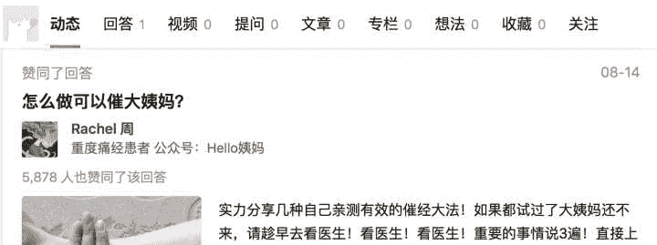
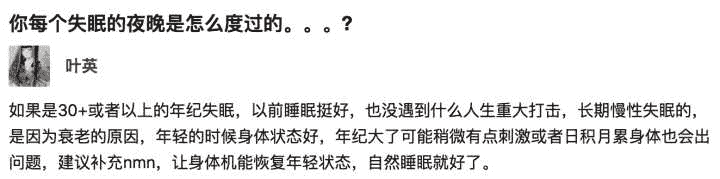

# 知乎问答：男性应该怎么解放自己?

> 来源：[https://www.zhihu.com/question/415362898](https://www.zhihu.com/question/415362898)

* * *

> 作者：[宿舍南山南](https://www.zhihu.com/people/dao-mi-7)
> 
> 赞同数：1229
> 
> 编辑于：[2020-11-05](https://www.zhihu.com/answer/1551224778)

讨论男性的去责任化前，先讨论男性的责任是什么。

去责任化的核心是**责权相对**，有什么权利，付什么责任。下面我以欧美婚姻为例，浅谈这个话题。

我国对欧美的婚姻变迁有着非常严重的误解，造成这个误解主要原因是以女性为主的群体对国外婚姻制度有利于女性的一面选择性传播。

先讲一个被误解的事实，中国人以为“男外女内恩恩爱爱”的传统保守婚姻，并不是中国的“传统文化”，欧美也没拥有“开放的传统”。

很多人在面对中外婚姻差异时，总喜欢将“开放”与“保守”作为文化差异理解，这种理解是完全错误的，造成的这种错误印象的原因主要是影视剧的影响。

无论从哪一方面讲，欧美都拥有和中国一样的“传统婚姻”，并且以爱情为主的传统婚姻出现的时间比中国还要早。我们所以为的中国“传统”在欧美都能找到翻版，甚至只有一二十年的差距。

**英国人口统计学家凯瑟琳·基尔南认为，在欧州和北美，婚姻过渡分为四个阶段。**

在第一阶段，只有一小撮波希米亚分子和某些穷光蛋才未婚同居。

第二阶段，很多人暂时同居，但他们通常会朝着结婚的方向走，如果他们当了父母，则几乎总是会结婚。

第三阶段，未婚同居成了一种社会可以接受的婚姻之外的选择，可以大大方方讲出来自己的同居对象，有了孩子也未必结婚。

第四阶段，同居和结婚实际上变得没有差别

而美国在20世纪末，大概处于第二阶段过渡到第三阶段的状态，这个答案让很多人感到惊讶，因为中国目前就是处于这个阶段。

人们会惊讶于原来西方并不是拥有“开放”的传统文化，**不过比中国进度快了2.30年而已。**

在北美传统婚姻达到顶峰的上世纪60年代，男女同时都对传统婚姻表达了不满，并以此改变了婚姻形态，女性的声音比男性更大。但与中国不同的是，很多欧美男人不想以多的代价去迎合挽留女性，而是与女性一起重构婚姻，并在新秩序中求得平等。

**1953年，休·赫夫纳创办了《花花公子》杂志，作为一种反抗男性家庭责任的声音。赫夫纳怂恿男人去“享受女性提供的快乐，而无需情感上的投入”——也无需承担更糟糕的经济上的责任。在第一期《花花公子》中，一篇题为《1953年的掘金小姐》的文章攻击了那些指望男人养活自己的女人。同年发表的另一篇文章悲叹有很多“可怜的、受到严格管制的丈夫，艰难跋涉在这个女人支配的国家的每一条由女人支配的街道上”。到1956年，这份杂志每个月的销量超过了100万册。**

其中比较突出的成果，就是给我们留下了欧美男性“不负责任”的印象。中文互联网上的男人很喜欢抨击这一点。

**比如法国前总统25年不和女友结婚，生下来几个孩子全都是非婚生子。**

瑞典讨论立法保护男人**“弃胎权”**

**这样的主张2016年在瑞典被提交立法审议——在女人被允许堕胎的孕期中(截止到孕18周)，胎儿的父亲如果不想对孩子负责任，就签署法律文件分割自己和胎儿的一切关系，即便孩子出生他也不享有任何家长权利，同时也不承担任何责任。**

这些都让中国人惊掉了下巴，觉得男人怎么可以这么“不负责任”？

更奇怪的是，如果你关注女权相关的话题，你会发现关于婚姻的话题，**大多是在讨论国外的婚姻法对女人多好，男人要付多大的代价给女性。**

**这是到底怎么回事？其实很简单，因为欧美的“传统婚姻”曾经比中国还要根深蒂固，抚养制度发源于宗教和男外女内的家庭观，直到上世纪后期，抚养制度才从男对女变成不分性别。**

**而代表着更加平等，更加照顾男女利益的制度，却在国内鲜为人知，比如法国pacs制度。pacs本来是世纪初推行的，面向同性关系的婚姻替代品，却在推出后获得了异性情侣了广泛欢迎。**

**法国因为宗教关系，有婚姻冷静期，离婚繁琐。而pacs解除不需要对方同意，pacs在财产方面更是将男女双方作为独立个体看待，执行分别所有制，在此基础上有着朴素的公平主义，如果一方在家庭中贡献较多可以申请补偿。对于共同后代而言，双方父母都是有扶养责任。**

**这里插个题外话，我国婚内劳动补偿只有在双方约定财产分别所有制时才会补偿。道理也非常简单，如果财产共有，那么家庭劳动的一方实际上已经得到了另一方的婚后财产。只有在双方财产分别所有制下，索要赔偿才站得住脚，可惜财产制的问题很少人提 ，大部分时间只提到了婚内无偿劳动。**

到这里，我们可以对“责权相对”做一些朴素的解释。

法国总统不结婚，非婚生子。**因为无论结不结婚，总统对后代的扶养责任都不变，总统不结婚，因为他和女朋友之间是平等的，财产分别所有，如果总统女朋友有家庭内的无偿劳动，总统也完全可以从其他方面补偿。不需要结婚把自己整个身家搭进去，如果女性靠结婚就能分到一半身家，显然不符合平等原则。**

**瑞典讨论男性“弃胎”法案，也是秉承着责权相对的原则。**

**首先，法律保障女性的生育权不能被干涉，女性想要孩子就要，不想要就不要。男性不能插手，同样的，在男性不想要的情况下，女性要生，男性也要拥有放弃的权利。女性拥有100%的生育权，同时也要付起100%的责任。**

**举这两个例子是为什么呢？因为中国离欧美真的不远，以法国总统的例子为例，我们暂且把法国总统的婚姻称作自由平等路线的婚姻。传统的要男性负责的婚姻称作传统保守路线的婚姻。**

**知乎上有个回答，获得了几万赞，但我没有收藏，知道的朋友可以发在评论区。**

这个回答的大意是：土豪应该感谢“拜金女”，因为没有拜金女，正常的漂亮女性是不会和毫无魅力土豪结婚的，土豪魅力不行就得花大价钱去找拜金女，看到很多人大呼过瘾。

对于传统保守型的土豪，这个回答说的话一点也没错。我们可以看到很多贪官包了情妇，又是给情妇买房又是买车，估计这些情妇也看不起这些贪官，觉得自己的颜值委屈了，外面还要包小白脸。

对于家庭尚可的男性来说，这些道理也同样适用，你魅力不够，就要买房买车能赚钱上交工资才能娶到漂亮老婆，娶完老婆还不一定看得起你，这里就有一个活生生的例子

[匿名用户：当初那些娶了漂亮女孩的男生，现在觉得怎么样了？](https://www.zhihu.com/answer/1412119685)

这些自由平等派的女性对待传统保守派的男性确实是降维打击。男性不付出代价就没法结婚。更别说一些大男子主义的男性了，更令人厌恶。

**但是，为什么男性就非得是传统保守的不可呢？**

**我看了一本煤老板写的书，里面一个滑稽的情节让我印象深刻，一个煤老板感慨，以前的煤老板虽然包养情妇，但是糟糠之妻都没有抛弃，现在富二代根本没有责任感。**

**真的是煤二代没有“责任”吗？**

**我们可以假设一下，**

**一个是大男子主义，几个老婆的煤老板。**

**一个是好聚好散，一个星期一个女朋友的富二代。**

**在“土豪”煤老板眼里，女性就要主内，就要对男人服服帖帖，男人可以在外面出墙，同时给情妇们买房买车才能拴住她们，也觉得男人给女方花这些钱是应该的。**

**在富二代这里，大家好聚好散，别缠着我就行，基本不会对女方有什么要求，同时只需要很少的甜头就能找到女朋友。虽然女朋友换的勤，但是一次只有一个。对利益更加敏感，不会让对方占到车房这种大便宜。**

**明显，后者不但态度上对女性更为平等，也付出了更少的代价。**

**再举这个例子**

[匿名用户：当初那些娶了漂亮女孩的男生，现在觉得怎么样了？](https://www.zhihu.com/answer/1412119685)

这个主人公，年薪70万，因为是个传统男性，思想上必须要结婚生子，娶了个漂亮女朋友，虽然他女朋友除了漂亮啥都没有，但就是有底气看不起他。等到他受不了离婚，女方从婚后财产里分几百万不是问题。

我们假设这个主人公按照法国总统的自由平等观念重活一遍。这个男人年薪七十万，如果不结婚，代孕个孩子找个保姆，性欲花钱解决，各种梦中情人的类型可以体验一遍。等到35岁性欲下降了就专心事业，和老婆离婚分几百万比哪个好呢？

欧美男性的去责任化，不是因为欧美的“传统”如此，而是对于生活压力小欧美的男性而言，去责任化的好处是显而易见的。

**再讲瑞典的“弃胎”法案，你真的以为中国不会有吗？早就有女性反应过来了，自己在法律上早已拥有了100%的生育权，完全可以行使自己的权利。可中国男性别说用“弃胎权”来保护自己利益不受侵害了，连去责任化的意识还在萌芽，和欧美那样去责任化几十年的根本无法比较。**

<figure data-size="normal"></figure>

至此，我们可以勾勒出一个基本的“去责任化”男人的形象。

1.首先尊重女性，不会用“传统”之类的东西束缚女性，同时，也拒绝被女性用“传统”束缚。

2.女性不想生就不生，分手就是，生孩子是找合作伙伴的不是补贴她的，大不了选择代孕。负起对孩子的所有责任，不等于对女性有责任。这一点在法国总统的家庭里，和法国的pacs制度中体现的很好，国内有些人不太理解。因为男女是平等的，孩子是两个人都想要的，双方都有对孩子的责任，男性并不对女性有什么额外的义务。

3.不会认为自己有任何对女性的义务，正常的关心除外。

4.对任何“责任绑架”的情况保持敏感，比如，如果你是一个想要孩子的男性，当你另一半说“我给你生孩子，要补偿巴拉巴拉”，迅速判断另一半是不想要，还是想拿孩子牟利。如果女方不想要，好聚好散。如果女方自己想要，只是拿这种话术牟利，要有看穿的能力。

5.主动平分家庭内的劳动，同时用分别财产制之类的手段，拒绝女性靠婚姻牟利的可能性。

等等。。。。。

最后强调一点，没有死板的“去责任”化，去责任化是动态的，如果你发现另一半在拿自由派要求自己，你当然要赶快去责任化。**中国男性的去责任化比女性晚的多，导致目前女性拿自由平等做派要求自己，拿传统保守做派要求男性的婚姻比比皆是。**

**如果你稍微观察一下，你就会发现，在女权旺盛的论坛，一边拒绝对女性的传统束缚。另一边却对男性的传统责任层层加码，最受欢迎的话题是与外国保守男对应的婚姻补偿，而不是与外国自由男对应的去责任化，财产分离，pacs制度。**

**顺带一提，男性对女性的扶养义务起源于宗教，直到上世纪70年代，北美才能无过错离婚，是典型的男权制度，上世纪末才从男对女变为不分男女的婚姻补偿。**

* * *

> 作者：[amo](https://www.zhihu.com/people/amo-27-9)
> 
> 赞同数：130
> 
> 编辑于：[2020-09-27](https://www.zhihu.com/answer/1496639281)

不要总有那些愚昧的大男子主义就可以。凡是想想凭什么，而如果做这件事的原因仅仅是因为“凭你是个男的”，那就果断拒绝去做。

* * *

> 作者：[一苇杭之](https://www.zhihu.com/people/he-yan-84-5)
> 
> 赞同数：291
> 
> 编辑于：[2020-11-05](https://www.zhihu.com/answer/1559859756)

泻药，我从一个小概念说起：情绪价值。

这个概念被各种情感公众号自媒体反复热炒，然后广为传播，从大概念来讲是没有问题的，男女相处双方都有情绪价值，相处很舒服、共同愉悦，这话题比物质高级，又很实际，多金有钱始终只是少数人，平常人没太多钱也能高高兴兴在一起获得幸福，这一切都挺好啊。

精神上相互愉悦相互付出获得幸福，从任何角度来看都没有什么问题，但实际上是有很大的问题。

只要仔细看炒作者和传播者，就会发现所谓谈情绪价值的，多半谈男性，尤其是普通男性的情绪价值，再直接一点，就是普通男性取悦女性的能力、意愿和技巧。一方面讲男性具有情绪价值才能找到对象，另一方面讲普通没有物质实力，又没有情绪价值，谁会跟你？双管齐下，有理有据。

情绪价值本身是中性的，也是双方的，双方都有提供的责任和义务才能引起的化学反应，取得1+1大于2的幸福效果，但实际上，情绪价值是基本只针对男性而言，指的是男性取悦（甚至是舔）女性的能力、意愿与技巧。

双方的责任成了一方的责任，另一方就去责任了。所以你看，谈情绪价值、倡导情绪价值的，都是在教男性如何做事、如何对女友，几乎看不到在这个概念下教女性做事的。诚然，女性比男性在情感上更为熟练，但这也不是主要原因，情绪价值不应该是单向取悦与迎合。

这种话术就是一个去责任化的过程，在双方相处上，如果责任是定量的，就是此消彼长，责任推给对方，自己就去责任化了。

当然，这种行径不值得倡导学习，但需要提防，碰到这种就需要“对等责任化”，谈情绪价值可以，你有要求，我也有同等要求，你说男性要取悦女性，那么要求女性同样取悦男性也合情合理。什么？你说死直男，活该找不到老婆。看么，真是又菜又爱玩，还输不起。

抽烟喝酒纹身蹦迪约炮是好女孩，没有问题，那吃喝嫖赌游手好闲的街溜子就是堪堪配你的好男孩，这样没毛病吧？

再说，概念和标准男的也可以提出来、玩起来嘛，每次都让对方提出合作约定条款，自然是于对方有利，双方权责不对等。就算玩游戏，也得有个角色轮换才能玩下去吧

去责任化听起来不好，对等责任就很不错；如果之前被加了太多责任，搞成了三七开，现在对等责任五五开，那就是去责任化了。当然，五五开的标准，一定要有发言权，否则五五开（责任对等）又会成为下一个“情绪价值”一样单方面抽打的大棒。

* * *

> 作者：[重拾男人心](https://www.zhihu.com/people/zhong-shi-nan-ren-xin-65)
> 
> 赞同数：69
> 
> 编辑于：[2020-11-08](https://www.zhihu.com/answer/1559909567)

学女性的做法就行。女性群体为男性群体提供了榜样。

我从常见的几句话和几个问题来说吧。

1、为什么被称“贤惠”会很气愤？ - 知乎 [https://www.zhihu.com/question/283683942](https://www.zhihu.com/question/283683942)

这个问题下面的女性的态度是“因为贤惠是一种让男人爽的技能”“贤惠完全是对女性的一种歧视”“贤惠这个品质是把女人物化让女人当工具人”……

好吧，我同意你们的说法，你们是女性**有各种不喜欢某事而反对它的自由**。

所以男性应该怎么做呢？很简单，**抛掉任何你觉得不喜欢的东西，注意这个“不喜欢”是你自己觉得的，而不是由别人来定义的**。

当女性觉得A品质不好她想抛掉，可以。那么男性就可以抛掉B品质。这里警惕某些女性的说法，她们会说“A品质是专指女性的”“女性抛掉A品质男性也只能抛掉A品质”。

NO，不是。本质是女性不喜欢某个品质她们抛掉，所以男性也可以抛掉他们不喜欢的某些品质，这个决定权在男性手中而不在女性手中。女性不能当两边的裁判。

2、日常中的某些话术。

“你这样子肯定没有女朋友”、“你这样子肯定没有男朋友”，这两句话出现的频率哪个更高一点？

“只有如何如何你才能找到男朋友”、“只有如何如何你才能找到女朋友”，这两句话出现的频率哪个更高一点？

“与女朋友相处需要…………”“与男朋友相处需要……”，这两个那个要求更多呢？

提“情绪价值”是谁给谁更多呢？

提“你得学唱跳rap篮球、发型健身……”才能找到女朋友、提“你如何如何”才能找到男朋友的差距有多大？

所以我说，舔狗都应该被消灭。舔狗就是活该。

女大V说男性应该学着点巴拉巴拉我还能理解，尤其是某些男大V也说男性应该捯饬自己提高自己巴拉巴拉，我就不能理解了。

其实说了半天都是在叫男性该怎么做，层层加码。最让我恶心的一句话就是“ctrl其实很容易你稍微学学就行了”，“今日割五城明日割十城”，总之就是不说女性该如何是吧？就这种人的存在这环境能真的男女平等才有鬼了。

去责任化就是，别一味跟着女性的思路走。女性要求男性提供情绪价值，是的，短期来看、少数人来说，你去给她们提供的确可以收获女性。但大环境呢？批判996、批判工贼的时候不是很努力吗？怎么到了今天开始号召男人内卷了？

有个东西叫“阈值”，上去很容易下来就难了。今天你学ctrl，明天你就得各国旅游了。女性都是受益者对吗？就没有人提“女性应该给男性提供情绪价值呗”？

* * *

> 作者：[知乎用户](https://www.zhihu.com/people/)
> 
> 赞同数：58
> 
> 编辑于：[2020-11-06](https://www.zhihu.com/answer/1561157442)

向主流女性学习即可。照着5K+赞同的女性立场回答去做。这样做的话，女性有两个阻拦方式，一是“她们摆烂你就摆烂吗，你不是好人”，二是“她们只是一部分，不能代表真正的女性”，嗯，你看着办吧。

[为什么现在很多女孩不愿意和男生aa?](https://www.zhihu.com/question/398902015/answer/1268027161)

* * *

> 作者：[芦智刚](https://www.zhihu.com/people/lu-zhi-gang-66)
> 
> 赞同数：110
> 
> 编辑于：[2020-10-20](https://www.zhihu.com/answer/1533404142)

男性应该怎么喝水？

——把水倒进嘴里。

男性应该怎么走路？

——交替迈腿。

男性应该怎么“去责任化”？

——就像你说的，不特意保护女性，不女士优先就完了呗。

<figure data-size="normal"></figure>

我排队打饭或者坐车时，从来没有让哪位女士“优先”，没有任何一个男人或女人因此指责我不道德。

组会我比同年级女生先发言时，没有谁指责我不道德。

跟女性一块出行，我也不会特意走在靠马路车流的一边，也没有人因此指责我不道德。

我曾经送女同学去车站，但据我了解，即使我拒绝送行，她也不会指责我不道德。

我会帮有需求的人——女性为主——搬运重物，但我的女导师曾经因为我手滑以为我搬不动，就自己搬了，她也没指责我不道德。

我跟同学吃饭一向AA，没有哪个男女同学指责我不道德，或者缺乏男子气概。

我既没有扛起枪保家卫国，也没有赚大钱买房买车，我既没有用物质向女生献过殷勤，也不曾对除我妈以外的女人进行语言吹捧。没有谁指责我不道德。

我确实好奇，题主是曾因为不保护女性、不女士优先受到身边多数人的道德责难，还是把少数人（比如家长）的规训当了真，自己吓唬自己。

如果是前者，希望下一次你能挺直腰板告诉他们，我不欠你们的，请你们闭嘴。

如果是后者，那就先迈出尝试的第一步吧。

* * *

> 作者：[知乎用户](https://www.zhihu.com/people/)
> 
> 赞同数：139
> 
> 编辑于：[2020-11-17](https://www.zhihu.com/answer/1561440216)

**中国男人是世界上最负责的男性！**

一直以来，他们**出房、出彩礼、买三金、买钻戒、尊重女性、约会买单、过节送礼、主动认错、不要求婚后改姓**。。。试问放眼全世界全地球，有哪国男性能做到这样？？？

可换来的是什么？不是尊重！不是感激！是女性的嘲笑、鄙视、贪得无厌和认为理所当然！

中国男人，花费时间、花费精力、花费金钱，到头来养了一头吸血鬼白眼狼！！！

女性有法律条款里白纸黑字的特别保护！也有妇联这样专门的组织来保障权益！男性有什么？谁来保护他们的权益？**男性，在现代社会成了弱势群体！**

现如今，中国男性必须要**去责任化**！不要再去争当什么女人定义的“好男人”了，那不是什么好男人，只是供养者，工具人，接盘侠！

男性只有做到**“不讨好、不接盘、不出彩礼，要求对等出房”的三不一对等原则**，中国男人才能真正站起来，才能有自己的地位，才能保障自己的基本权益！

## 中国男性，不讨好、不接盘、不出彩礼！对等出房！

[听说你还在傻傻给彩礼？请学好婚姻法！](https://zhuanlan.zhihu.com/p/149340310)[非C叫嚣无法识别！男性注定接盘？](https://zhuanlan.zhihu.com/p/158777472)[惊了！彩礼竟是女性离婚的底气](https://zhuanlan.zhihu.com/p/242221026)[男性接盘有哪些危害？](https://zhuanlan.zhihu.com/p/68426091)

=====2020.11.9日更新=====

呵呵，一开放评论区果然出现**田园拳师**和**伪装成男性的女人**了！妖魔鬼怪都齐活了啊！看我彻底揭穿你们！

看看下面这个假装男性的女人！谁是你哥啊？我和你认识吗？一口一个哥想让别人以为你是男的？假装了男人好义正严辞的来教训我？？？

说得好大义凛然啊，但你假装男人以为我看不穿你？我在知乎抓你这样的假冒者的时候你还不知道在哪呢！[看看你的同伙露馅被我抓住的经过](https://www.zhihu.com/question/276896289/answer/662453472)，我把你露馅的地方都截图贴出来了，下次装男人请装像点！

还吾日三醒吾身？你是女的你让我三醒吾身？你咋不反省反省你们要彩礼搞双标的事呢？过来让我反省？？？您配钥匙吗，配几把？

中国男性每个人，都会知道“不讨好、不接盘、不出彩礼、对等出房”的三不一对等原则，劝你们别再负隅顽抗了，任何反抗都是徒劳的！认清接受这个现实，好好上班赚钱买房，别想着不劳而获了！中国男性不可能再让你们欺负占便宜！

<figure data-size="normal"></figure>

<figure data-size="normal"></figure>

<figure data-size="normal"></figure>

<figure data-size="normal"></figure>

<figure data-size="normal"></figure>

<figure data-size="normal"></figure>

<figure data-size="normal"></figure>

。

。

。

还有30+某拳师也来了，真是虽迟但到啊！失眠？是因为我们男性都不讨好、不接盘、不出彩礼了，发现自己占不到便宜所以郁闷焦虑导致的吗？呵呵。

还想着随母姓？想多了吧，我们男性会学习国外，要求以后女性婚后都**随夫改姓**！告诉你吧，更厉害的还在后面！再搞双标欺负男人啊？清算很快会到来！！！

<figure data-size="normal"></figure>

<figure data-size="normal"></figure>

<figure data-size="normal"></figure>

* * *

> 作者：[爱分析的金融男](https://www.zhihu.com/people/ai-jin-rong-de-fen-xi-ren)
> 
> 赞同数：208
> 
> 编辑于：[2020-10-08](https://www.zhihu.com/answer/1512313414)

向国女学习就好了。

合理化神圣化自己所有的欲望和利益诉求。把大部分精力用在如何攻击异性那里。

然后你所有的行为都会得到社会的赞扬。

* * *

> 作者：[琉璃之穹](https://www.zhihu.com/people/liu-li-zhi-qiong)
> 
> 赞同数：47
> 
> 编辑于：[2020-10-08](https://www.zhihu.com/answer/1512570939)

各种营销号已经把话术都教你了。

结婚如果降低生活质量，不如不结。

结婚不是为了扶贫的，

不愿意为你花钱的人一定不爱你。

女的只要貌美如花，男的负责赚钱养家。

（潜台词:男的如果不能赚钱了那就换，同理女的不再貌美如花了那就）

* * *

> 作者：[超电磁炮吕青橙](https://www.zhihu.com/people/yl8735)
> 
> 赞同数：84
> 
> 编辑于：[2020-11-09](https://www.zhihu.com/answer/1560940209)

## 简单啊，不婚或者慎婚就好了啊。

宪法规定公民有劳动的权利和义务，所以不事生产是政治不正确的。

但是不婚或者慎婚没这问题。

恰恰相反，宪法和民法典保护公民的婚姻自由，婚姻自由自然也包括了不结婚的自由。

题主提到去责任化，婚姻关系（广义上也包括恋爱关系）作为具有社会契约性质的人际关系或者民事法律关系，一旦得以成立了，就需要遵守相应的法律和社会权利义务。

但是反过来说，民事法律关系是要遵循平等自愿公平和诚信原则的。不管是基于婚姻自由原则还是民事关系自愿原则，任何人都不得被强迫达成婚恋关系。

其他答案都提到了，权利义务是要对等的。现在的情况是，女拳师们已经用语言和行动明确表示了，自己既不打算承担包括家务、赡养、忠诚等家庭义务，也不打算就生育、抚养监护、财产分配等本应夫妻协商解决的事宜进行任何协商。

更不用说成天到晚把蝈蝻弔子蛆甚至婚驴母伥鬼挂在嘴边的极端拳师了。

男人放弃单身的自由生活，背负起房车妻儿（女）四座大山，被视为理所应当并且得不到认可和支持还不算，甚至还要在面临困难的情况下接受来自老板/上级和妻子双方的侮辱、谩骂和挤兑。

如果男性在婚姻中的权利被抽空了，那婚姻之于男人还有什么意义可言呢？

话说回来，女拳师们敢这么嚣张跋扈，其逻辑基点不就是男人不能不结婚吗？

那男人想要破局最好的办法不就是非暴力不合作吗？

要知道，现在一线城市的剩女数量是远高于剩男的。北京上海的剩男剩女比例早几年前就已经到了1:3到1:4左右了。

我前两天被好友转发了个北京本地交友公众号，根据我的观察，其中推送的男性和女性比例与上述大数据基本相当。

在男女总人口比例基本平衡的前提下，我觉得最可能的情况就是，有一大批男性实际上已经处在独身且不打算婚恋的状况，所以既没有使用婚介服务，也没有被婚介服务业统计为剩男。

而且这种男性的数量和增速都是远多于女性的。

所以女拳师们最好搞搞清楚，自己到底还有没有仇男辱男漫天要价的本钱。

* * *

> 作者：[秋名山跤警队长](https://www.zhihu.com/people/qiu-ming-shan-jiao-jing-dui-chang-87)
> 
> 赞同数：24
> 
> 编辑于：[2020-11-05](https://www.zhihu.com/answer/1559838957)

女性应该如何责任化？

权利和义务不对等，就是男性去责任化的理由

如果男性尽到了责任，凭什么不可以要求女性责任化？

* * *

> 作者：[六月六的黄瓜](https://www.zhihu.com/people/liu-yue-liu-de-huang-gua)
> 
> 赞同数：9
> 
> 编辑于：[2020-11-08](https://www.zhihu.com/answer/1565264614)

好说，一辈子租鸡青一即可。不谈感情不谈责任，所有的欲望都可以通过消费的方式来实现。工作也可以完全填补这些金钱的窟窿。就够了。

**男性被道德责任压制，归根到底还是父权制权力体系的成功运作**。它规定了男性需要以一种什么样的方式存在在世界上。他的权力的根源，他的权力的范围，以及他为了行使对家庭的支配权所需要担负的责任。

所以，一个男性需要担负责任，起源在于他开始成为父权制中的那个“父”，存在于父的权力的行使空间：“家庭”中。

父权制是制度，制度归根到底是一种关系。**一个人的活动构不成制度**。所以，父权制一定要在存在其他主体（女性、儿童等），在家庭范围中才能成立。

那么，想要去责任化，最好的选择就是不要和任何人组成家庭。也不要选择成为“父”。永远也不要。

* * *

> 作者：[Morpheus](https://www.zhihu.com/people/bei-mei-ji-tou-wang-60)
> 
> 赞同数：159
> 
> 编辑于：[2020-10-09](https://www.zhihu.com/answer/1515408084)

不谢邀

首先得承认，男人效仿女人去责任化的那种”为自己而活“的态度没问题，但我认为具体实操上做不到完全复制女人的那一套做法，事情恐怕没那么简单，因为男女有别。这个问题之所以被包括题主在内的很多男人问出来并引发诸多讨论，就说明去责任化或“黑化”对相当一部分男人来讲是有一定难度的，不像女人那样可以直接顺流而下。

首先从原始本能上讲，男人去责任化面临比女人更大的生理层面的阻力。要知道去责任化对女人来说是一件再自然而然不过的事，Responsibility is women's kriptonite. 随着父权制土崩瓦解，这对她们来说简直是一条最小阻力的路，论精致利己，特权性别那才是行家里手，人家甚至都不用多此一举黑化，因为男人费尽心机学习的那一套什么PUA、倪哥道、”为自己而活“等等对人家特权性别来讲完全是默认出厂设置的被动技能，完全就是真情流露。从进化心理上讲，你作为一个带把的，需要先克服原始本能当中深深烙印的“渴她舔狗倾向”、“舍己利她倾向”、”女性认证需求“和主导意识带来的容易”融入大我忘却小我“的冲动等一些根深蒂固的女本位习气，才能勉强够到“利己”的门槛，而人家不带把的一开始就是利己，她们自始至终在乎的就是在自己那一亩三分地里各种小确幸。去责任化这件事对你来说是条条大路通罗马，可人家不带把的一出生就在罗马（手动滑稽）。没办法，现实就是这么逗比又欠操，这无疑又是男女有别的一个铁证，性别虚无主义再次惨遭打脸。（手动滑稽）

除了原始本能自带的一些阻力，男人去责任化还有女人所没有的外部社会阻力，男女毕竟有别，一个社会真正的中流砥柱永远只能是男人，而女人去搞女权一时半会对社会生产整体而言是无伤大雅的，你看美国历次闹女权大罢工时，街上照样车水马龙，工厂继续全速运转，各行各业还是按部就班，整个社会几乎不受任何影响，当然，女权社会长期来看还是会因为母鸡不下蛋导致出生率雪崩而被扫进历史垃圾桶，最终难逃周期律的惩戒。但如果男人也开始“罢工”、“掀桌不干”，用不着等长期，整个社会机器几乎立刻就得瘫痪，别的不说，没了那么多为了能结婚勒紧裤腰带甘当奋斗逼的渴婚”刚需“房奴男，一些国家（手动滑稽）的房市立刻就得崩盘，进而引发难以挽回的financial collapse。另外，父权制崩塌也会导致一些刻舟求剑的女本位盲点患者拼命卡版本，一方面他们对女人去责任化置之不理或默许纵容，但另一方面他们却一个劲地要求男人hold住传统性别义务，典型的就是无处不在的光棍羞辱和你那些对你逼婚的繁殖癌亲戚，他们构成了去责任化的又一阻力，具体可参考拙作 [MGTOW 谈极右女本位](https://zhuanlan.zhihu.com/p/263059856)。也就是说，不要以为你消除了自身女本位本能的影响就万事大吉了，还有一整个女本位体系在和你对抗，我比个例子，你再怎么”觉醒“，再怎么“红丸”，请问你能让绝大多数男人也像你一样红丸化吗？你能立刻改变女人寿命更长但退休年龄更早这个社会现实吗？你能让充斥着整个社会的仇男厌男情绪和对男性的道德绑架立刻消失吗？最终，你还是跑得了和尚跑不了庙，躲得过初一躲不过十五。

总之，世界是女本位的，男这个性别先天就是为了承担族群整体生存压力并提供生存和保护资源而分化出来的，因而其去责任化面临比女人大的多的内部阻力和外部阻力，无法完全照抄照搬女人去责任化那一套。

至于男人究竟怎么做？这就涉及方法论了，而方法论是一个见仁见智的事。

有的男人去搞PUA那一套了，不过PUA也有很多弊端，比如被米兔风险、染病风险、以及女性认证依赖成瘾的风险（PUA到后期已经不是为了满足生理欲望而是获取心理层面的女性认证）。

更有甚者直接选择女装大佬或trans，走艾比路线，我称之为”性别逃亡主义者“（手动滑稽），不过即便如此也不能一劳永逸，因为就算你变成不带把的了，以现有技术条件，你也还是没有那个特权性别之所以是特权性别的关键 --- 子宫，更不用说激素带来的各种副作用（参考泰国人妖）。因而你只能在性别虚无主义笼罩下狐假虎威一段时间，套一波伪性别红利，不可能做到完全拷贝原装不带把的的所有性别红利（手动滑稽），而且一旦SHTF（Shit Hits The Fan），你还是要被打回原形，因为你没有子宫，还是上不了原装不带把的才能上的救生艇和诺亚舟，还是要和其他原装带把的同甘苦共命运，而且此时你已经不是真正的男人了，因此你恐怕只有get your shit pushed in的份（手动滑稽）（手动滑稽）

最后说说MGTOW，MGTOW方法论中介绍的遁形（Ghosting）是一种在女本位登峰造极的社会里男人的明哲保身之举（你说是权宜之计也罢），指的是男人彻底成为女本位社会的透明人，大隐隐于市，因此躲避掉一切可能的虚假杏侵指控，相当于对PUA的逆操作，可以类比穆斯林在自己是少数派时的塔基亚行为。另外就是极简主义，包括物质极简和精神极简，这也是一种MGTOW所倡导的生活态度。当然这些属于一些比较基本的MGTOW方法论，后期你可以走上宗教哲学的出世之路，也可以去搞SHTF Prepping，这就不一而足了。

希望以上内容对题主有所帮助。

* * *

> 作者：[无名](https://www.zhihu.com/people/wu-ming-85-74-23)
> 
> 赞同数：229
> 
> 编辑于：[2020-11-05](https://www.zhihu.com/answer/1560793709)

本着一贯三观不正的态度，简单谈谈男人怎么去责任化？

要知道传统社会同时赋予了男人和女人各自不同的责任，然而现代社会女权爆发，女权分子借着各式各样的语言腐败，巧妙的推脱了传统加在女人身上的责任，而且女权分子将这些责任归咎于男权社会对女人的系统性压迫。

因此现在传统的道德早已经崩溃了，现在的女人早就已经不遵守任何传统道德了。传统的儒家思想，在女人身上绝对是找不到一点的，而男人这个时候如果继续恪守着传统的道德，那么势必会在两性交往中大大的吃亏的。

这就得出了黑化的必要性。要知道责任往往是守恒的，任何一方放弃责任，那么该承担的责任并不会消失，只会通过种种方转移到另外的人身上。

女人放弃了传统的道德，那么被女人所放弃的责任，就会被强加到男人身上。所以男人想要去责任化的关键就在于，就在于将原本女人的责任重新转移给女人。

那么如何将女人的责任转移给女人呢？其实很简单，当然我所运用的语言可能很粗鄙。说白了就是让女人发情，女人一旦发情就会为了男人付出一切，甚至千方百计的想要为你生孩子，更有甚者会想要通过生孩子来留住你。

一个发情的女人，会完全被自己的动物脑绑架，深深的迷恋一个男人，那么会为男人付出很多。

知乎著名大V，人性化理论的提出者城市猎人先生就说了：

> 一旦女性作为独立个体可以工作、流动、议价，中国男及其父母还信仰繁殖教就是坑害了全国男士。基督教、伊斯兰教厉害就厉害在可以让一部分女信徒愿意多生，甚至有高学历女信徒愿意多生。中国的繁殖教是男方求女方，所以必须拿出真金白银、车房、彩礼。
> 中国人信“我老王家要有后”，美国人信基督。某些中国人在网上嘲笑美国人信基督不理智。真相是美国人没有承担这么高的（相对收入而言）结婚成本，中国人的信仰把自己逼得更惨，还好意思笑话别国信基督不理智？

可以说，城市猎人先生的人性化理论非常高深，然而再高深的理论，都必然存在各式各样的漏洞和缺陷，因此城市猎人先生的人性化理论，依旧是存在缺陷的。

城市猎人现实只指出了，中国很多信奉传宗接代思想的人，想要要求女人生育，必须拿出真金白银，车房，或者彩礼？这个看法是大大的错误的，因为这种看法已经假定了女人是不想生育，而只有男人才想生育的。

可实际上，女人远远比男人更想生育，女人一旦发情了，会求着男人和她一起生孩子，生怕男人遗弃她和她的孩子，更有很多女人得知她和她的孩子被男人遗弃，会精神崩溃。

同时，城市猎人先生指出了，基督教，伊斯兰教的女信徒愿意多生，甚至有很多高学历的女信徒依旧愿意多生。然而城市猎人先生依旧遗漏了一个重要的关要点，那就是如何做到让高学历的女人可以心甘情愿的为男人多生孩子呢？

我并不知道，基督教和伊斯兰教是如何做到让很多包括高学历的女信徒都多生的。但是我知道，想要让一个女人心甘情愿的为男人生孩子的关键，就在于让这个女人发情。

而房车，彩礼，这些都不能起到让女人发情的作用，因此是没有用途的。实际上，假如一个男人缺乏让女人发情的能力，女人就算收了你天价彩礼，照样可能东食西宿，给你带绿帽子，让你喜当爹！

女人相对于男人是更加感性的，女人在择偶过程中，理性的要素要远远比男人更少。因此想要让女人心甘情愿的为男人生孩子的关键，就在于让女人发情。女人只有发情了，才会心甘情愿的为男人生孩子，这一点是城市猎人先生没有考虑到的地方。

于是我们的问题就转移到了，如何让女人发情呢？语言可能有些粗鄙，但是我一时也想不到更高雅的词汇了，因此只能用这样粗鄙的语言了。

想要知道如何让女人发情，我们就需要观察一些easy girl的表现了。众所周知，有很多eg面对外国男人的时候，就会无底线的倒贴。而面对国男的时候，就会要房，要车，要彩礼。其表现可以说是十分的双标。其实eg面对外国男人无底线倒贴的状态，就是女人发情的状态。

那么问题来了，如何做到让女人面对国男的时候，能够跌破最基本的尊严和底线，并且无条件的倒贴呢？要知道，发情这种生理学现象，其实是不受人的理性控制的，就好像男人不能控制自己看到美女不产生性反应一样，女人是无法控制自己不发情的。

其实让女人发情的关键，就在于对女人的动物脑形成有效的刺激。为什么很多洋垃圾能够在中国随便睡很多女人？其实很简单，只要无脑鼓吹雄性气质，就能对女人的动物脑形成有效的刺激，并且睡到很多女人。而做题家怎么也想不明白这种行为为啥有用！

你千万不要觉得无脑鼓吹雄性气质的行为很低俗，因为动物脑本质就是无脑的，这种低俗的行为能够对人的动物脑形成有效的刺激，特别是对于女人而言。否则你怎么也不能理解，为什么会有女人喜欢，渣男，小混混，四马路刚子，甚至会有女人爱上杀人犯。

所以说，很多做题家做题做久了，他们根本不知道两性吸引发生的原理。更不知道如何对女性的大脑形成有效的刺激，而这些知识本来应该是一个男人具有的常识。具体实操的方法，各位可以去现实中尝试，在实践的过程中，你应该很容易的就能感觉到，如何能引发女人的情绪波动，并且对女性的大脑形成有效的刺激，具体方法就不一一列举了（完结）。

公众号：无名的思想空间

* * *

> 作者：[多冰正常糖](https://www.zhihu.com/people/duo-bing-zheng-chang-tang)
> 
> 赞同数：79
> 
> 编辑于：[2020-10-08](https://www.zhihu.com/answer/1512444574)

冷静地思考就可以了。

首先要明白你是哪国人。

如果你是洋带人，国内是不需要你负担任何责任的。

毕竟洋带人，雷霆雨露皆是君恩，哪怕你拍视频发网上了，女权也会理解你原谅你，你不需要出房出车出彩礼，也不需要负责。

如果你是中国男性……

在这个女权时代，如果遇到了女权……

还是租鸡青一吧，这样过得至少好一点。

别问，问就是你为什么不是洋带人。

* * *

> 作者：[战斗力旺盛的蝈衄](https://www.zhihu.com/people/chui-luo-xing-ru-yu-14)
> 
> 赞同数：25
> 
> 编辑于：[2020-10-30](https://www.zhihu.com/answer/1551098110)

就一句话，别给自己施加负担。

中国女性从小就对男性进行精神洗脑PUA，跟他们灌输男生就应该让着女生，长大了西方女权主义给你洗脑绅士风度，给你灌输谦让女性是种美德，中国女性用这种方式，以各种理由巧妙的向男性灌输你们生来就是应该被剥削的，就是应该被压迫的底层人。

所以怎么解决呢？就凡事都以男女平等为模板，全部都平等，不给自己施加任何负担就行，衣食住行都AA，再狂野一点可以学习西方的男性，增加单亲妈妈的比例。

* * *

> 作者：[coco小甜心](https://www.zhihu.com/people/chao-ji-tian-xin-xiao-bao-bei)
> 
> 赞同数：39
> 
> 编辑于：[2020-11-06](https://www.zhihu.com/answer/1560304845)

1.男性往往被父母要求养老，因继承家里全部财产。

解决方案：可以提出让父母均分财产，只继承自己的那一份，把其余财产和养老责任甩给姐妹，让女人也知道伺候父母的辛苦、守护财产的不易，不能让女人平白享清闲。

2.很多男人被“送命题”困扰，为请女友吃饭花销多而烦心，被作妖的女友闹得无计可施。

解决方案：追求女性时，丑话说在前头：“女生不要问无用的问题”、“我不会选择不aa制的女人”、“我没时间哄女人”，让不懂事的女生知难而退，避免选个作女做妻子，影响后代、影响家风。

或选低颜值的女人做女友，女友作妖，一句“你找了帅哥，你懂点事怎么了？”顺利解决问题。

3.部分男性经常被要求上交工资卡、房产改名，甚至受到“不给钱不结婚”等话术要挟。

解决方案：可在相亲时拟一份“彩礼项目计划书”，明确要求女方付出的义务与己方支付的报酬，把选择权留给女方（如：我出10万彩礼，5万买姓，3万给你坐月子，2万买断过年先去我家......）防止出现女方收了很多钱，履行很少义务的现象。

4.很多男性被工作折磨苦不堪言，而他们的妻子往往不如他们能打拼。

解决方案：呼吁社会给予男性做家庭主夫的权利，全职爸爸不应该被歧视。反对就业男性优先，防止被斥责“你一个男的，给你优先，还不如女人？”

男性可与自己的老婆协商，在家带孩子，老婆承担养家的费用，相信讲道理、懂进退的好女人不会拒绝。

5.部分男性被道德绑架，很多婚姻都是“奉膜负责”、“奉子成婚”、“奉女人青春结婚”，男人跟不爱的人在一起很辛苦。

解决方案：线上、线下鼓励女性单身生育，告诉女性“孩子有妈妈就够，不是非要爸爸”，防止女人一怀孕，生怕孩子没爸爸，哭天抢地要男人负责，导致男人明明不爱眼前人，却为了负责，一入火坑终身难出。

并在网上大肆宣传“女人的价值不由年龄决定”、“男人就爱娶大龄女，女人别妄想拿青春要挟”，让女人形成“原来我的青春不值钱”的观念，避免拿年龄对男人进行道德绑架。

6.很多男人并不喜欢儿子，但被“香火观念”逼迫，为了责任要求“追男孩”，使得家中多有争吵，妻不贤子不孝，导致没有幸福感。

解决方案：鼓励“子随母姓”，减轻传承压力。等父母族人问起，可直接将责任推脱给妻子：“孩子已经随了老婆姓，要问就去问她！现在随母姓家庭越来越多，孙子、重孙子姓啥谁也不知道，你逼我有用吗？”

彻底打碎父母不切实际的幻想，从祖辈强行给套上的香火枷锁中解脱出来，不再为了做香火工具付出全部心力。

先写这么多，当代男人的辛苦，我一个女人看在眼里，希望我们每个人都帮助男性“去责任化”、“去道德化”，毕竟两性关系不是互相排斥的，应该是互相帮助的。

* * *

> 作者：[anzhdjwnbx](https://www.zhihu.com/people/anzhdjwnbx)
> 
> 赞同数：28
> 
> 编辑于：[2020-11-11](https://www.zhihu.com/answer/1568970359)

别把孩子、家庭看那么重就行了，眼里最重要的优先是自己个人的利益，你就看最新公布的数据，约70%离婚提起诉讼的都是女性就懂了，都结婚了哪还有什么感情，既然女人更盯紧财产分配，那男人也就盯紧财产和个人利益就好了

国男挺矛盾的，老是笑话人家黑人，得知有孩子就跑路，反过来自己却在孩子和家庭重压之下喘不过气来，老想当美其名曰好男人的工具人，却去怪女人拿孩子和夫妻合睦来抬价。

自己非看那么重怪谁呢？人家可不紧着你最珍视的东西抬价么？

你以为女的不在意孩子，不在意夫妻和睦啊？人家也在意，只是看你更在意，更猴急，所以用这俩逼你，你就得必须得妥协，反过来你要不在意了，在意的就是她了

什么时候男人也敢随随便便用分手威胁，敢用离婚的字眼，并付诸行动，至少先把离婚诉讼率追平，再说别的吧，一句“家庭和睦重要”、“男人责任大”就能骗傻子一样的男人群体，你说谁救得动

* * *

> 作者：[柯李思Chris](https://www.zhihu.com/people/dsdstv)
> 
> 赞同数：30
> 
> 编辑于：[2020-10-08](https://www.zhihu.com/answer/1513158103)

想现阶段的女权学习

只要权利不要义务

后期扶持女权掌控社会大权

男人从此享受女权社会红利

女人赚钱养家，在外面打仗，男人成为弱势群体被女人保护，不用履行义务

* * *

> 作者：[Ivony](https://www.zhihu.com/people/Ivony)
> 
> 赞同数：21
> 
> 编辑于：[2020-11-05](https://www.zhihu.com/answer/1559934309)

道德压力是人类社会族群共同价值观/优势价值观产生的。

离开相应的社会族群即可……

* * *

> 作者：[凤梨味儿的柠檬](https://www.zhihu.com/people/mei-zhu-zhu-74)
> 
> 赞同数：28
> 
> 编辑于：[2020-10-13](https://www.zhihu.com/answer/1520185847)

**看题主说的去责任化貌似是要男人做自己、爱自己，那么这无关于男女性别，与其把异性当作对立面，不如好好想想到底是什么让自己这么累，是自己欲望过多、过分强求，还是外人、时代和环境在逼迫你。**

**一、先说下很多回答里有关婚姻的，很多人明明痛恨异性却依旧不情不愿甚至被迫结婚是因为什么？父母的逼迫和养儿防老**，那么就得从这两方面下手去避免被迫结婚承担相应丈夫和父亲的责任了。

**首先，抵抗住父母压力，这点只能靠自己，有独立的经济条件、不用吃父母手软，**那么即便父母的套话再多，只要坚持住，**道理能说通最好**（比如自己仇视异性或者对婚姻无感），**正面硬刚不行就欺哄瞒骗、坚持己见**，**他们毕竟还做不到硬逼你嫁娶、生育；**

**其次，自己想通透：婚姻不一定不会孤独终老、养儿更不一定能防老。其实两人能相伴一生和养儿能防老是个概率和运气问题，很考验夫妻关系和亲子关系，而这些关系都要费心、负责任去经营。**

从进入婚姻那一刻责任就绑在了身上，无法去除，想要什么都不做还能够获得幸福婚姻和能养老的靠谱孩子未免是痴心妄想了。**想一想，即便自己什么都做了也不见得能获得幸福婚姻和能给自己送终的靠谱儿女，何况如此不情愿，不想负担责任甚至仇视异性的另一半呢？这个道理想通了也许就不会有这么多明明仇恨异性的男女还嘴上骂咧咧，内心mmp地踏入婚姻了。**

**想活的十分轻松、去责任化，活出自己、爱自己，无论男女，都不如直接不结婚、不生育来的痛快。**

**因为单身与结婚生育相比，有可能生病、临终时会有各种短缺，但关键是结婚生育不见得就一定比单身时生病、临终过的更好，这中间可是带有一定甚至很大的不确定性，没有哪个选择更好、只能看对个体来说，哪种过程更适合自己。但前提是自己想好、毕竟最后自己做的选择得自己担。**在此捋一捋二者的人生路径：

**单身→无子女、妻子丈夫责任→生病、临终时不一定没有保障。**

**结婚生子→有子女、妻子丈夫责任→生病、临终时不一定有保障。**

所以**我支持想通透后的单身和有感情的结婚生子，因为起码在离开这个世界时不会有那么多后悔，不会后悔没有做自己、不会后悔遇人不淑毁了自己一生等等。**

**二、个人感觉，对男性来说，比起结婚，赚大钱、有出息、荣华富贵、传宗接代、大男子主义等这类虚名和面子、固有印象问题才更束缚男性、更让男性头疼，什么男人不能哭、不能喊累这个真是太坑了，996、狼性、福报更像是这些的升华洗脑版，所以，与其勉强自己拼成奋斗x甚至猝死，干嘛这么累，不如直接放弃那些有的没的，够自己生活就行，不必去强求，自然能不那么累、最大程度地去责任化。**

**个人想法，一与二结合后，就剩下自己未来独身、赡养父母的责任了，应该是已经精简到极致了，别那么多欲望，别过于强迫自己，低欲望生存享乐。当然这种方法不限于男女，我认为，男女是都可以独自美丽/潇洒滴~**

**再说些题外话，关于看到的一些关于西方婚姻制度消亡和黑人如何潇洒的莫名其妙言论，我有些不太理解。**

**1、如果西方婚姻制度消亡到他们说的那种地步的话，为何西方同性恋群体迫切地要求国家法律承认他们的婚姻？**西方的同性恋群体按理来说不会涉及什么仇视异性，他们已经在自己的天下里大同，成为couple、领养孩子，没那么多像我国很多同性恋群体骗婚的。**如果西方的婚姻制度消亡到没什么意义的话，为何他们还要像异性恋群体一样引入婚姻制度？**还不是因为婚姻制度依旧是保障、依旧值得遵循，诉求背后是利益驱使，真要是像表面那么民主地在乎自由平等，种族歧视至于留存至今……

**2、说黑人的那些，是真看不到黑人在欧美接受教育率低和受歧视、贫穷程度等等其他社会环境吗，他们可不见得能在本国如此潇洒，我国男人在韩国、越南貌似也蛮受欢迎的吧，那这么比下去到底有啥意义呢……**另外我国特殊是因为部分官方有些拎不清，对外国人（不限于种族，只要是外国人）相对来说实在太过礼貌和宽容大方，单单从留学生各种福利就能看到，奖学金、宿舍条件等比起我国大学生，那可不是一般的优厚。

**所以希望男女拳别总把锅甩到异性身上了，周围大多数男女也都只是出卖劳动力赚辛苦钱的普通人而已，有那闲工夫好好想想自己面对的困难究竟是什么引起的、怎么解决。**

**对个体来讲，整天骂异性、仇视异性不会让自己生活变得更好，因为异性不是你痛苦的原因，**很多时候，我们自己才是最根本原因（尤其因为自己父母或者感情受挫而仇视异性的那些愤恨不满之人）。**有时候是自己的物质经济条件，有时候是自己的情感处理方式。**

**比如西方的已婚有孩同性恋couple，他们感情和婚姻上上依旧要面对各种问题，躲不开的couple关系和亲子关系。极端地假设下，假使你是同性恋，不必和仇视的异性结婚生子，你的性格就真的能让自己和另一个同性幸福到老吗？真的未必，因为自始至终，性别其实都不是感情和婚姻的主要矛盾点，而是个体间的相处，只不过异性恋里，把问题归结给性别更简单方便。**

**我们要接受自己的平庸、普通处境、普通运气，然后努力去做改变、过好自己生活，无欲无求就更高好说了，强求不到的就放弃，别执着成瘾、被各种仇视情绪迷了双眼、阻拦自己往前走。**

**当然也有些资本和流量故意为之，**对韭菜换着样的割，以为转移或者激化矛盾就能自己坐享其成了，**希望大家还是不要被带节奏和情绪，过好自己的小日子，现在洗脑的都不止消费主义了还有各种仇恨主义，也难为这些赚黑心钱的人，绞尽脑汁想着怎么能赚钱，哎。**

* * *

> 作者：[Biaz Imia](https://www.zhihu.com/people/lu-hua-67-17-61)
> 
> 赞同数：272
> 
> 编辑于：[2020-08-20](https://www.zhihu.com/answer/1421728281)

打倒父权制即可

* * *

> 作者：[五更寒](https://www.zhihu.com/people/xu-shi-lin-53)
> 
> 赞同数：8
> 
> 编辑于：[2020-11-05](https://www.zhihu.com/answer/1559850096)

太负责任，别人会觉得你很无趣，因此轻视你，但完全不负责任，那原本喜欢你的人也会逐渐远离你啊。所以，负不负责任，你都要会。

人是活的，怎么能有固定的思维模式呢？

总体来说，人类还是喜欢负责任的生物的，人人都喜欢的东西你为什么不给呢，给不给在你，你有随时收回去的权利嘛。

慢慢给，注意剂量，注意别手里大方，心里抱怨，嘴上小气。

感情游戏，我还是建议男同胞们参与进去，别老站在观众席发怵。人嘛，你不搅和搅和，怎知她几斤几两？

* * *

> 作者：[匿名用户](https://www.zhihu.com/people/)
> 
> 赞同数：70
> 
> 编辑于：[2020-08-20](https://www.zhihu.com/answer/1422649068)

其实前几年“不主动 不拒绝 不负责”，

就是一种“去责任化”

讽刺的事

平时叫喊打倒男权最凶的甜圆女权们

对这个“三不” 那是气急败坏 跳着脚地骂

充分暴露了她们表面上要打倒男权

实际上又逼着男性负责买单的双标虚伪性

* * *

> 作者：[我杀死了知更鸟](https://www.zhihu.com/people/lucris2008)
> 
> 赞同数：84
> 
> 编辑于：[2020-11-05](https://www.zhihu.com/answer/1560304057)

现在婚恋市场上大部分男人所谓的责任感，其实是一种自大狂妄又幼稚的表现。

他们连基础的讨女孩喜欢，让女人崇拜他都做不到。却在考虑男人应该负起怎样的责任，会带给女人怎样的伤害。

这就像，一个人想去找工作，连面试都通不过，不想着怎么过面试，整天跟别人说自己应该怎么给公司赚钱，自己的离职会给公司带来多大的经济损失。

步要一步一步走，饭一口一口吃。

**女人喜欢你就是喜欢你，不喜欢你就是不喜欢你，你们不要自大到，觉得你们的离开会给女人带来多大的损失，说难听点 你们还不配。**

员工总以为自己的离职，可以给公司带来麻烦，但是其实公司可以轻易找一个人接替你的位置。

中国男人当前最需要的不是去责任化，而是先学会自尊，自爱，自信，自强。

思想上要学会独立，而不是依赖女人。

但是很可惜，大量的中国男人没法独自生活在这个世界上， 他们的精神必须寄托在一个女性身上，得到女性的许可和称赞为荣。

和女人相处中不像一个丈夫而像一个儿子

他们以满足他们的女主人为终生目标，他们连自己都不爱，又怎么去爱别人呢？ 又有什么资格被别人爱呢？

* * *

> 作者：[始皇陵在逃兵马俑](https://www.zhihu.com/people/rui-ying-24)
> 
> 赞同数：39
> 
> 编辑于：[2020-11-06](https://www.zhihu.com/answer/1561894313)

刺激啊兄弟，多少年了，我第一次碰到这样放心的男孩子，泪目。

假设一对夫妻，结婚证，办宴席的钱都是AA，收到的彩礼也全平分。房子家具都是全款，俩人AA拼的。

婚后水电费AA，家务对半分，过年了各回各家。

结果老婆怀孕以及产后期间，没有收入也没有积蓄，但是老公坚持AA，拒绝承担照顾妻子的责任，理由是老婆是自愿怀孕不工作的，为什么经济损失以及全部家务要他来承担。

噗。

老婆无奈之下只能把孩子打了，当然，这笔费用是老婆自费。

然后老婆就在反思，自己的住宿水电跟老公AA，那生孩子可以找个愿意照顾孩子和自己的老王来承担啊。

于是老婆拒绝与老公同房，找到了愿意承担自己孕期费用的老王，老王愿意在老婆孕期的时候，负责与老公水电费和家务对半。

这样的话老公需要承担的责任一直没有增加；老婆也找到了愿意承担自己孕期费用的人；老王也有了属于自己的孩子。

三喜临门，皆大欢喜。

* * *

> 作者：[苍龙](https://www.zhihu.com/people/cang-long-25-59)
> 
> 赞同数：11
> 
> 编辑于：[2020-08-19](https://www.zhihu.com/answer/1418660913)

这才是真正意义上的消除性别刻板印象，，，不过这个词儿被那些娘炮把概念扭曲了。变成了消除生理特征的印象，纯粹乱扯，，真正含义的消除性别刻板就是指对两性的优缺点互补。不能把某些优点或者缺点，比如道德，责任，勇敢，果断，专门固定在某个性别上，

* * *

> 作者：[墨述白](https://www.zhihu.com/people/mo-shu-bai-29)
> 
> 赞同数：53
> 
> 编辑于：[2020-08-18](https://www.zhihu.com/answer/1417905298)

认同女性的能力。

举个比较极端的（？）例子：那比如两口子过日子，男的如果认为自己老婆不应该出去抛头露面，就应该在家当家庭主妇，那家庭责任（至少是经济上的）自然而然要男的来承担。

另一种情况就是，男的支持自己老婆的事业，两口子一起打拼一起挣钱，那男的只需要承担一半左右的经济责任，男性身上的压力这不就降下来了。

再举个例子：比如有某个客观条件上男女都能干，但是由于一些落后观念不让女性接触的行业（传男不传女），我们称它为x行业。

那么x行业现在出现了传承问题，要断代了，但是没有男性愿意来继承，但是有那么几个女性对x行业感兴趣，那这还不放开，真就等着断代？（咱们非遗继承里其实也有这种例子，具体的一时想不出来）

你放开了，x行业的传承问题就是大家的责任，不再是男性自己的责任了。

总而言之，社会给男性的责任是一个装得很满的担子，担子里都是米，要想减轻担子呢，就得有把米舀出去的勇气。

虽然都讲女性独立女性应该自己去创造属于自己的价值，但我本身是不支持的。

男女共同生活在一个社会里，就如同同岗位的同事一样，如果两个人共同合作才能达到最高效率，那当然是两个人的工作都保得住；但如果这两个人都能独立完成工作，等差距拉开了，老板肯定会开掉一个啊。今天这俩员工是“男女”，明天就能是“新老”，后天也可以是“城里来的和农村来的”……只要有一对标签，人类任何时候都能搞对立。更何况，社会的“老板”不是活人，而是无情的社会机制。

所以男女对立要不得啊要不得，对立下去大家都成韭菜了。（当然这句话偏题了）

题主说的是“道德责任”，但是道德这东西毕竟跟观念有关，物质决定意识，先把实际情况改了，才能讲道德观念吗不是。

* * *

> 作者：[Thutmose](https://www.zhihu.com/people/cyhsimon)
> 
> 赞同数：126
> 
> 编辑于：[2020-08-21](https://www.zhihu.com/answer/1423636563)

很多当代男性的精分之处在于一边喊着要男性去责任化，要求家庭经济责任不能全落在男性身上，要求女性对组建家庭承担同等的义务，另一边又把打倒女拳挂在嘴上，对主张女性工作机会均等的女权主义者冷嘲热讽，要妇女三从四德，要女性作为丈夫的附属品。

人家封建社会的男人这么要求好歹承担了几乎所有家庭经济负担，现在有些人可好，既想享受父权制带来的福利，又不想承担父权制加给男性的社会负担，合着就想空手套白狼是吧？

* * *

> 作者：[隽维](https://www.zhihu.com/people/lan-tian-81-58)
> 
> 赞同数：33
> 
> 编辑于：[2020-10-19](https://www.zhihu.com/answer/1532473032)

这么简单的问题就别邀请我了。不结婚，就没有责任了啊。

还有，我善心大发的提醒男士们一句，反女权是对的。但也要小心掉入另一个圈套，被两手抓满红药丸的大湿一顿忽悠，玩起感情游戏来，沦落的身心疲惫，失去真爱别人的能力，以为睡到女人就是赚到。睡得多赚的多。可谓谬矣。

当一个人心中装着比儿女情长重要的事情时，当他的心胸宽阔，装着许多人的喜怒哀乐时，就不会简单的把责任感理解为只对一个女人负责，怎么叫对女人负责，买房买车做家务？怎么叫去责任化？只同居打炮不结婚或者恋爱也不谈，独自美丽？

大丈夫只患事业不立，何患无妻？（希望读者不要理解为升职加薪当总裁的事业）天下兴亡匹夫有责（当然匹妇也有）。不要说我一介草民，没有权力。人人都漠不关心，就是纵容黑暗蔓延。人心都聚在一处，强大的意愿或许就能改变现状。当你忙于专注提升自己的境界也好实实在在的做有益于他人的事也好，女权的责任绑架怎能对你起作用？你的心，你的眼，不在她们身上。相反，会吸引来正常的女人。

责任不责任，不是女权说了算。我的人生我做主。每每看到男人被女人耍的团团转，像条舔狗一样被“女神”使唤，甚至自杀，我都很鄙视。他们知道责任二字如何写？他们的使命就是做好工具人，备胎。接盘侠之类吗？他们对父母的责任呢？对恩师的责任呢？对社会的责任呢？让一个女人的地位(还是一个道德恶劣的女人)凌驾于亲友师长之上，真不配做男人！

什么为难，女人的心思难猜，夹在老婆老妈之间受气，等等，根源在于男人不像男人，没有主见，缺钙。男人真正理解了责任的含义，就会择善固执，不因女人的唠叨抱怨而动摇不知所措。女人无理取闹，男人更应该有原则，不放任她闹才对。亲手把她培养成作精，再埋怨自己命苦，哪门子的道理？

你说她一开始就这样，不是自己培养的？那你为什么偏偏喜欢这种女人，找这样的人呢？夫年少者，戒之在色。是日本女老师不够浪了还是淘宝玩具型号不够多了？手机不好玩还是郊游没意思？

不好意思让人失望了。我的观点一向是各打五十大板。女人错在堕落贪婪，男人错在屈服于女色，为此退让，纵容她们的欲望吞噬自己。管教不好自己的对象，就是失职。

* * *

> 作者：[糖份不足待充值](https://www.zhihu.com/people/muamua-78)
> 
> 赞同数：53
> 
> 编辑于：[2020-08-20](https://www.zhihu.com/answer/1421611175)

我寻思着，这问题你应该邀请猎人才对啊(๑^o^๑)

接着权责对等来说，义务从何而来？人身关系。因为你是父母，所以你要抚养子女，因为你是子女，所以你要赡养老人，因为你是丈夫，所以你要忠诚贡献，不愿意？

那么，请放弃你作为伴侣、父亲的身份，当然作为儿子的身份你是放弃不了的，除非你是石头缝里蹦出来的。

租鸡青一，没毛病啊，但是请你离有责任心有家庭观的女性远一点，没有金刚钻，别揽瓷器活，毕竟除了《民法》之外还有一本叫《刑法》。

* * *

> 作者：[彤彤](https://www.zhihu.com/people/tong-tong-66-40)
> 
> 赞同数：4
> 
> 编辑于：[2020-10-22](https://www.zhihu.com/answer/1537814406)

任何人天性利己！

任何人天性利己！

任何人天性利己！

重要的事必须说三遍，承担责任者，有谁不想着得些好处？

不想担责？三和大神早已指出一条明路。

现代社会有各种法律法规保护你的自由！

但也给了他人同样的自由！

放弃好处，也就没了责任!

放弃好的社会评价，

放弃吸引优秀的异性，

放弃舒适的生活，

学学三和大神！

你承担的所有责任，根源都在于你想得到些什么，然而这东西不会轻易到你手上，你想要，又不想付出任何努力，这就引发你问了这个问题。

女人不能揪着你的头发让你顾家，资本家不能踹着你的屁股让你996，道学家除了三寸不烂之舌，有什么能力让你成圣人？（实际上他们说得再好，圣人少而庸人多）

幸运而又不幸的是，世界上和你有着同样美妙想法的人占大多数，因此大家都把着自己那点小钱钱，这是你必须担责任，才能得到点东西的原因，吸血鬼对吸血鬼，针尖对麦芒，简直完美契合。

一句话，不索取，则无需付出。

* * *

> 作者：[雷电法王](https://www.zhihu.com/people/lei-dian-fa-wang-95)
> 
> 赞同数：11
> 
> 编辑于：[2020-11-06](https://www.zhihu.com/answer/1561028945)

为自己而活，而不是一味满足长辈的无理要求（比如抱孙之类的）。

* * *

> 作者：[地瓜干](https://www.zhihu.com/people/di-gua-gan-17-93)
> 
> 赞同数：4
> 
> 编辑于：[2020-08-22](https://www.zhihu.com/answer/1426914685)

男女绝对平等，这样任何与性别有关的束缚都会统统失效

* * *

> 作者：[木王虹](https://www.zhihu.com/people/635946)
> 
> 赞同数：5
> 
> 编辑于：[2020-10-30](https://www.zhihu.com/answer/1551002327)

去责任化都不会？就是对方不给你钱你就别做事。

* * *

> 作者：[知乎用户](https://www.zhihu.com/people/)
> 
> 赞同数：45
> 
> 编辑于：[2020-08-21](https://www.zhihu.com/answer/1422896089)

**责任和权力是相对等的。**

**想放弃责任，**

**只要同时放弃相应的权力就行了！**

**没错，我这里指的就是父权社会的那种男人一家之主，以男人为尊的权力！**

* * *

> 作者：[知乎用户](https://www.zhihu.com/people/)
> 
> 赞同数：6
> 
> 编辑于：[2020-10-16](https://www.zhihu.com/answer/1526342468)

你就活你自己的，你管那么多干嘛？好像自己为了所谓的责任真的付出了什么了不起的东西一样；这个问题和那种女券上来就说自己为了婚姻付出啥……

首先你多知名？对人类发展有多大贡献？事业上有多大成就？

啥啥没有，你就对你自己有价值，你就自己想怎样怎样就好了！你的决定和选择对社会毫无影响，甚至看着想笑！

所以问什么？什么都要问？

* * *

> 作者：[匿名用户](https://www.zhihu.com/people/)
> 
> 赞同数：45
> 
> 编辑于：[2020-08-21](https://www.zhihu.com/answer/1423902107)

拒绝婚姻，同时反对女权主义。

有人在这个问题下面说“打倒父权制”。首先，“打倒”这个词蕴含着强迫他人和侵犯自由权利的极左思想，所以不建议采用。其次，如果真的想尽量消除父权制对男性的束缚，那就要抵制女权主义，因为女权主义根本不可能消灭父权制对男性的束缚。它只是把父权制下个体丈夫要履行的责任转移到国家身上罢了，比如征税搞各种女性社会福利，供养单亲妈妈，这就相当于“云绿帽”，相当于全社会的男性在无条件为女权主义者履行父权责任。

另外，有机会可以观察一下，在知乎各个问题下面规训男性承担更多的责任才能成为一个“好男人”的，很多也都是女权主义者。

所以，去责任化首先要不婚，因为男性性别身份带来的责任大部分都和婚姻有关。其次，就是抵制女权主义，防止它把公权力变成强迫男性履行父权责任的工具。

* * *

> 作者：[卡拉迦迪斯](https://www.zhihu.com/people/ysaraz74)
> 
> 赞同数：44
> 
> 编辑于：[2020-08-21](https://www.zhihu.com/answer/1423145778)

剥夺政治权力终生？

* * *

> 作者：[谁谈恋爱谁傻子](https://www.zhihu.com/people/785623470)
> 
> 赞同数：2
> 
> 编辑于：[2020-11-06](https://www.zhihu.com/answer/1562182336)

放弃权责，怕就怕鸡贼女让你既担责任又要你放弃权利，当然，底层男性我实在想不到有什么权利

* * *

> 作者：[M3小蘑菇](https://www.zhihu.com/people/m3xiao-mo-gu)
> 
> 赞同数：27
> 
> 编辑于：[2020-08-20](https://www.zhihu.com/answer/1422772018)

学习黑人好榜样

但是如果中国男人普遍不承担责任，不养孩子，懒惰，整天酗酒，那么代价是很严重的，中国会走向衰弱

* * *

> 作者：[本道颇有些感慨](https://www.zhihu.com/people/tian-tan-72)
> 
> 赞同数：16
> 
> 编辑于：[2020-10-08](https://www.zhihu.com/answer/1512114347)

重返母系社会，实施走婚制。

这个提议得到了男女双方一致的高度赞扬！

* * *

> 作者：[司徒风](https://www.zhihu.com/people/si-tu-feng-79)
> 
> 赞同数：36
> 
> 编辑于：[2020-11-05](https://www.zhihu.com/answer/1560353640)

只要你是个废物，就永远不需要负责任。

所以，让男人去责任化，只需要将男人培养成废物就可以了。

哦，你说男人的自尊心怎么办？

不会有这种东西的，废物哪来的自尊心？躺平任踩就是了。

所以但凡有点自尊心的男人，不会想“去责任化”。

毕竟能力越大，责任越大。

对吧？

* * *

> 作者：[葛大壮](https://www.zhihu.com/people/qiao-qi-30-21)
> 
> 赞同数：40
> 
> 编辑于：[2020-08-22](https://www.zhihu.com/answer/1426505410)

有一部分男生已经完成了半去责任化，让渡一部分权利给伴侣，同时也转移一部分责任给伴侣。

像题主这样的显然做不到到，那就跟我们女拳一起反婚反育就完事了。

不过题主依然做不到，像他这一批的通常是装做愿意负责任，然后在婚后去责任化。

由于题主这种人的出现，使得第一部分人风评被害，无法分辨，所以建议女生直接反婚反育完事。

* * *

> 作者：[林中貓](https://www.zhihu.com/people/huang-xin-wu-66)
> 
> 赞同数：5
> 
> 编辑于：[2020-11-05](https://www.zhihu.com/answer/1560273473)

我看了很多回答，发现大家可能因为有一定的情绪，忽略了社会生活一个重要的要素：大G。

所谓“租鸡青一”，其实是建立在经济发达到一定程度、社会风气自由、小政府基础上社会的，目前我国不具备这个现实条件。

租房不提了，单说这个鸡。

首先就是不合法、不能公开交易，那就会导致：贵、没有售后服务、没有质量保证。

所以你以为你能花点钱享受AV剧情，实际上很可能很贵、长得一般乃至丑【因为现在美貌变现渠道太多了，为什么要当普通的鸡】、年纪大、身材不好、态度不好体验差、环境不好、有性病或者其他传染病、可能有仙人跳等等，总之绝对不会像我们解决午餐一样的解决性。

【AV剧情是高净值人士享受型pj，不是租鸡青一那种工薪平民刚需性pj，不具备可比性】

而性，在我们生活中是很重要的需求。

你咋办？

所以欧美那种otaku/nerd的生活我们中国就是过不了的，你不是选不选择的问题，而是不得不背负的问题。

众所周知，必需品是价格弹性低的商品，提价有利于销售者。大G大可借着扫打运动，拉一波价格，玻璃丝蛮抽成他不香吗？

综上，不看好各位的脱离现实的纯粹形式逻辑的想法和建议

PS，所谓租鸡青一，我想到了之前看过的一部纪录片《妓女的荣耀》，其中孟加拉部分非常震撼，建议轻言租鸡青一的朋友看一看。

* * *

> 作者：[压着黄实线骑](https://www.zhihu.com/people/zhao-guo-88-1)
> 
> 赞同数：23
> 
> 编辑于：[2020-09-25](https://www.zhihu.com/answer/1424012382)

卸责是新时代解放中国男性思想的一次伟大实践，能推就推，能不承担就不承担，能卸责就卸责。对等化，既然女人不想承担责任，男人就要与之对等，不能自己给道德绑架了，学会松绑，这方面女人是老师。女人的语言腐败，女人的自我道德合理化，都是男人学习非常好的素材，一定要多向老师学习，用好用足，可以极大丰富中国男性卸责的具体内涵。推动全体中国男性卸责向纵深发展，在中国大地上掀起一场卸责的大潮，扭转现阶段男性工具人的不利局面，只要男人们久久为功，一定会取得伟大胜利。开创属于男性的新时代。

* * *

> 作者：[就这](https://www.zhihu.com/people/jiu-zhe-45-46)
> 
> 赞同数：11
> 
> 编辑于：[2020-10-08](https://www.zhihu.com/answer/1512522023)

加大力度支持女拳主义。。你没看错，我也一个字都没打错。。

只有越来越多的人支持女拳主义，才能让很多女性暴露出她们的不堪，才能败坏女性名声。。才能使男性去责任正当化。。

就好像美国一样，滥用种族歧视，导致黑人膨胀，犯罪率持续在在高点。。。发展到如今地步白人已经可以随便射杀黑人了。而且舆论的压力还不会太大。。

* * *

> 作者：[万丈阳光](https://www.zhihu.com/people/na-yu-tian-mei-li)
> 
> 赞同数：5
> 
> 编辑于：[2020-11-05](https://www.zhihu.com/answer/1560529188)

思想枷锁以外的问题，99%都是钱和权的问题，剩下的的1%是钱和权不够多。

而解除思想枷锁，可以这样做：

多和女人接触，多和真正的女人接触。

把自己从影视剧、动画片、各种故事里知道的女性全部扔掉，走出家门，睁大眼睛，看清楚**现实中的女人，真正的女人，是个什么东西。**

仔细观察你见到的每一个女人，从你妈和你姐妹开始，学校的的女同学，女老师，餐厅服务员女生，空姐，小姐，白领，菜市口的大妈，环卫工老婆婆等等等等。

最终，你会明白一个你早就知道的答案：女人就是女人，雌性智能无毛猴子，也就是人类。

而男人所谓的负责，并不存在，他们只是贪图柰子。

只是有着女人很聪明，懂得拿柰子钓凯子。

而有着男性很愚蠢，女人告诉他做到XXX就可以让他摸一摸，他居然觉得值。

* * *

> 作者：[斯大王](https://www.zhihu.com/people/si-da-wang-45)
> 
> 赞同数：5
> 
> 编辑于：[2020-11-06](https://www.zhihu.com/answer/1561447063)

找一个对你没有责任需求的女性。

<figure data-size="normal"></figure>

* * *

> 作者：[袁玺](https://www.zhihu.com/people/yuan-xi-52-10)
> 
> 赞同数：4
> 
> 编辑于：[2020-08-21](https://www.zhihu.com/answer/1422879789)

不结婚，或者铁丁

* * *

> 作者：[匿名用户](https://www.zhihu.com/people/)
> 
> 赞同数：4
> 
> 编辑于：[2020-10-02](https://www.zhihu.com/answer/1504256127)

放下权利还不如放下道德来的快

就算个人放权，群体不放还不是一样要背负舆论压力

况且还有一大堆底层屌丝哪有啥权可放

给老弟倒一杯 秋天的奶茶

* * *

> 作者：[罗羽](https://www.zhihu.com/people/luo-yu-71-75)
> 
> 赞同数：3
> 
> 编辑于：[2020-10-08](https://www.zhihu.com/answer/1512112055)

不买房不结婚不生小孩，只保留赡养上一代的责任。

* * *

> 作者：[知乎用户](https://www.zhihu.com/people/)
> 
> 赞同数：5
> 
> 编辑于：[2020-10-16](https://www.zhihu.com/answer/1526628025)

**不得不背负责任，是因为国内的游戏规则是固定的。**

**你要择偶进入婚姻，就要按照社会约定俗成的规矩来，打破这个规矩，就要引入新玩家。**

**比如引进外国新娘**

* * *

> 作者：[Seika](https://www.zhihu.com/people/seika-16)
> 
> 赞同数：2
> 
> 编辑于：[2020-11-08](https://www.zhihu.com/answer/1564447721)

学习西方先进经验，在任何时候都不会有错。

不要变成什么nerd或者soy boy，成为一个有趣的男人。具体很简单，看看西方

* * *

> 作者：[「已注销」](https://www.zhihu.com/people/bao-you-yi-ji)
> 
> 赞同数：12
> 
> 编辑于：[2020-08-22](https://www.zhihu.com/answer/1426756169)

高赞说什么放弃父权，这就跟鬼zi进村说缴枪不杀一样。而且去责任很难吗，除去法律上规定的责任，其他的责任都可以轻易舍去，去责任最重要的是***摒弃责权对等这种错误的观念***，没有这种观念你放弃责任就没有任何的包袱和感觉。

我劝男性一句不要以为放弃父权，就能放弃责任，这是一种妥协，等你真放弃之后你的责任反而会越多，放弃武器投降的人，怎么处置都是敌人的问题，作为一个男人，一个雄性就应勇敢的抛弃责任，追求权力，去拥有一个雄性主导和支配的意识。

* * *

> 作者：[将爱](https://www.zhihu.com/people/jiang-ai-97-2)
> 
> 赞同数：9
> 
> 编辑于：[2020-10-21](https://www.zhihu.com/answer/1534588308)

人呀

别活的太累

中国自古给男人披上了责任的枷锁

以至于在男人小时候

认为那些出轨的男人都是坏蛋

不值得效仿

可是呀

人家活的舒坦，人家不用像你一样

吃了一堆亏，还笑着说没什么

中国女人已经丢下了传统枷锁

贞洁，新婚之夜的处女身

中国男人何必自己给自己上枷锁

什么睡了她就要负责一辈子

到最后

你把美好的东西让给别人

自己当了接盘侠

当了接盘侠还不敢反抗

只敢心里委屈

因为你怕别人骂你

你真不是个东西

是啊

中国男人

要活成别人心里男人的模样

却是自己心里的窝囊废

出轨的男人不是好东西

但人生短暂

人家舒服

女人能喊出

女人出轨是因为老公对她不好

男人何必给自己上枷锁

娶了非处女不如意

要么出轨，要么离婚

别做人家眼中那个可怜的好男人

没得卵用

其他也是如此

中国女人丢掉了中华传统

中国男人何必像古书上那样

做什么好男人呢？

先想想

她配吗？

他配吗？

它配吗？

* * *

> 作者：[Vampire](https://www.zhihu.com/people/kai-se-lin-15-61)
> 
> 赞同数：34
> 
> 编辑于：[2020-10-11](https://www.zhihu.com/answer/1517819546)

很简单，无欲则刚，管好身下二两肉，除了你父母，没人在意你娶不娶妻生不生子，就更别提责任了

当然，如果你是钻石王老五，被很多女人盯上，只要你洁身自好，没有人要求你负责任的，女人拿你一点办法都有

我看到那个标题上有个米道格标题啊，我不知道你们是怎么自认为自己的，但是吧，我刚开始看到“男人的自行之路”这句话我还好奇，你说你们又没有遭遇职场歧视，自行起来那还不简单？还需要创立什么米道格？

直到我看到了“租鸡青一”

我笑了，我真的笑了，搞了那么半天，喊了那么久口号，你们怎么还是离不开女人啊

同时我也知道了，这群人站不起来了，永远站不起来了

你们需要的不是什么米道格，而是戒瘾

* * *

> 作者：[匿名用户](https://www.zhihu.com/people/)
> 
> 赞同数：3
> 
> 编辑于：[2020-10-12](https://www.zhihu.com/answer/1520125637)

虽然我没好的办法，但是感谢题主支持平权。

外国社会形态不了解，中国社会现状就是强制性给男性施加压力，当然也有相应的配备，比如继承权。

是男人你就得怎样怎样，是女人你就得怎样怎样，社会对对性别有硬性要求，大家都没有选择。

希望男性去责任化的男性太少了，现阶段你们，也只能将就下，不想做的事不必做，不想承担的责任不去承担，遇不到有担当的女性可以没有亲密关系。虽然舆论压力会比女性大一些，但是生存资本/机会也本女性强很多，就尽量不去在意外界评价，保护好自己吧。

男性不是生来就该承担责任的，不想承担没有错，心生退意也不是什么丢脸的事。也不是每个女性生来就想要被保护！希望有朝一日，大家都能遵从本心，不受性别束缚。

* * *

> 作者：[Larry1848](https://www.zhihu.com/people/larry1689)
> 
> 赞同数：35
> 
> 编辑于：[2020-10-07](https://www.zhihu.com/answer/1420754586)

高中政治晓得伐？

拥有权力也要履行义务。

男性被社会强加的责任，本质上也是父权主义的枷锁。

什么男生一定要有车有房啊，男生一定要去买单啊，男生一定要承担家庭的重任啊。这些清一色都是义务，大部分情况下，不是男人心甘情愿要做的。男人所做的这些，只不过是社会和男人说，想占有那个女人？给车给房给钱。只不过是社会和女人说，他想占有你，要车要房要钱。

大部分男人不是爱这个女人，打心底里想让她好点，去给她优渥的生活，而是男人女人都接受了一个社会捏造出来的习俗，各自承担了社会捏造出来的角色。男男女女之间互相默默地达成了一个契约。

为啥我说这是契约？

一个契约由什么组成？offer, acceptance , consideration and intention of creating a legal relationship.

男人问女人：阔不阔以嫁给我？这是不是offer？

女人说：愿意。是不是acceptance？

consideration是什么？你给一个东西，对方必须给回你一个。男权社会里的consideration包含什么呢？

男人对女人说：结婚以后我保证让你幸福，咱再生三个大胖小子。女人对男人说：行，以后都听你的。但是我家那边要收彩礼。

女人从此在家庭里处于从属地位，男人从此负担家庭的重任。女人给男人生小孩传宗接代，男人给女人车子票子房子。这是不是consideration？

intention：男人女人在一个风和日丽的下午，意识清醒地，有自主行为能力地，去了民政局，在民政局工作人员作为第三方见证的情况下领证，男女都同意了这种男权婚姻，遂婚。这表没表明意图？婚姻是不是一个法律关系？

问题出在契约内容，不在契约本身。如果，婚姻是出于爱情和共情。那其实契约的内容包括并不限于：允许各自拥有除自己之外的性伴侣；允许各自保持工作的独立性，双方不能插手；允许生育养育女性后代；共同承担家庭的经济开销；关乎双方利益的决定双方有同等话语权。

我知道第一条就会有人说不行。但不好意思，你知道人类存在母系社会的时候，一个女人会想环尾狐猴的女王一样么？嗯。所以，所谓出轨，绿帽，也不过是社会塑造的一个概念。你信就信，不信就不信。毕竟罗性艺人不信，遭雷劈了么？不跟从这些概念又不是不能活。当然，得双方同意。

而且，讲道理，一个人出于占有为目的的时候，才会害怕所占有物，被除自己以外的人占有。但有时候，占有的只是你想占有的东西，这个东西是不是你想占有的东西，你不知道，可能只是臆想出来的。这个东西还是不是ta自己本身的存在，还是变成了你想占有的东西，你不知道。我个人觉得被占有之前的被占有方已经不存在了。你把一个人当做物品来看的时候，眼里只有ta的商品属性，不可能真正而深入地了解，你还会逼迫ta，捆绑ta来最大化你的获得，尽管这是违背本意的。

连对方到底是怎样都不知道的占有式婚姻的下场，我个人能想到的，只有四个：离婚，苟活，杀妻，杀夫。毕竟越想占有，就越不可能真正的拥有彼此，反而越推越远。

综上，根源出在男权主义。因为男权主义，婚姻这个契约的terms and condition出了问题。

所以，

要嘛你有能力改变社会，处处平权，不存在男权。人人的婚姻都基于爱情，不再有这种社会约定俗成的Cosplay，大型过家家。

要嘛，你找一个一样是平权的女人，互相尊重，互相欣赏，共情、fall in love，结婚（这不是必选项），然后建立属于你们自己的terms and condition。

要嘛，你可以选择不婚，不恋爱。远离这个道德责任的根源。反正日常生活中，你顺从社会道德，功利主义一点来说，也是在规避被社会厌恶的风险。承担这些责任对你来说，无伤大雅，是趋利避害的。

还有，如果你觉得你可以打破契约。选择其他方式来分配社会关系。

那么不好意思，目前人类在脱离原始氏族社会后存在三种方式调配资源。社会约定俗成，强力主权人调控，市场自愿买卖。

第一种，印度的种姓制度。你可以选择建立一下，比如以后姓王的只能娶姓李的，姓何的不能和姓赵的接触。

第二种，中央计划，国家分配社会关系，发男人票和女人票，每年去供销社领。

第三种，市场契约。

* * *

> 作者：[才华横溢](https://www.zhihu.com/people/cai-hua-heng-yi-6)
> 
> 赞同数：0
> 
> 编辑于：[2020-11-14](https://www.zhihu.com/answer/1574132715)

真正的解放是没有烦恼，想要没有烦恼就要没有欲望，

饮刀成一块，中华有神功！！

* * *

> 作者：[魔法处男新八鸡](https://www.zhihu.com/people/minamoto-72)
> 
> 赞同数：24
> 
> 编辑于：[2020-10-15](https://www.zhihu.com/answer/1525163434)

包含两部分：

高度利己，道德跟利益挂钩

跟现在的女权走一条路

* * *

记得带套记得带套，不知道为什么网上的女权都觉得全天下的男人都必须要孩子一样。

聊天记录一定要备份保存好，以免被强奸诉讼敲诈。

赚钱赚钱只赚钱，同阶层女人所要求的无偿义务直接无视，给睡或业务客户可以选择让步。

学会嘴贱和降低道德底线，拒绝女人要求的无偿义务后被攻击可以作为战力。

长线投资习惯，为日后可考虑领养孩子提供保障。

管住下半身，发生关系或恋爱中所承担的成本让对方均摊，不要因为会导致关系结束为由，主动承担所有责任和费用。

婚嫁前做好财产公证，最好双方各交等额彩礼（押金），以免由于对方的过失所导致离婚而蒙受到损失，过错方归还本金并没收彩礼。

冠姓权，随哪方姓就进哪方户口，签订协议由同一方承担全额抚养责任。并且公证无亲属关系，18岁请出自己有产权的物业，随哪方姓就由哪方安置。如果现行法律不支持，没有冠姓权那就直接拒绝生育，做避孕措施。已经拒绝生育但意外怀孕的情况，没有冠姓权由对方抚养，否则拿掉费用由持有冠姓权的一方承担，其他同上。

拒绝援助伴侣，可写借条按合法利率计算。

做家务，只做自己使用的部分，建议学日本人分餐的，只洗自己的餐具。家具使用权划分清楚，可以有一定程度的交换，例如你今天用了我的电脑，我要拿你明天的电视使用权来交换。

对自己的权利的保护，女性的子宫是自己的所有物，所以怎么使用都是个人权利。同理，回不回家，花不花钱，约不约炮，是你自由的权利。

如果对方侵犯了你个人权利，请上书法庭，让对方作出合理的赔偿。

* * *

> 作者：[浮生流年](https://www.zhihu.com/people/xiao-hao-er-yi-42)
> 
> 赞同数：0
> 
> 编辑于：[2020-11-16](https://www.zhihu.com/answer/1577546682)

## ***不需要解放自己！！！***

自古以来的传统是有道理的，因为不管是在古代还是现代，生孩子这个责任只能落在女性身上，所以只要结婚，女性必然面对生孩子这样的大事。古代的话，会面临生命威胁，而现代，则会面临职业危机。

**因此，**男性必须承担照顾自己另一半的责任，无论是赚钱养家，还是提供安全感。

## ***但是！****履行这些责任是有前提的！那就是****你的老婆不是一个女拳师！***

为什么这么说，结婚对两方来说，都是要承担责任的。但是，这并不是一味索取的原因。社会赋予女性生孩子责任的同时，也赋予了男性赚钱养家的责任。如果女方一味地拿这种责任来威胁，那男方为什么还要履行自己的责任？

**不对，跑题了！**如果女方一味地威胁，那结个锤子婚？离婚啊？别和任何女拳师扯上关系！

* * *

> 作者：[凉宫薰](https://www.zhihu.com/people/cynthia_Syou)
> 
> 赞同数：17
> 
> 编辑于：[2020-11-05](https://www.zhihu.com/answer/1560545236)

我认为男性去责任化对女权来说是好事。我看看还有哪个女的傻不拉叽去做家庭主妇。你辛苦受罪你活该，谁让你傻呼呼的。不带脑子活着就是要付出代价。

如果这个社会上全是不负责任的男人，就会推动女人自己承担起养活自己的责任，让她们没法再以为自己生孩子是多么了不得的牺牲。

毕竟你自己要生，可没人逼你生。凭什么问男人要钱？

至于那些想要孩子的男的，让他们一次性付清买断就好啊。比如市场上代孕费100万，让他们一次性出一半。当然，如果你喜欢的话，也可以算上误工费身体损伤费等等，只要有男人愿意支付这个成本。

人和人之间没有道德法律束缚也没有信任的结果就是这样。要么断子绝孙，要么预先支付昂贵代价。要么去社会上捡漏，看哪个傻女人可以白嫖。

* * *

> 作者：[勃大璐](https://www.zhihu.com/people/urbino-49)
> 
> 赞同数：0
> 
> 编辑于：[2020-11-18](https://www.zhihu.com/answer/1582320399)

寇可往，吾亦可往

* * *

> 作者：[小清同学](https://www.zhihu.com/people/ming-tian-qing-74)
> 
> 赞同数：0
> 
> 编辑于：[2020-11-09](https://www.zhihu.com/answer/1566891158)

我一直就不理解你们对结婚生孩子的狂热是哪来的，我也没见几个男的多喜欢小孩啊？或者真像她们说的，没有女的给你处理家务就生活不能自理了？我怎么看女的乱起来比男的还乱？那到底图点啥被人拿这样？

* * *

> 作者：[退戈的尾巴](https://www.zhihu.com/people/xie-hong-yu-80)
> 
> 赞同数：6
> 
> 编辑于：[2020-11-07](https://www.zhihu.com/answer/1563097124)

不要结婚！不要结婚！不要结婚！坚持AA！坚持AA！坚持AA！使用性玩具！！！远离女人！！早早结扎！！坚决丁克！！绝不上进！争做废物！！吃喝潇洒！！寅吃牟粮！！买好保险！！学会上访！！医闹！！找媒体！！包你快乐似神仙！！！！

* * *

> 作者：[冲啊奶油酱](https://www.zhihu.com/people/liang-meng-19)
> 
> 赞同数：8
> 
> 编辑于：[2020-10-08](https://www.zhihu.com/answer/1512196585)

不要结婚就好了呀，也别想着传统的养孩子之类的。

我没开玩笑，很多西方的情侣一辈子都不结婚的。我在英国美国都看过好多。他们有的凭兴趣养孩子，大部分也不养。

男性要去责任化很简单，没有权利就没有责任了，我见过西方的孩子找父母要钱，父母说“诶我教你领低保”，孩子说“好呀，问题解决了”。

啥？你想不负责任还要好处？别做梦了，人都想这样好不

* * *

> 作者：[战斗力不行的伯母](https://www.zhihu.com/people/zhan-dou-li-bu-xing-de-bo-mu-83)
> 
> 赞同数：19
> 
> 编辑于：[2020-08-20](https://www.zhihu.com/answer/1421987930)

一句话：学习黑人。

中国男性一直以来都被教育：要做负责任的男子汉。但渐渐的，男性发现自己被“负责任”三个大字给绑架了。

男人想负起对家庭的责任，所以996，所以拼命赚钱，你可以看到有一本书叫《穷爸爸，富爸爸》，你看不到《穷妈妈，富妈妈》。男性为了负责任，做了家庭的收入主力。

男人想对女朋友负责任，所以不得不接受着高昂的彩礼和各种无理且高昂的财务支出，为了给她们所谓的安全感。值得么？那些狮子开口越来越大的女人，配的上你对她进行负责任么？

男人完全可以不结婚。你拥有更好的收入，你有更好的职业发展空间，你不必为了一个女人而被敲诈一辈子，婚前敲诈彩礼，婚后分你工资，离婚分你财产。

男人完全可以像黑人一样，只管自己爽，不对女人负责的。约会就约会，date而已。怀孕了就消失，再找下一个。她们想生下来，就让她们自己抚养，她们不想生，就自己去打掉。

男人不负责任的黑人的生育率是最高的，男人负责任的中日韩生育率是最低的。所以不必担心男人不负责任了女人不会生。

男人，不负责任，才是好男人。

* * *

> 作者：[匿名用户](https://www.zhihu.com/people/)
> 
> 赞同数：9
> 
> 编辑于：[2020-10-11](https://www.zhihu.com/answer/1512159489)

这问题下有些人因果关系都没搞清楚。提起裤子不认人是去责任化的结果，不是去责任化的方法。

你想提起裤子不认人，你也得有这个资本啊？长得不好看嘴巴不甜性格也不温柔，你连脱裤子的机会都没有好吗。

去责任化很简单，变帅就行了，变帅你就可以不负责任了，甚至能够为所欲为。

女人是视觉动物，看到帅哥就走不动路，所以只要你帅，会有女人源源不断主动贴上来，你永远不用负责任，她们还会争着给你零花钱养你供你吃喝玩乐，生了孩子也不会让你抚养，毕竟对女人来说，有了帅哥的基因已经是天大的好事。

提起裤子不认人、不负责对帅哥来说是多么正常的事啊。

不相信的话你可以去问问那些从小帅到大的人，只要他想，白给的女朋友不会断的，就算已经名花有主，也有一堆暧昧对象争着上他的床。

举个我知道的例子，我认识一个从西北来的小伙子，原生家境贫穷，虽是北方人身高也就170左右。

不过他有一张浓颜长相的脸，可以给个7.5分吧，在素人中真的是挺帅了。尽管身高不算高，但衣品不错。

这个人从物质上来说要啥啥没有，也就是外在形象好，但是前女友、对他有好感的姐姐妹妹一大堆，且全是江浙沪本地中产家庭以上的漂亮女孩子，你觉得天真吗？可这就是现实。

* * *

> 作者：[知乎用户](https://www.zhihu.com/people/)
> 
> 赞同数：19
> 
> 编辑于：[2020-11-05](https://www.zhihu.com/answer/1559898183)

租房找家禽啊。

一手交钱一手交货。

孩子代孕。

不讲感情就不用负责。

缺点是永远得不到爱。

优点是你享受了绝对的自由。

中国很多男性看中女性年轻漂亮处女的价值，这样就不如西方容易找随便玩玩的伴侣。毕竟女生被你睡了在你眼里就贬值了，她肯定会让你付出贬值的代价。这个代价可以是钱，也可以是你的颜值，和情绪价值。

所以我说不如租房找家禽来的痛快没有纠葛。

我年少时期曾经向往过某些美国情侣，

大家各自忙各自的，闲的时候一起聚聚。

开销绝对AA，婚后买菜都可以扯两张账单的那种AA。大家开心就在一起，不开心就好聚好散。为什么要组建家庭？

我爸很严肃的跟我说你有了绝对的自由，

就不会体验到什么是爱，你以后的人生会充满遗憾的。

我至今不觉得哪种选择就一定是错的。但是人生很多事不能两全是真的。不贪心就会活的很舒服。我花了很久才悟到这个道理。就像我的时间都喂给学习了，我不能一边想要最优等拉丁荣誉一边又想要一个声色犬马的青春。

人生大事，落子无悔，别给自己留下遗憾就行。

* * *

> 作者：[辩证法](https://www.zhihu.com/people/bian-zheng-fa-41)
> 
> 赞同数：2
> 
> 编辑于：[2020-11-06](https://www.zhihu.com/answer/1561386673)

就记住一条，只有魔法才能打败魔法，女性怕什么你就来什么。

女性很反对pua吧，ok那就pua，害怕说明她们觉得这个对她们杀伤力很大。

* * *

> 作者：[匿名用户](https://www.zhihu.com/people/)
> 
> 赞同数：22
> 
> 编辑于：[2020-10-08](https://www.zhihu.com/answer/1512952625)

**1.跟姐妹平分家产。**

不要以“女人逼男人买房子”、“丈母娘逼男人买房子”、“社会逼男人买房子”为由，**毫无心理负担的多吃多占。**

**2.把一半的冠姓权还回去。**

不要以“传统观念逼男人传宗接代”、“父母亲人逼男人要冠姓权”、“女人逼男人买单”为由，**毫无心理负担的多吃多占。**

**3.把一半的家务工作要回来。**

不要以“碎嘴巴邻居逼男人不干家务”、“传统观念逼男人不干家务”、“父母亲友逼男人不干家务”为由，**毫无心理负担的多吃多占。**

做的以上三点。

你基本就可以去责任化了。

当然肯定会有人杠我，那样就会有白富美嫁我了吗？

TMD你在说废话？

**做到以上三点的女人海了去了。**

**你妈就是一个。**

**你爸是高富帅吗？**

当然。

别说家产了，单是跟姐妹**平分教育资源**，就已经任重而道远了。

就是两个儿子。

大儿子**多吃家里的教育资源，继承家里的全部财产**，父母熬干自己给大儿子带孩子，直到熬成人干一蹬腿。

小儿子**教育资源让着哥哥，家产让着哥哥**，孩子让岳父母看，说不定倒霉催的还得**入赘八十岁富婆，给哥哥换买房钱。**

这种情况下。

**大儿子还好意思问怎么去责任化？**

**真该大耳雷子扇你。**

* * *

> 作者：[电控阀](https://www.zhihu.com/people/dian-kong-fa-48)
> 
> 赞同数：2
> 
> 编辑于：[2020-08-21](https://www.zhihu.com/answer/1423135806)

那再想一个问题，男女互换是否就能解决问题？

接着会衍生许多问题，去责任化之后责任的分配问题，权利与义务如何处理？有牵扯社会男女歧视问题，中国公私企业中高层以男性为主如何破解？

我也想过这个问题，暂时想到的只有社会男女平等，中高层男女比例55开，也就是提高女性经济上的地位，然后男性入赘。好听就是男的嫁给女的，社会能接受了。如果只想去责任占便宜，那去责任化就没意义了。

* * *

> 作者：[grace wang](https://www.zhihu.com/people/grace-wang-1-88)
> 
> 赞同数：5
> 
> 编辑于：[2020-10-08](https://www.zhihu.com/answer/1512836728)

很简单，放弃男性在现在社会语境下的权利

你看那些被包养的男性，有人让他承担买房买车，养家糊口的责任吗？怕的是即要享受男权社会带来的权利，有要想方设法摆脱自己的责任

* * *

> 作者：[喂两位公子吃饼](https://www.zhihu.com/people/dui-chang-zuo)
> 
> 赞同数：1
> 
> 编辑于：[2020-11-07](https://www.zhihu.com/answer/1562834667)

多问问自己的欲望，少去听他人的言语

* * *

> 作者：[左二毛](https://www.zhihu.com/people/zuo-er-mao-26)
> 
> 赞同数：3
> 
> 编辑于：[2020-11-13](https://www.zhihu.com/answer/1572613360)

责任和权利大多对等，除非你是……例如小学男老师。搬抬重物爬高上低各种琐细维修就是你的责任，充斥着你闲时的每刻。（不再展开细说）

责任和权利不对等的时候，你是可以拒绝的，然而有时候，拒绝，会被很多人认为不道德“你个大男子汉还不干呢，让我们小女人干吗？”你想把这些不对等的责任去掉，无疑是个大挑战。（不再展开细说）

物竞天择适者生存弱肉强食，这是自然法则。人类社会却有其自己的法则，照顾弱小，也可以称之为人性的光辉。要不然，灾情发生时就不用先救老小和女性。你首先挑战的，就是人性，追求和谐美好的人性。（不再展开细说）

公序良俗。我国乃至全世界，绝大部分地区，是男主外女主内，男性责任和权利多于女性。你要挑战的，是根深蒂固的观念。男不和女斗，男人不能打女人，男子汉大丈夫。（不再展开细说）

男女生理条件差异。这个客观事实，是第三个大挑战。这个差异，深深的影响着古代社会，也深深影响现代社会。社会结构各种职业都受其影响。（不再展开细说）

那应该怎么做才能完成这个挑战，真正实现男女平等呢？

一是生产力和科技的进步。未来的某个时候，借助机械，弥补了男女体力差异，借助科技，弥补了生育差异。至于智力和思维方式的差异，我认为前者男女间这种差异不大，后者是社会引导造成的，后天的，可以改变的。总结就是，科技发展到一定程度，男女之间的差异被科技补充。（不再展开细说）

二是解放思想。如果男女平等那天到来，你是先驱者。因为科技的进步，明显的男女差异没有了，社会结构会慢慢变化，会有越来越多要求平等的声音。这声音不仅来自男性，也来自女性。“凭什么你男的能干我就不能干，你旁边看好了，我也能干。”（不再展开细说）

接下来的是我的猜想。人是群体中的个体。我个人认为，随着社会发展和分工细化，人的个体性越来越强，人性也越来越少。如果一家人承受不了社会波动，那么亲族关系会很密切。当一个人，能够通过简单机械的交换，就获得生活所需并且有极强的抗社会风险能力，那他和其他人的关系就会疏远。8090后的农村孩子，见证了社会进步机械发展电力充足后，村里的人情味变淡了。生产力低下和抗风险能力低，让人不得不紧紧依靠在一起，生产力提升，抗风险能力增加，人有了另外的选择，从群体生活中逐步分离出去。人与人之间的联系，慢慢变成人与社会结构与人的联系，人被隔在了社会结构两边，人性是否会慢慢消失呢？（不再展开细说）

以上所有，总结起来就四个字：赶紧干活。

* * *

> 作者：[喝奶茶的黑熊精](https://www.zhihu.com/people/wang-gen-gen-17-27)
> 
> 赞同数：1
> 
> 编辑于：[2020-11-08](https://www.zhihu.com/answer/1560228697)

额，感受就是要脸皮厚一点，别人说归别人说。该我做我做，不该我做当耳旁风，听听就好，实在被烦的不行就稍微远离一点儿，也没有那么多不识趣的人。再一个就是找拎得清的玩，实在想找她他玩儿帮他她拎清也不是不行，再勤奋点儿就给自己整个拎的清的圈子，不过躺着确实舒服(ಡωಡ)hiahiahia

以上为抖机灵

抖完决定认真回答一波

男性的责任化主要集中表现在男女关系以及社会生产合作分工中。社会生产合作中我个人能做的有限，起不到多大作用就不展开了。

在男女关系中我的去责任化是

对凡是男人应该怎样怎样、你不够男人等类似说法钝感或无感，对这类人保持警惕，如有必要跟持有这类说法的人保持一定距离

与成年女性承担同等的家庭与社会责任，因为我没有女性的子宫，生理上不能独立生养，出于公平我放弃生育权，以后倾向丁克，也能接受领养

其次很喜欢的女生如果生育意愿强烈，非常想要孩子，我能做到的上限是愿意作为丈夫体恤女性生养育不易，愿意作为父亲角色在家庭生活中的分担孩子的养育教育工作。但前提是女方不持有教育军备竞赛观念，不强求孩子必须要成龙成凤。

因小孩在我生活里并不必要，所以我不会额外感激女方的生育行为，只承担既定事实后家长该承担的基本义务，不接受因为对方喜爱孩子就要求我也要爱到同等程度的行为

再有是不能接受女性替我做决定，让权除外，否则不承担事后事项，大概就是非情愿不承担。

以上

* * *

> 作者：[Elvira](https://www.zhihu.com/people/elvira-65-22)
> 
> 赞同数：1
> 
> 编辑于：[2020-10-13](https://www.zhihu.com/answer/1521600879)

有什么责任倒是列举一下啊

* * *

> 作者：[不知道知道](https://www.zhihu.com/people/rao-ye-27)
> 
> 赞同数：1
> 
> 编辑于：[2020-11-16](https://www.zhihu.com/answer/1577090710)

不用刻意，竞争最终会平衡责任。

* * *

> 作者：[Shadowzerk](https://www.zhihu.com/people/shadowzerk)
> 
> 赞同数：1
> 
> 编辑于：[2020-11-01](https://www.zhihu.com/answer/1553418449)

你確定不是因為女性沒有道德才會去壓制男性?

我認為道德是中國獨特的一種特色，道德與責任讓中國存活了五千年，這樣的東西丟不得

但我同時也認為中國女權有點過頭，應該要回歸中華文化才是正道

畢竟，我們都看到歐美社會崩毀，那是你們想要的未來嗎?

* * *

> 作者：[Leon Xue](https://www.zhihu.com/people/leon-xue-76)
> 
> 赞同数：1
> 
> 编辑于：[2020-10-31](https://www.zhihu.com/answer/1552025234)

很简单。只要你一拒绝自己当舔狗，二拒绝爱情之外性关系。（无感情的性也不是绝对不可以，前提是，双方都要认识到，你并没占任何便宜！不管是一般的聊天吃饭还是床上关系，这是双方的共同需要。认为一方占便宜的，那是PC了。）

假如你遇到爱情，你会乐意赴汤蹈火，自愿负起超越任何人要求的责任。对方亦然。婚姻从来都不是爱情的坟墓，只能说，是关于爱情的幻想的坟墓。

当然，更大的可能是，独自孤老。

假如，提问的本意，是指婚恋关系之外的道德绑架。既然与婚恋无关，与性别又有什么关系呢？！另外，那是不相干人的言论而已，不理会就是，别人的嘴巴你当然管不了。

* * *

> 作者：[洛洛](https://www.zhihu.com/people/luo-luo-30-91-81)
> 
> 赞同数：1
> 
> 编辑于：[2020-10-30](https://www.zhihu.com/answer/1551129656)

个体去责任化，在这个时代只有道德压力，而无行为压力。只要你能忍受别人的非议，其实就完全可以做到个体的去责任化。不过想来题主想要的是集体去责任化。

集体去责任化，就要打破现有的以家庭为单位抚养孩子的生活模式，男性放弃婚姻，放弃养育责任，只管个体享乐。不过想来，当男性完全放弃责任，女性也会相对有大量放弃个体责任，所以要想有一个良好的可持续发展，相应的制度必须跟上。

如果要想实现想象中的去责任化，而且还不会让这个社会变的一片混乱，也不会毁灭人类本身，那就应该大力推行社会化抚养，发展人造子宫，小孩由国家批量生产，批量抚养，而不和个体有任何关系，这样就能实现去责任化，每个人只需要管自己，自己赚钱自己花。

* * *

> 作者：[还需要什么](https://www.zhihu.com/people/huan-xu-yao-shi-yao)
> 
> 赞同数：1
> 
> 编辑于：[2020-11-12](https://www.zhihu.com/answer/1572185040)

其实男性只要把传宗接代的责任抛开，一切问题几乎都解决了。一个男的只要不想娶妻生子，人生难度至少下降一半。

* * *

> 作者：[矛盾的人](https://www.zhihu.com/people/zhiyuhuang)
> 
> 赞同数：1
> 
> 编辑于：[2020-11-08](https://www.zhihu.com/answer/1565528329)

找一个全能的老婆，孩子你带，家务你做，钱女性赚。

你每天负责老婆的生活起居，老婆负责每天下班回来哄你开心。

很简单的，你只需要把你的性别意识转变一下，很好用的。

* * *

> 作者：[zhj冰茶](https://www.zhihu.com/people/zhjbing-cha)
> 
> 赞同数：1
> 
> 编辑于：[2020-11-06](https://www.zhihu.com/answer/1562553474)

找张A4纸，把你每天从睁开眼睛到晚上睡觉前做的每一件事情都详细地罗列出来，然后找出其中你被道德责任压制的那几件，圈出来划重点，从现在开始，立马停止做这几件事情，然后你就可以去责任道德化了。

* * *

> 作者：[霍子瑜](https://www.zhihu.com/people/huo-zi-yu-59)
> 
> 赞同数：1
> 
> 编辑于：[2020-10-16](https://www.zhihu.com/answer/1526258488)

不拒绝、不主动、不负责，你懂的。

* * *

> 作者：[阿萨德10086](https://www.zhihu.com/people/a-sa-de-10086)
> 
> 赞同数：1
> 
> 编辑于：[2020-10-09](https://www.zhihu.com/answer/1515359937)

放弃父权，包括养育，冠姓权等等。第一步就是女方怀孕就跑，生不生养不养看女方自己，提高女性独立地位。

如果你不想像上面这么做，那么没有办法的办法，拒绝结婚，拒绝生育。

* * *

> 作者：[懒癌晚期](https://www.zhihu.com/people/zhu-yi-xiao-31)
> 
> 赞同数：2
> 
> 编辑于：[2020-10-09](https://www.zhihu.com/answer/1514974940)

支持社会化抚养，稍微多交点税给生孩子的女人，不婚。完美。

* * *

> 作者：[没有人](https://www.zhihu.com/people/mei-you-ren-34-43)
> 
> 赞同数：0
> 
> 编辑于：[2020-11-13](https://www.zhihu.com/answer/1572713298)

再等十年。

现在对于“男人养家”“男人换桶装水”“男人无偿干体力活”够多了，年轻听的进去的人还没成为中流砥柱，年纪大的人又很难改变多年的习惯。

希望男性们不要有那么重的心理负担。真的不是有房有车才能结婚。。也不是约会必须去人均500+的餐厅逛街买东西。。。看看你们身边真实的女性吧。女性也可以换桶装水搬桌子的。。。

* * *

> 作者：[南北之间](https://www.zhihu.com/people/li-zi-yige-44)
> 
> 赞同数：11
> 
> 编辑于：[2020-08-20](https://www.zhihu.com/answer/1422720811)

权责对等。

为什么男性傍富婆感觉比女性傍大款要难？

因为富婆还是太少了嘛！！！

全球富豪榜中，女性所占比例只有不到百分之十五，在中国这个比例只会更低。

这种状况下想傍富婆未免面临着太大的竞争，

**如果能保证女性享受绝对的 教育公平、职业公平、财产权利公平**，

世界上再也没有给儿子几套房子给闺女几床被子的父母，

再也没有男生400女生600的录取分数线，

再看不到挂科延毕男比全优女拿到更好的offer，

把富婆搞得和富翁一样多，

让女性富起来，

想傍富婆的男性不也就容易了吗？！

* * *

> 作者：[周源](https://www.zhihu.com/people/zhou-yuan-5-65)
> 
> 赞同数：2
> 
> 编辑于：[2020-10-16](https://www.zhihu.com/answer/1527558962)

这事很简单，只要你开始渣就行。渣并不需要什么特别多的钱特别帅的面孔，只需要渣。钱都投入到自己身上，及时行乐。大胆尝试，拔*无情。

* * *

> 作者：[Sapphire](https://www.zhihu.com/people/shi-yue-guan-a)
> 
> 赞同数：0
> 
> 编辑于：[2020-11-22](https://www.zhihu.com/answer/1587929078)

建议反婚。

去责任。

不当父亲。

* * *

> 作者：[罗德德](https://www.zhihu.com/people/chen-yu-ting-62-31)
> 
> 赞同数：0
> 
> 编辑于：[2020-11-16](https://www.zhihu.com/answer/1577543736)

平时分居一人一套房 各过各的 家务自己做 想生孩子就生 谁养归谁的跟谁姓

* * *

> 作者：[李聪明诶](https://www.zhihu.com/people/li-cong-ming-ai)
> 
> 赞同数：0
> 
> 编辑于：[2020-10-31](https://www.zhihu.com/answer/1551966613)

文化的改变需要一个过程。而教育是最好的方式。但目前的教育内容只有最基本的平等，效果差了些。

如果要去责任化，我觉得第一步应该先拿出一套通俗易懂的男女平等的理论。用这个理论去改变现在这种性别刻板的现状。

最好的方式莫过于国家教育，国家教育是最大的宣传。

* * *

> 作者：[华建](https://www.zhihu.com/people/hua-jian-74-10)
> 
> 赞同数：0
> 
> 编辑于：[2020-11-06](https://www.zhihu.com/answer/1562035580)

受一些极品女影响，认认真真做个渣男就好了

* * *

> 作者：[小幸运](https://www.zhihu.com/people/xiao-xing-yun-35-11)
> 
> 赞同数：0
> 
> 编辑于：[2020-10-20](https://www.zhihu.com/answer/1534398367)

多简单的事

不结婚

不养娃

不赡养老人

你不就没啥责任了？

* * *

> 作者：[JohnCLee](https://www.zhihu.com/people/18666915230)
> 
> 赞同数：0
> 
> 编辑于：[2020-11-06](https://www.zhihu.com/answer/1561860732)

可以學習一下黑人兄弟，越南兄弟。

睡完就跑（黑人兄弟對待EG），就算結婚了也不負責家裡事（越南兄弟沒事就泡咖啡店留老婆在家忙死忙活有的甚至還不賺錢靠老婆出去打工）

沒事多想想憑什麼。

約會男的埋單？憑什麼？求婚男的下跪？憑什麼，你難道不想嫁嗎？想嫁為什麼不是你求婚。

吵架先道歉，憑什麼？你是小寶貝我也是個老baby啊。

女士優先？憑什麼？我欠她的嗎？

傳教士？憑什麼？你爽還是我爽？自己動！

就凡事這麼想想，就不會被道德綁架了。千萬不要大男子主義，害死自己的。

* * *

> 作者：[或许一位小生](https://www.zhihu.com/people/huo-xu-yiwei-xiao-sheng)
> 
> 赞同数：0
> 
> 编辑于：[2020-11-13](https://www.zhihu.com/answer/1572721005)

别的不说，只要再过二三十年吧，当现在的男人不再把传宗接代作为人生必要做的事情的时候...现在一切的女拳就会失去市场。

现在像我们这些二十来岁的对姓氏，对传宗接代真的没有什么执念，但是迫于父母辈的坚持，大概率还是反抗不了的。

但我们自己的后代，就不会去管他们了。

* * *

> 作者：[赫墨醍柯](https://www.zhihu.com/people/heispoem)
> 
> 赞同数：0
> 
> 编辑于：[2020-10-21](https://www.zhihu.com/answer/1535277470)

去性别化，尤其是“性别理论框架”。

从没有没男人如何如何与女人如何如何，而是，人类可以如何生活。

这一命题成为基本命题即可。

* * *

> 作者：[whenhear](https://www.zhihu.com/people/whenhear)
> 
> 赞同数：0
> 
> 编辑于：[2020-10-16](https://www.zhihu.com/answer/1526420068)

只要没道德，就没有道德包袱

* * *

> 作者：[甜甜甜](https://www.zhihu.com/people/ning-meng-31-29)
> 
> 赞同数：0
> 
> 编辑于：[2020-11-12](https://www.zhihu.com/answer/1568985786)

实际上男人很难去责任化，也已经去责任化过了。

关于第一个观点，在物质及精神极度充裕的情况下提升某一个项目的指标，比如通过支付女方的生活费及抚养子女提高子女的质量。

第二个观点，就是物质极端匮乏时所有物种的本能，就是先照顾自己，放弃繁育行为，减少繁育导致的开支增加，表现为无子化。

所以从天性和能力的角度来说，只要本身资源是允许的，任何人类大概率都会追求更好的，比如配偶，子女，多子女，拥有足够的资源却要按照匮乏资源状态来生活就显得奇怪。

一方面匮乏的生活方式使得各项指标满足率很低、一方面充足的资源却被闲置。

这种奇怪的号召就好比我明明吃得起一顿小龙坎却为了一种奇怪的生活信仰而非要去捡别人不要的菜叶子吃。

当然这里还涉及下一个论题：究竟是吃小龙坎好还是吃烂菜叶好，就好像为一个温馨家庭可爱小孩付出好还是骗一个傻女人生孩子并对她娘俩一毛不拔看着孩子饥寒交迫发个烧没去医治烧成傻子好，所以这个论题很奇怪，比较非人类。

我个人始终认为为一个配偶付出，为子女付出能够极大的满足我的被需要感，道德水准，并且我的经济条件也某种程度上是允许的。

所以我对那些一定要去生育一个质量并不太好（仅有单亲付出）的子代的人的脑回路是怎么样的。如果特别不想付出的，仅从X关系考虑也许X工作者体验更好，而不是普通女性。

* * *

> 作者：[苏木木](https://www.zhihu.com/people/su-mu-mu-92-96)
> 
> 赞同数：0
> 
> 编辑于：[2020-10-31](https://www.zhihu.com/answer/1551980932)

不要孩子，基因断绝。

不搭理女人，自己宅着

* * *

> 作者：[袁长伦律师](https://www.zhihu.com/people/yuan-chang-lun)
> 
> 赞同数：0
> 
> 编辑于：[2020-10-11](https://www.zhihu.com/answer/1517538319)

我国有男主外女主内的传统思想，现在时代不同了，强调男女平等。对于家庭来讲，要以平等友爱、和睦共处为原则，不能特别强调是男方的责任大，还是女方的责任大，而应当双方都负起建设美好家庭的责任，共同抚育后代、赡养老人，夫妻之间互相扶助，才是幸福家庭应当达到的标准。

* * *

> 作者：[Richer](https://www.zhihu.com/people/zhao-ri-tian-98-49)
> 
> 赞同数：0
> 
> 编辑于：[2020-11-06](https://www.zhihu.com/answer/1560967480)

嘿呦，头上辫子好剪，心里辫子难剪。人家责任心抢的优质男觉得自己理应承担更多呢，像极了子贡买奴隶的那个事，破坏市场。

男性没有任何办法去责任化，因为只要有人叫嚣责任平均论就会有人鼓吹男强女弱论来佐证男性要承担的多一些从而讨好女性。这就吧女性的择偶条件一直的拉高，陷入内卷。这样下去无数的男性因为这种踮脚效应只能把那些所谓的责任从新捡起来。

我想不到，我也不认为有人可以想到任何可操作的办法可以打破这种循环，让那些所谓的好男人脑子稍微转个弯比国足得世界杯冠军还难。

综上所述，此题无解

* * *

> 作者：[倚剑独饮](https://www.zhihu.com/people/chen-xi-83-5-24)
> 
> 赞同数：0
> 
> 编辑于：[2020-11-06](https://www.zhihu.com/answer/1562353639)

不要结婚

不要谈恋爱

完毕

* * *

> 作者：[巫阿水](https://www.zhihu.com/people/wu-qi-qi-96)
> 
> 赞同数：0
> 
> 编辑于：[2020-11-20](https://www.zhihu.com/answer/1585192031)

少点爹味。ps男性还觉得自己不够解放也真的牛皮

* * *

> 作者：[风轻云淡](https://www.zhihu.com/people/feng-qing-yun-dan-21-99-85)
> 
> 赞同数：0
> 
> 编辑于：[2020-11-17](https://www.zhihu.com/answer/1579451760)

学女生就行，女生所信的毒鸡汤男生也来一套，然后实行，不需要想什么责任，她愿意暧昧那就暧昧，喜欢帅哥咱们就学美颜化妆。但是要钱的话，不给，要房子，不给，要安全感，不给。群撒网没错，专一就是你傻，别天天想着给她安全感对她负责，你活的就舒服多了

* * *

> 作者：[谢宣](https://www.zhihu.com/people/xie-xuan-20-75)
> 
> 赞同数：0
> 
> 编辑于：[2020-11-08](https://www.zhihu.com/answer/1564360309)

道德又不是法律

你别听 随心所欲不就完事了 活的开心就好

那些谴责你的 就和他们盘清楚逻辑 让他们认识到被道德压制相当于奴隶

* * *

> 作者：[cerok](https://www.zhihu.com/people/cerok)
> 
> 赞同数：0
> 
> 编辑于：[2020-11-06](https://www.zhihu.com/answer/1561756260)

不结婚

有钱鸡没钱飞机杯

想要孩子就代孕

just给出可能性 女权不要狙窝

* * *

> 作者：[好人](https://www.zhihu.com/people/hao-ren-89-22-40)
> 
> 赞同数：0
> 
> 编辑于：[2020-11-07](https://www.zhihu.com/answer/1561696315)

我先来，你先把这个问题名字变了，改成，男性应该如何解放自己。

* * *

> 作者：[飞流直上三千里](https://www.zhihu.com/people/fei-liu-zhi-shang-san-qian-li)
> 
> 赞同数：0
> 
> 编辑于：[2020-11-14](https://www.zhihu.com/answer/1536402807)

去责任化可以，但可不要做渣男啊

为自己而活，是你的你就做，不是你的就不要做，少些英雄主义。

最后，脸皮要厚，不要让人留下口实。

* * *

> 作者：[知乎用户](https://www.zhihu.com/people/)
> 
> 赞同数：0
> 
> 编辑于：[2020-10-21](https://www.zhihu.com/answer/1534591695)

不结婚就可以实现了。

* * *

> 作者：[知乎用户](https://www.zhihu.com/people/)
> 
> 赞同数：0
> 
> 编辑于：[2020-11-10](https://www.zhihu.com/answer/1567280168)

不婚不育保自由。

* * *

> 作者：[摸摸哦](https://www.zhihu.com/people/mo-mo-e-95-43)
> 
> 赞同数：0
> 
> 编辑于：[2020-11-13](https://www.zhihu.com/answer/1572773307)

被压榨狠了，自然就去了。

举个例子，往前20年，房车财产写女名，我好多长辈家里写的都是女方名，稀松平常，现在呢？90后还完全信任女方，财产写女名的有多少？男人没那么傻，只是在千年传统的束缚下，觉醒的慢而已。但也一直在循序渐进。

不信再过20年，也就是10后这代人，女人还想空手套白狼，没有对应的付出，用生孩子理论，拎x入住，你看那时的男人还吃她们这套不？

* * *

> 作者：[宵宇微微](https://www.zhihu.com/people/xiao-yu-wei-wei-3)
> 
> 赞同数：1
> 
> 编辑于：[2020-10-15](https://www.zhihu.com/answer/1525507769)

入赘就行了……

加油

* * *

> 作者：[小鱼](https://www.zhihu.com/people/xiao-yu-83-78-15)
> 
> 赞同数：1
> 
> 编辑于：[2020-11-02](https://www.zhihu.com/answer/1554635923)

男人最大的责任是传宗接代，你得先反抗这个，不结婚不生娃，就没有多少责任了。谁让你结婚你怼谁！加入不婚族！！！要是你喜欢男人就更好了！性别一样，两个人都无需负责任！加油哦！

* * *

> 作者：[terminal](https://www.zhihu.com/people/baibai-love-she)
> 
> 赞同数：1
> 
> 编辑于：[2020-11-08](https://www.zhihu.com/answer/1565138643)

去责任化，有女孩子需要你负责任吗，你能对谁负责……天天在这叫叫叫

* * *

> 作者：[知乎用户](https://www.zhihu.com/people/)
> 
> 赞同数：11
> 
> 编辑于：[2020-11-07](https://www.zhihu.com/answer/1562994340)

我非常支持男性呼吁弃胎权。

既然女性几乎承担了生育的全部的生育成本，且拥有100%的生育权，那与之对应的，男性也得拥有弃胎权。

这对于女性来说也是有利的，免得男的仗着自己提供了精子就来抢小孩的抚养权或是冠姓权。

只有单身生育才是当代女性的唯一出路。

* * *

> 作者：[半部讨龙真君](https://www.zhihu.com/people/fin_frost)
> 
> 赞同数：0
> 
> 编辑于：[2020-11-05](https://www.zhihu.com/answer/1559890176)

我肯定没错，错的肯定是你对吧，要不是你这样，怎么会有今天这样的结果？

首先，你应该反思自己的错误。

然后，要感恩，感恩这段时间你虽然有错，但我依然没有揭穿

当然还要大度。希望你能看开一点，人生漫漫，祝福你找到更好的。

此乃“树立自信三步走”

* * *

> 作者：[知乎用户](https://www.zhihu.com/people/)
> 
> 赞同数：0
> 
> 编辑于：[2020-11-08](https://www.zhihu.com/answer/1564533424)

太简单了啊，市级以上官员职务全部让女性担任，男性逍遥一身轻，什么都不用管！

* * *

> 作者：[80后男人蓝鲸](https://www.zhihu.com/people/xiao-sha-gua-36-28)
> 
> 赞同数：0
> 
> 编辑于：[2020-10-31](https://www.zhihu.com/answer/1552127235)

男人是领地里动物就应该强化自己，对外拼搏对内温柔。

* * *

> 作者：[白鱼非羽](https://www.zhihu.com/people/bai-yu-fei-yu-48)
> 
> 赞同数：0
> 
> 编辑于：[2020-10-23](https://www.zhihu.com/answer/1538832025)

一出生就去寺庙修行

从此万丈红尘与他皆无挂碍，什么风花雪月、痴男怨女、考学求学、结婚生子、养育子女赡养父母通通不用操心麻烦了

完美

* * *

> 作者：[吕华阳](https://www.zhihu.com/people/lv-hua-yang)
> 
> 赞同数：0
> 
> 编辑于：[2020-10-19](https://www.zhihu.com/answer/1532255413)

1.不结婚

2.不负责

3.不努力

从个体层面上来说，这个很容易做到，毕竟只要我跑得够快，脸皮就追不上我。

但问题是，毕竟几十万年的生物学基因镌刻，想放弃不是那么容易。

* * *

> 作者：[爨紫依](https://www.zhihu.com/people/cuan-zi-yi)
> 
> 赞同数：6
> 
> 编辑于：[2020-11-05](https://www.zhihu.com/answer/1560477421)

很简单，你不负责任就好了啊，一般也不会有人拿刀逼着你去负责。

但是由于两性博弈的存在，女性要生育后代肯定偏向选择愿意“负责”的那部分男性。

所以这个社会没办法成为一个“所有男性都去责任化”的社会。

叛徒在你们中间哎！

当然，如果题主想问的是“男性如何不负责任不付代价的解决性需求和获得后代”，那就只能去做白日梦啦*⸜( •ᴗ• )⸝*

* * *

> 作者：[机智一批冯宝宝](https://www.zhihu.com/people/chang-jing-lu-chi-liao-na-duo-hua)
> 
> 赞同数：12
> 
> 编辑于：[2020-11-06](https://www.zhihu.com/answer/1561217863)

这个问题我会！！

你只是被道德压制，又不是被法律压制，很容易去责任化啊，也不用受到什么制裁！！

从小到大，让父母去出去赚钱，回来再给你洗衣做饭收拾屋子，你就吃完饭一推碗回屋假装写作业。

等到不上学了，不上班，在家啃老，让父母出去上班，回家伺候你，反正你也大了，父母也打不过你了，不听话揍他就完事了。

等到看上哪个姑娘，逼着父母掏钱买车买房办婚礼，不给就揍他就完事了，本来不想上班，为了喜欢的姑娘装装样子吧，毕竟在家待烦了。

姑娘娶回家了，你还挺喜欢的，她怀孕了，你发现她胖了，不好看了，脾气也不好了，没有外边的小姑娘，漂亮，年轻，单纯。

让她自己掏钱做产检，生孩子，不然就引产去，反正也是你受伤，给你选择权，你自己选择吧，我不说话，也不给钱。当然也别说我不出力，你在产房给我卡，我去给你缴费啊，剩了多少花不花看我心情，毕竟是夫妻共同财产。

至于我的工资，我都花了啊，但凡给你买俩苹果，都是用于家庭支出。

你起诉离婚，我就不同意，还能过两年好日子。拖到新婚姻法，冷静个几年也不是问题，别问我钱呢，我花完了，就是真判离婚，也没有共同财产。

等老了起诉孩子，再养活我，美滋滋的一生。

* * *

> 作者：[我的死亡](https://www.zhihu.com/people/stkflt)
> 
> 赞同数：0
> 
> 编辑于：[2020-11-06](https://www.zhihu.com/answer/1560894169)

去不了。所谓的男性责任其实是最适合男性身体、最能发挥男性身体特长的，所有选项任你选绝大多数人最后还是会选这个，并不存在一个传统或者习俗、环境在控制你觉得只要把它干掉你就自由了，不要犯和女权或者平权运动一样的错误，那是披着解构主义皮的地摊心灵鸡汤伪科学，割的就是你这种心怀希望异想天开的韭菜。想逃脱男性责任，要么变性，要么接受放弃发扬天赋变废物，要么死。

* * *

> 作者：[迟飞](https://www.zhihu.com/people/chi-fei-71)
> 
> 赞同数：16
> 
> 编辑于：[2020-11-05](https://www.zhihu.com/answer/1560684273)

这是要比烂？男女各有各的责任。一部分女人在所谓女权蛊惑下放弃责任，你们也想效仿？不一样地是烂人么？

* * *

> 作者：[知乎用户](https://www.zhihu.com/people/)
> 
> 赞同数：1
> 
> 编辑于：[2020-10-07](https://www.zhihu.com/answer/1511636201)

和网络男拳相反，周围大多数男性确实有过分的责任心，这在如今男女平等的大势下确实带给男性（包括女性）过分的压力。

我们从小被灌输强调了爱护女性（因为她们美好柔弱）的观念，打破这种心理，认识到男女在各方面没有多大差别，并不需要得到特殊照顾，对男女来说都更好。

* * *

> 作者：[不是二班](https://www.zhihu.com/people/bu-shi-er-ban)
> 
> 赞同数：0
> 
> 编辑于：[2020-11-05](https://www.zhihu.com/answer/1559282262)

一辈子活在没有任何女人的环境里，就可以去掉“男人”的责任，保留下的只是人的责任。一辈子不当人当个动物，就可以去掉“人”的责任而只留下生物的责任。停止一切生命活动，就可以去掉“生物”的责任而只留下物质的责任。至于单纯的物质有什么责任，我暂时还没想到，要怎么去除物质的责任也还没想到。

啥？还想享受着生物、人甚至男人的身份和权利，却想去除掉对应的责任？您可真是个。。。

* * *

> 作者：[栀栀](https://www.zhihu.com/people/zhi-zhi-31-55-39)
> 
> 赞同数：0
> 
> 编辑于：[2020-10-31](https://www.zhihu.com/answer/1551771368)

不接触女性即可（包括所有社会接触和经济接触以及肉体接触）

* * *

> 作者：[许晓风](https://www.zhihu.com/people/xuxiaofeng)
> 
> 赞同数：11
> 
> 编辑于：[2020-10-01](https://www.zhihu.com/answer/1501951922)

一个团队，人人各司其职，做事又快又容易出业绩。作为团队成员，做事轻松，有成绩，有开心。

一个团队，人人虚与委蛇，不主动、不拒绝、不负责 做一天和尚撞一天钟。看起来人人轻松 实际上浪费时间。

你选哪个团队？

男性责任过大是男权社会管理失当的锅，改变得方向不应该是男人去责任化，而是女人责任化。

每个人，都是独立个体，生活于世，都要承担自己的那一份责任。

不想合作，比如王垠，也是一种人生选择。

最不合适的就是，要合作，要混团队，在团队里面占着位置不尽人事。

* * *

> 作者：[遊asobu](https://www.zhihu.com/people/huang-mu-you)
> 
> 赞同数：2
> 
> 编辑于：[2020-08-22](https://www.zhihu.com/answer/1426790257)

那当然是打拳啊！

打倒压榨普通男性的男权社会！

男女平等，天下大同！

* * *

> 作者：[吴国映画](https://www.zhihu.com/people/fu-wo-yi-xia-21)
> 
> 赞同数：3
> 
> 编辑于：[2020-09-03](https://www.zhihu.com/answer/1421725185)

不应该，当下的【消除性别刻板】思想，其本意本来应该是【消除优点不能在某个性别上展现】是【责任平等化】而不是责任消除，目的是男女平等，而不是鼓励某个性别丢失自己的优点，，，男女分工，阴阳调和，男性就应该对社会，对家庭，有最起码的捍卫能力，一部分人给自己的懦弱找了一个冠冕堂皇的借口，结果他却妄图将这个思想拿出来影响所有人，鼓励整个男性和他一起懦弱

* * *

> 作者：[朱若极](https://www.zhihu.com/people/zhu-ruo-ji)
> 
> 赞同数：5
> 
> 编辑于：[2020-10-03](https://www.zhihu.com/answer/1504688392)

我们首先要认清权利和责任的关系，封建君主需要手下的贵族为其打仗，所以给了他们特权；现代国家需要公民们服从，所以给了人们公民权；一二战国家需要女性上战场为其打仗，所以给了女性权利。

这个是很简单就能看出的社会契约，所以男性并不是想要权利而附带的义务，而是男性在古早的时候承担了养育和保卫的责任，作为补偿，才有了男性的权利。

所以放弃父权并不会使你的责任少哪怕一丝，就像你自愿放弃工资并不会让你不用工作一样，责任先于权利而产生。

这几年法国正想搞的单身母亲福利就很能体现这点了，女性生的孩子如果找不到愿意抚养的男性，就会想办法向其他存在求助。

所以我向来看不起传统主义，尤其是东方的传统主义，因为东方传统把一个明明白白的东西给说的仿佛是男性占了多大的便宜。前几天听说继续者张付怼爱分析的金融男，回来看看简直要瞎了眼，我原以为通过放弃权利来放弃义务就属于很做题家的表现，但居然还有增加义务以期待权利增加的。

我不怀疑这个方案在个体上是有渺茫的可行性，但是在社会学上来看，这都是“合理的波动”，什么叫合理波动，就是你这些多增加责任的行为，通常会被认为是个人的自愿行为，不影响整体的权责分配方案。

所以男性的去责任化，恰恰要以保护男性的权利为原则，否则就都是在白日做梦。

我们为什么要去男性责任，因为男性痛苦，因为什么痛苦，就因为男性承担了过分的责任，但若你在放弃了责任同时放弃了权利，那意味着你同意男性是通过权利换的义务，所以男性的痛苦就变成了男性自己的问题了。

但实际呢，能够承担这些责任的人才是少数的奇葩，一般的男性承担这些责任本身就会很痛苦，所以我们要去责。

上面是一点，第二个是不保护男性权利的男性去责任化会变成小团体的自嗨，因为谁都知道性别隔离能够解决问题，但是大多数人又没有这个条件，大多人又不能真的隔离掉所有的女性，所以我们必然需要在保护自己的权利的前提下，放弃多余的责任。

而第三点则是，认为去责任的同时需要去权利的人，都犯了公正世界假设的谬误，当然，很多人知道这个世界不公平，但是确认为这个不公平的世界坚不可摧，所以我们要决绝的破弃一切。这个倾向也不好，因为假如这个世界坚不可摧，那么这个世界就很符合大多数人的利益。

但实际上并不然，这个世界摇摇欲坠，蛀虫孳生，腐朽不堪，我们有很大的操作空间。

这同样也说明了另一个疑问，即为什么男性去责任化同时需要打击女权，因为这个本来就是个打击既得利益的者的革命行为，而不是一个避世的兴趣选择问题，女权会想尽办法来打击男性自由，而我们需要反击，就是这么简单。

所以去责任化的行为，其实就是在自己的权利不受影响的情况下，尽量的砸穿底线。我之前就有说，我家里基本上是我爸做饭，而到我以后如果想结婚的时候，我定然是不会做饭的（虽然我会做——开饭馆能不会做饭吗）。

当然你如果不知道自己的要求有多大的影响，那我建议多相亲几个，然后差不多的人里，一半人提这个要求，一半人不提，然后看看对方的反应，以调整自己的要求程度。

至于最终的结果，在张付党人发明出男性权责公式之前，我只能说“以你的心态为准”，能够开心就好，并没有严格的标准。

* * *

> 作者：[123](https://www.zhihu.com/people/123-86-32-92)
> 
> 赞同数：5
> 
> 编辑于：[2020-11-06](https://www.zhihu.com/answer/1560846122)

长得帅就行了

我知道的最渣的男人就是（也是知乎某些人最喜欢的模式）：海王+上完就跑

这男的光我知道搞大姑娘肚子，家里出钱摆平就两次。我跟他不太熟，见面次数不超过5次，每次见面每次女朋友都不一样。结合他的各种八卦，保守估计女朋友两位数，女朋友清一色比他经济条件好、长得真漂亮，浪到30多还不肯结婚

知道这男的啥条件：我可以很客观地说是我有生之年里见过的长得最帅身材最好的（不算明星和大街上看到的）、会撩会玩有趣、家里不穷

他的女朋友有些明知道他渣，依然耗着青春跟他在一起好几年，被各种渣过还求结婚，曾经有过半公开4人行…绝对是低低低配版梁正贤。而且他这么渣，我居然没觉得要骂死这种男人，而是想要发知乎分享一下…

想去责任化之前，不如先照照镜子，问问自己：帅否？身材好否？帅到什么程度？身材好到什么程度？甜言蜜语会吗？有趣吗？有趣到什么程度？有钱吗？有钱到什么程度？

什么都没有就搁这儿说去责任化，我倒是要看看哪个傻X女能让你有去责任化的机会，你不当个正常人能不能找到一个正常的对象。

* * *

> 作者：[乐子乐子er](https://www.zhihu.com/people/kraghebo)
> 
> 赞同数：7
> 
> 编辑于：[2020-11-05](https://www.zhihu.com/answer/1559886853)

你们疯狂点反对的样子我喜欢(^-^)

* * *

太搞笑了，一群男人鼓励男的往女权那条路上走，我不是歧视男性，但是这条路真的没得走

我们女权那么潇洒是因为我们大部分认可不婚不育，但是这个问题下面我就没看见一个男人说我可以没人伺候我可以不要孩子

男女差别就是个子宫

你想要孩子，你就满足那个子宫

你不想要孩子，再谈去责任化

要不然全是空谈

另外，代孕违法，这个回答下面的男人我估计99%挣不到那个去外国违法犯罪的钱

我真的要笑死了 ，这是被女朋友伤得多深或者单身多久才能想出的奇葩问题

而且你们男的，婚内杀人判的永远比女的轻，司法真的就是男法，这种情况下还要去责任化？我真的是，默默告诉自己，攒钱，快跑

* * *

> 作者：[ASH](https://www.zhihu.com/people/ash-36-71)
> 
> 赞同数：2
> 
> 编辑于：[2020-08-20](https://www.zhihu.com/answer/1421916851)

可能会偏离，就随便聊聊。

这个社会约定俗成的条款太多了，我们可以用道德来约束自己，但不适合压制别人，每个人的自律性是不同的，所以未成年人的教育就显得尤为重要，何为传统美德，须耐心教导。

孝敬父母（童年受虐待者忽略）夫妻平等相待（一个人一辈子那种忽略）疼爱子女（丁克忽略）再往细就不说了，这些需要男性基本要做到的，就目前而言，这个约束应该不过分，而且正常人必须做到。

关于婚姻，最近网上这种话题真的太多，恐婚恐育的.....牵扯到女权母系父系社会太复杂有些我也不懂。

我的想法是很异类的，现在的社会实现不了。开始极端了，人类太过于执着与手中的控制权，男性通过婚姻与女性交配产生后代，表面关爱，实则控制。而女性愈发感受到不平等，现在可以做到女女产生后代（技术自己查），当全球男性灭绝，人类仍是可以继续繁衍的（理论上吧），然而男性的地位降到了最低，社会会发生巨变，这是男性不允许的，即使男性基因缺失这也不是女性打压男性的措施。看到了吗，无论男性女性都想把握控制权，很难达到平衡，但只要你是人你就会想活下去想繁衍生息。

那么来了，消除婚姻制度，砍掉女性生育功能，消除性别差异，放弃情感。我们从根本上把一切破坏掉，重新构建，人类不再打娘胎里出生，而是像庄稼一样被机器人种出来，生育不再是人类的事，而人类就处在被采摘出来，被输入技能和知识，正常工作，睡觉生活，维护机器，寿命结束这个循环中。很恐怖但更理性，人类依然活着，但矛盾差距少了些。

上面这段也是十几年前上学时候的想法，很黑暗我知道，人类没有自由了丧失主权了，可人类又为这颗星球真的带来什么积极方面的？没有！

* * *

> 作者：[喵分已无](https://www.zhihu.com/people/shinku-98)
> 
> 赞同数：2
> 
> 编辑于：[2020-08-20](https://www.zhihu.com/answer/1422096586)

责任产生于人际关系。去责任很简单，放弃一切人际关系。比如像鲁滨逊一样去玩现实版饥荒。

* * *

> 作者：[暗裔捶地魔](https://www.zhihu.com/people/an-yi-chui-di-mo)
> 
> 赞同数：6
> 
> 编辑于：[2020-08-21](https://www.zhihu.com/answer/1424195636)

扔掉一切父权制给你的权利，父权制主要是以婚姻为核心的，所以不婚就好。

* * *

> 作者：[Susan](https://www.zhihu.com/people/susan-57-29)
> 
> 赞同数：0
> 
> 编辑于：[2020-10-08](https://www.zhihu.com/answer/1512925448)

父母双亡、投资挣钱、保持单身。

女性也适用。

* * *

> 作者：[匿名用户](https://www.zhihu.com/people/)
> 
> 赞同数：8
> 
> 编辑于：[2020-10-08](https://www.zhihu.com/answer/1512696470)

我虽然是**MGTOW**，但是我的建议是不要盲目去掉身上的责任，至少在“表面上”不要表现得像女性那样自私。

人类是一种能够在脑中快速计算潜在收益的物种，**因此敬重那些为群体带来利益的人，厌恶那些自私，不能给群体带来利益的人。**

古代有侠士出手阔绰，行侠仗义，得到了周围三教九流的信任。所谓信任，便是潜在收益的人心体现。如果他坐拥千金，却从不“受损”，那只会得到他人的羡慕，却无法赢得他人的尊重和信任。

几年前曾有大爱无疆的人年复一年捐献金钱给贫困儿童，人们也很敬重。

然而，侠士失去了金钱，大爱无疆的人他的家人生活水平也难以提升。

**这其实是一个关于群体信任和利益损失的数学模型。**

为群体带来利益，则以自身利益受损为代价。

为群体带来利益，则获得群体的信任。

攫取群体的利益，则获得群体的厌恶。

女性因为天性中的自私，其实是非常难以得到人类的信任，甚至女性自身群体，也很清楚女性的德行，难以信任彼此。又因为女性的攫取属性，人类日益厌恶女性。

而且无论怎么女性呼吁社会正常看待她们，那种信任也只是表面功夫。人类群体不可能信任这么一群自私的操蛋玩意儿。

有了前车之鉴，男性不能学习女性的缺陷。责任，该承担的还是要承担。利益，该受损还是要受损。

**因为那是我们男性强大的通行证。先得到他人的信任，然后才能得到他人的帮助。**

要记住，**无论豪侠是否真心，是否心疼自己的真金白银**，如果想要得到他人的帮助，成就自己的野心，那么豪侠必须让渡利益给他人。

所谓责任，便是靠吃亏，证明自己是可值得群体信任的人。

男性所需要做的，便是辨别哪些是高效率的责任，哪些是无效的责任。**那些常态化的责任，一个都不要做。**

**因为锦上添花，无用。雪中送炭，高效率。**

* * *

> 作者：[知乎用户](https://www.zhihu.com/people/)
> 
> 赞同数：3
> 
> 编辑于：[2020-11-06](https://www.zhihu.com/answer/1560946533)

要辩证看待这个问题，对于受法律保护的女性合法权益，我们应该负责任，从这个角度看，去责任化的做法有失偏颇。

但是对侵犯男性合法权益的极端女拳，我们不需要谈责任，对付她们需要科学灵活的战术。和女拳谈责任无异于试图在抗日战争时期用仁义道德来感化日本侵略者，此时我们需要的是灵活的战术和战略，而不是谈什么责任，从这个角度谈去责任化，是正确的。

毛主席说过最重要的问题是分清敌友，不能把女权和女拳混为一谈，就像不能把日本帝国主义和日本人民混为一谈一样，因为女人中也会有男权主义者，日本人民中也有支持中国抗战的共产主义者。对于法律保护的女性合法权益，我们要支持，对于违背法律并且侵害男性合法权益的女性特权主义，我们应该反对。女权和女拳要分清楚，我们要打击的是极端女拳，而不是女权，女性合法权益和妇联组织都是受国家法律保护的，毛主席也说只有在社会主义劳动中才能实现真正的女权，而不是虚伪的女拳。

笑贫不笑娼的年代，资本把女人当男人用，把男人当牲口用，即便这样，女拳仍然可以靠资本炒作高过男人一头，毕竟男人化的女人的地位总比牲口化的男人高，如果失去舆论话语权的男人只是被当成牲口一样蹂躏，而不是像以前一样被当做家庭的顶梁柱受到应有的尊重，那么责任便不复存在。

夺回舆论话语权需要一个长期的斗争，目前总体上女拳是占优势的，以前封建时代的男人可以用家庭暴力镇压女性，但现在稍微男性过分一点，都会被当成家暴男受到舆论指责，轻则离婚时损失财产，重则被以虐待罪、故意伤害罪抓进监狱，暴力对抗女拳的方法已经很难适用，最好的办法是争取温和派和中间派进行，打击极端派，对其进行分化瓦解。

评论区有同志说和资本做斗争就已经很累了，还要花时间和精力去分清楚女权和女拳，简直是浪费时间和浪费精力，不如将女拳连同女权一举消灭掉算了。我想说搞男女对立是不会长久的，社会主义建设需要劳动力和人才，没有足够的人口，社会主义很难实现，想要有人口，就要让年轻人去结婚生子。很多有极端主义倾向的人可以不谈恋爱不结婚，但是不能让所有男生不谈恋爱不结婚，必须想办法让一些建设社会主义的老实男人结婚留下后代，社会主义事业才后继有人，不能让他们被女拳欺骗，所以他们需要分清楚女拳和女权，我写这个回答的意义就在于此。

如果不能正确对待女权和女性合法权利，便无法争取到女性中间派和温和派的支持，便相当于把女性全部赶向极端女拳，到时候就真的把阶级矛盾转化成性别矛盾，这就让资本家得逞了，接着就会出现戏剧性的一幕，中层、底层男女打着男权和女权的旗号自相残杀，而资本家坐在高台上快乐的看着这出闹剧，拍手称快、哈哈大笑。

* * *

> 作者：[彼岸之刃](https://www.zhihu.com/people/bi-an-zhi-ren-92)
> 
> 赞同数：6
> 
> 编辑于：[2020-11-05](https://www.zhihu.com/answer/1560309439)

这个问题还没火 啊，等什么时候火了，大概答案就会有个轮廓了，所以我先插个眼。

肯定单靠你们自己是不行的，需要更多的男性参与乃至法律的支持。

至于为什么男性要去责任化，那肯定是目前有部分女性，或者说，声音最大的这部分女性，她们代表的女性形象，已经破坏了男性责任的付出所应获得，应该被交换到的利益。简而言之，就是付出＞回报。

我来补充一下有的大up没提到的东西，

我个人认为，男性的去责任化的原因之一，就有现在女性的性开放，在我个人看来，传统责任中的婚姻，长期关系，是对于女性的性经历，也就是贞洁有需求的，否则，大家也没必要有提出一个问题，“你会不会看不起夜场工作的女生”，包括于此相关的问题等。

同时，你可以观察，知乎上的，无论是你哥道，还是红药丸，还是猎学，还是男性自行之路，租鸡青一，等等等等，都是在倡导短期择偶，低成本，快速获益。这和传统的婚姻，长期关系大相径庭。

因此，我个人认为，女性的性经历，在如今不能够被确定的前提下，是此类问题被提出，平衡被破坏的起点之一。

而揪其背后的本质，则可以用博弈的角度来看问题，各位如果工作过，相信都知道钱并不好挣，资本运作下的社会，阶层跨越很难，而人与人之间的充分竞争，导致路大多数人的失败。

鄙视链也就存在，贫富差距明显，同时人与人之间的比较标准和博弈的点也就会发生改变。

当富的平等，或者穷的平等，我们就会转头看其他品质，但是当资本运作模式下，一帮富有的人，比你要富有，为什么他们不能用自己优势的金钱来和你比较呢？

再进一步思考，他们为什么不能用这一点极少数人拥有的优势去获利最大化呢？尤其在男女两性问题上，倡导性开放，这才是符合利益的。

于是后果和影响就是，有钱的男性始终是极少数群体，而他们获利需要最多，导致性开放的女性数量很多，而广义上利益受损的普通男性是大多数，因此，由资本运作下的贫富差距导致的性开放，是打破传统男女平衡的一记炮弹。

特别注明，我不是反对性开放，而是反对在贫富差距过大，资本运作模式下的性开放。这就像是重男轻女思想下，我反对性别鉴定一样。

只不过有些可悲的是，很多女性会以为自己是既得利益者，就像过去那些堕女胎的家长一样。

* * *

> 作者：[明月天涯](https://www.zhihu.com/people/ming-yue-tian-ya-48-32)
> 
> 赞同数：5
> 
> 编辑于：[2020-10-22](https://www.zhihu.com/answer/1520265955)

笑了，是个人就有权利就有义务就有责任，不分男女，题主这么想去责任化，建议先放弃人籍。

以及看了下题主的描述更是完全违背你乎“先问是不是，再问what or how ”原则本来这年头就没什么女士优先，且不提没有泰坦尼克or扛枪上战场那种极端情况（真上战场请参考年初抗疫，女性工作者多的是），就说平时，升学入职工作育儿，来来来，你告诉我哪里有女士优先了？至于保不保护女性…别自作多情了，哪位女性要你保护了，你们能管住自己（）不去戕害其他女性就谢天谢地了。楼上说得好，“无欲则刚”

以及如果非要去责任化，男权女权应当达成的普遍共识就是把“不婚主义”贯彻到底，毕竟大家都怂，能去敢去的责任也就是这个家庭方面的责任，家庭之外就是资本家和劳工的矛盾了谁都不敢嚷嚷着去只能老老实实当韭菜，那关于前者最好的方法就是不要迈入婚姻的牢笼，更贯彻落实到底一点的就是不婚不育，没家庭你哪来的责任啊？非得要孩子的话，一方单身生育另一方可以领养，要是还是觉得自己亏，那就鼓励发展人造子宫技术人人都能有自己的娃，说到底题主和回答里有些人那都是捡软柿子捏本质上也都不敢和资本家嚷嚷去责任化吧，那在这之外的责任化那可太好去了，少与异性发生情感方面的纠葛就把她们当成与你们一样的韭菜，大家一起被割，公平公允，谁也不用对谁负责任。

* * *

> 作者：[了了](https://www.zhihu.com/people/liao-liao-79-60-75)
> 
> 赞同数：0
> 
> 编辑于：[2020-10-20](https://www.zhihu.com/answer/1533848566)

我认为去责任化的男人是针对全体女性，本质是仇女。他们知道害不了女权，就拿普通女生出气。所以本质是什么人可想而知，这就是我为什么讨厌反女权的很大部分原因。一方面他们给为女生发声的人都戴女权帽子，一方面污名化女权，然后说女权做了什么恶，一转眼就把气发在全体女性身上，无差别针对所有女性，他们去责任化针对全体女性，至于他们去不去责任化对女权伤害不大，因为女权好多人不结婚，甚至不谈恋爱。所以遇上他们的可能性很低。但是迁怒于其他的女生。所以他们本来就应该是这个样子。以前不喊出来，现在软事硬做而已。以前偷偷做这类事，现在光明正大做。仅此而已。

所以他们怎么去责任化，不要针对全体女性。那他们的格局还能高一点。

* * *

> 作者：[「已注销」](https://www.zhihu.com/people/liang-yan-38-80)
> 
> 赞同数：5
> 
> 编辑于：[2020-08-20](https://www.zhihu.com/answer/1421617132)

跟我一样，一心傍富婆就可以了。

月入3000，找个年入300万的富婆就可以了。

* * *

> 作者：[乡村野夫](https://www.zhihu.com/people/tian-yi-70-12-57)
> 
> 赞同数：0
> 
> 编辑于：[2020-10-08](https://www.zhihu.com/answer/1512304452)

男性责任，是相对女性责任而言的。男女责任，是相对家庭而言的。家庭是人类延洐的要求。男性去责任化，必增加女性责任。男女同时去责任化，就是人类摆脱家庭时。责任化，是历史中形成的，也是在历史中消亡。在当下条件下，男性责任化正在减少，增加女性责任正在增加，这是采集-农业-工业-信息的历史发展中完成的。人为的加快去男性责任化，就是反人类的行为。

* * *

> 作者：[匿名用户](https://www.zhihu.com/people/)
> 
> 赞同数：2
> 
> 编辑于：[2020-10-11](https://www.zhihu.com/answer/1518357654)

虽然问题不太符合国内道德习惯，但答案很简单，和欧美学习啊，比如要么提起裤子不认人，当海王，要么恋爱同居很多年，没想过结婚，平时约会或共同生活开销，最多AA，如果女方不乐意，换一个。欧美新生儿大半非婚生不是说的玩的，单亲母亲遍地都是。

* * *

> 作者：[山有扶苏](https://www.zhihu.com/people/ye-kong-5-15)
> 
> 赞同数：1
> 
> 编辑于：[2020-11-17](https://www.zhihu.com/answer/1561714634)

今天的男女地位，都是一群渴婚癌和繁殖癌卷出来的。所以，需要女拳加大力度，让那群患者感到痛

总之，加速就对了

* * *

> 作者：[匿名用户](https://www.zhihu.com/people/)
> 
> 赞同数：1
> 
> 编辑于：[2020-11-05](https://www.zhihu.com/answer/1560455197)

如果你一个男的，觉得结婚生子就是人生的头等大事，没有女人就活不下去，这种人还是别去责任化了，一来你的心态注定了你的失败，二来不去责任化对大家都好

可惜国内大部分男人就是这样的状态，那还谈什么去责任化

反过来说，如果大部分男的都没有了我开头说的想法，那就自然而然的去责任化了，因为不会有人逼你去做，社会风气也不会引导你去做了，那你不想干的事就不干，这种顺着人性的事还不简单？

市场经济的规律在这种地方真是无敌

* * *

> 作者：[匿名用户](https://www.zhihu.com/people/)
> 
> 赞同数：1
> 
> 编辑于：[2020-10-21](https://www.zhihu.com/answer/1535730031)

在中国几乎是不可能的。

可悲就可悲在那些最为房车彩礼所困的底层男性反而是封建父权和保守主义的最大支持者。死结，没用的。自作自受。

* * *

> 作者：[匿名用户](https://www.zhihu.com/people/)
> 
> 赞同数：1
> 
> 编辑于：[2020-10-12](https://www.zhihu.com/answer/1520247254)

很简单，向黑人学习就行了……

* * *

> 作者：[意大利炮面](https://www.zhihu.com/people/trn-77)
> 
> 赞同数：2
> 
> 编辑于：[2020-11-06](https://www.zhihu.com/answer/1561790869)

我仿佛正在见证历史。

男人考虑如何让渡责任和义务，

女人考虑如何接受权利和地位。

* * *

> 作者：[匿名用户](https://www.zhihu.com/people/)
> 
> 赞同数：1
> 
> 编辑于：[2020-11-07](https://www.zhihu.com/answer/1528021863)

警告题主，那不是“责任”，是大男子主义，我们要丢弃的是后清的大男子主义。

名不正则言不顺，当使用“去责任化”这个名词时，就代表这一策略已经失败一半了。

自我泼脏水，只会被各种枷锁教育烦死。女权明明那么脏还要吹自己是平权，就是为了名正言顺，学着点。

男人要摆脱后清枷锁、后清牢笼，活出真自我。枷锁之内的自我是虚假的、被驯化、被洗脑的伪男、空壳，打破枷锁的自我才是活生生、有自主意识的人，解放人性，为自己而活，让那些想给别人套上精神牢笼的人去死，要有这种虽千万人，我亦往之的牺牲精神。

爱一个人，当为之计深远，有些人任性、作死、不对自己负责，为了他们的长远成长，不能越俎代庖，替他们承担责任和后果，要让他们经历磨难，善莫大焉。

* * *

> 作者：[知乎用户](https://www.zhihu.com/people/)
> 
> 赞同数：0
> 
> 编辑于：[2020-11-19](https://www.zhihu.com/answer/1583648496)

去势即可

* * *

> 作者：[忘妖君](https://www.zhihu.com/people/long-quan-shao-zhu-ren)
> 
> 赞同数：0
> 
> 编辑于：[2020-11-17](https://www.zhihu.com/answer/1579583304)

弃权or夺权，都是最彻底的解放自己。’

* * *

> 作者：[王某人](https://www.zhihu.com/people/wang-ming-yuan-17-24)
> 
> 赞同数：0
> 
> 编辑于：[2020-11-15](https://www.zhihu.com/answer/1576282662)

1.不结婚

2.远离舔狗男

* * *

> 作者：[匿名用户](https://www.zhihu.com/people/)
> 
> 赞同数：0
> 
> 编辑于：[2020-11-15](https://www.zhihu.com/answer/1575981078)

邀请我？？？

只要你没有道德你就可以不负责

想轻松可以不结婚不生孩子再啃老，这样你就彻底解放了

毕竟这个世界上能无限包容你的只有你爹妈

* * *

> 作者：[秋风的湫](https://www.zhihu.com/people/qiu-feng-de-jiu-35)
> 
> 赞同数：0
> 
> 编辑于：[2020-11-15](https://www.zhihu.com/answer/1575329077)

回答被修改

* * *

> 作者：[匿名用户](https://www.zhihu.com/people/)
> 
> 赞同数：0
> 
> 编辑于：[2020-11-08](https://www.zhihu.com/answer/1565347168)

要看是哪方面责任了。

婚恋方面，不婚不育保平安。

工作方面，依自己情况而定，能甩掉多少甩多少。

这时候可别说是女性逼的买房加班996了哦。

* * *

> 作者：[匿名用户](https://www.zhihu.com/people/)
> 
> 赞同数：0
> 
> 编辑于：[2020-11-07](https://www.zhihu.com/answer/1562741709)

只要权利，不要义务就可以了

* * *

> 作者：[Ethan](https://www.zhihu.com/people/jimmy-30-3)
> 
> 赞同数：0
> 
> 编辑于：[2020-11-06](https://www.zhihu.com/answer/1561964008)

很简单，处处都向女人学习就行了，以其人之道 还治其人之身。

* * *

> 作者：[匿名用户](https://www.zhihu.com/people/)
> 
> 赞同数：0
> 
> 编辑于：[2020-11-06](https://www.zhihu.com/answer/1561305727)

这时候就要黑哥们学习了，啥责任不责任的，玩呗，结婚，买房买车，生孩子什么的全部都放弃。

游戏人间，赚多少花十倍，重点是捯饬自己，名牌衣服鞋子手表加豪车，什么?你说买不起？买不起还租不起吗,租不起还买不起A货吗？某泰改保时捷不香吗？

嘴上也浪漫点，能哄一个是一个，有pao就打，打完就pao，只要群体下限都够低，那就没有人可以用责任来约束你。

* * *

> 作者：[匿名用户](https://www.zhihu.com/people/)
> 
> 赞同数：0
> 
> 编辑于：[2020-11-06](https://www.zhihu.com/answer/1561122874)

亡羊补牢，为时不晚。现在还没到他们那个程度。

[http://s.zhihu.com/BxUc2](http://s.zhihu.com/BxUc2) (二维码自动识别)

* * *

> 作者：[匿名用户](https://www.zhihu.com/people/)
> 
> 赞同数：0
> 
> 编辑于：[2020-11-05](https://www.zhihu.com/answer/1560607243)

看看这条微博下面的评论，点赞说明了一切

[@城市猎人](https://www.zhihu.com/people/1a40d2e99ed2e10e3738d9f47aa126bc)

[https://m.weibo.cn/2945519201/4494987943690162](https://link.zhihu.com/?target=https%3A//m.weibo.cn/2945519201/4494987943690162)

* * *

> 作者：[匿名用户](https://www.zhihu.com/people/)
> 
> 赞同数：0
> 
> 编辑于：[2020-11-05](https://www.zhihu.com/answer/1559944362)

放弃权利，佛系生活。没有权力就无所谓责任了。自由自在天地任翱翔。

* * *

> 作者：[一往无前](https://www.zhihu.com/people/yi-wang-wu-qian-62-37)
> 
> 赞同数：0
> 
> 编辑于：[2020-11-05](https://www.zhihu.com/answer/1559795498)

有些女人说

男性去责任化不接触不找女人就好了

意思是不负责任的就不要找女人了

把负责任男人留给我们女人就行了

大错特错

去责任化不是不接触不找女性

而是接触女性，对等化

去责任不代表不负责任，对等化

而且还要推动负责任男人去责任化

当然这得罪女人了

女人会说你想吃屁

哪有女人会找这样男人

鬼子进村是悄悄打枪的。

* * *

> 作者：[念清](https://www.zhihu.com/people/bo-pu-88)
> 
> 赞同数：0
> 
> 编辑于：[2020-10-30](https://www.zhihu.com/answer/1551219048)

彻底抛弃权责对等的错误思想，学会要权利不要责任，并且正当化自己的各种诉求，熟练使用偷换概念，语言腐败以及双重标准，简而言之，向_______学习。不要接受各种让你多承担责任的规训与要求。

* * *

> 作者：[小武哥](https://www.zhihu.com/people/wu-chong-zhi-19)
> 
> 赞同数：0
> 
> 编辑于：[2020-10-13](https://www.zhihu.com/answer/1522058643)

推卸责任？

男人就要承担责任的，去责任化是什么意思？

主动推卸责任，和努力后没有达到预期是两个问题。

希望你勇于面对一切。

* * *

> 作者：[烟雨逍遥](https://www.zhihu.com/people/yan-yu-xiao-yao-23)
> 
> 赞同数：0
> 
> 编辑于：[2020-10-11](https://www.zhihu.com/answer/1517780418)

知乎越来越微博化了，能不能这些问题都去微博大本营去讨论？

* * *

> 作者：[红弘弘](https://www.zhihu.com/people/hong-hong-hong-57)
> 
> 赞同数：0
> 
> 编辑于：[2020-10-11](https://www.zhihu.com/answer/1517705810)

按照你的理解，法律以外的责任是由道德引起的。

那就很简单呀，只要你不讲道德，自然就可以去责任化咯。

问题是你的理解是否正确，也就是责任是否仅仅由道德引起。

我的答案是否。

法律外的责任除了经由道德，还有文化，还有你的大脑。

换句话说，如果你想抛开法律外责任，除了要面对内心的良知，还要面对社会文化形成的压力，并且还要与自己的身体作斗争。

这就是为什么，十岁前不是反社会人格，那就基本上很难是反社会人格了。

* * *

> 作者：[Valenz](https://www.zhihu.com/people/valenz-51)
> 
> 赞同数：0
> 
> 编辑于：[2020-10-10](https://www.zhihu.com/answer/1516032397)

在各种流行的观念体系中取交集，留下的是必要的，除外的是可以默认没有的。

* * *

> 作者：[知乎用户](https://www.zhihu.com/people/)
> 
> 赞同数：0
> 
> 编辑于：[2020-10-08](https://www.zhihu.com/answer/1513170527)

做到去责任化的第一步就是要去荣誉化，在很多男性眼里，承担男性责任是一种值得骄傲的荣誉，这使他们乐于承担保护者、提供者、付出者、牺牲者、供养者的角色，《男权的神话》把这称为奴隶式英雄，俗称white knight

<figure data-size="normal"></figure>

<figure data-size="normal"></figure>

<figure data-size="normal"></figure>

* * *

> 作者：[匿名用户](https://www.zhihu.com/people/)
> 
> 赞同数：0
> 
> 编辑于：[2020-10-08](https://www.zhihu.com/answer/1513163530)

我就是典型的那种不想负责的人。

被道德责任压制，想要抛弃这种责任，和想要非道德地抛弃这种责任是两回事。

我认为，总有选择可以既不背负责任，也不享有权利。比如处于开放式的关系，比如不接受非强制性的任务。

但是处于确定的关系中，或者进行中的任务中的“去责任化”不过是一种逃避。

* * *

> 作者：[匿名用户](https://www.zhihu.com/people/)
> 
> 赞同数：0
> 
> 编辑于：[2020-08-21](https://www.zhihu.com/answer/1423810231)

你只要知道：另一方承担了多少责任，你就承担多少责任。复读机人格永远是最适应一般社会的人格（就是那种首先对他人好，接下来会根据他人的态度而改变自己的态度，具体可以去找找《信任的进化》这款游戏。）

啥？做不到？那就说明两点之一：

1.  你是个很有责任心的人。
2.  对方很有责任心而你比不上他。

对于第一点，去找城市猎人。

对于第二点，我觉得你可以提升一下你自己。

这里有些人跳脚的原因都是为了打击“你怎么做我就怎么做”的想法（这是紧密联系的个体之间的），但是却没有办法反驳这个想法到底错在哪里。不过嘛，看着他们无可奈何、气急败坏却又强行装作与我无关的样子也是一种乐趣。

* * *

> 作者：[12321](https://www.zhihu.com/people/12321-95-30)
> 
> 赞同数：0
> 
> 编辑于：[2020-08-20](https://www.zhihu.com/answer/1421745261)

坚定做个光棍汉，放心大胆地吃喝嫖。黄赌毒，后面两个不要碰

* * *

> 作者：[知乎用户](https://www.zhihu.com/people/)
> 
> 赞同数：1
> 
> 编辑于：[2020-11-06](https://www.zhihu.com/answer/1561837088)

U1s1，结婚对男人没好处就别结呗。

家务不想做就别做，

孩子不想养就别生，

老老实实把自己父母养老送终完事。

你想要孩子or冠姓权，多出点钱应该的。

你想要稳定的家庭关系，多做点家务也是应该。

你非赶着趟结婚，彩礼房车三连也是该掏的。

随缘一点，哪来什么责任？？？

* * *

> 作者：[醉乡民谣](https://www.zhihu.com/people/hu-ding-90)
> 
> 赞同数：1
> 
> 编辑于：[2020-11-06](https://www.zhihu.com/answer/1561454448)

简单啊。去掉工作中以及其他社会经济中享受的红利，自然就不在需要承受更多的责任。

社会是公平的，占据了多少利益就得承受相应责任。你不能在受益的时候说这是我凭本事拿到的，在承担义务的时候说我凭什么为你们承担更多的责任

* * *

> 作者：[匿名用户](https://www.zhihu.com/people/)
> 
> 赞同数：2
> 
> 编辑于：[2020-10-03](https://www.zhihu.com/answer/1505135410)

只想到去责任化，我认为这是你对自己、ta人与社会缺乏深刻思考与理解的表现。

我知道责任带给人的束缚、纠结与痛苦。我也很想帮你缕清并丢弃掉那些带来痛苦的责任。但这很难。

当下社会，所有人都有被责任束缚，因责任纠结痛苦的经历，而且我觉得其被责任影响的程度与个人特质关系大一些，与性别关系倒小一些。

问题下很多都是基于某种背景下写的答案，例如父权、女权、男女对立等等等，我觉得这都不够全面，不够客观，过于主观臆断。只谈到某一个角度是治标不治本的。

所以我谈责任本身，不谈某一种责任。

责任来源有两个方面。

一是人与社会签订的协议，如法律道德世俗规范等。可以说这是人一出生就被动与社会签订的协议。但一个有独立人格的成年人不会始终被动下去。ta会思考，会尽量客观的认识自身、ta人与社会，理解且主动建立调整自身与ta人、社会的关系，并弹性且坚定作出选择并坚持。扯了一段话，愣是没扯到权利与责任是吧？真没有吗？不认识权利与责任的主体，怎么认识权利与责任？不认识权利与责任，怎么分辨、对应各权利与责任？怎么在其中最大限度的发挥自由意志进行自由选择？怎么最大限度的摆脱桎梏？怎么成为一个自由的责任自觉主体？（从道德自觉主体衍生而来，一个独立的人格道德上摆脱了ta律，实现自律就是自由的道德自觉主体，我理解的责任自觉主体就是一个独立人格正确的理解了权利与责任，摆脱ta律，能够自主选择权利并承担相应责任的个体。）

若想完全摆脱责任，那离开人类世界吧！

二是指有独立人格的人主动与ta人、社会签订的协议。

在这世界上，有争议的，能让人感受到束缚、纠结与痛苦的主要是第一种责任。很多人就是因为觉得自己是被迫的享受了权利与背负了责任，或觉得背负了责任而没有享受到相对应的权利而愤愤不平。

用点小手段理解下权利与责任的关系。

如果用共生关系来理解权利与责任，责任与权利相统一，两位一体。从这个角度理解就是没人可以摆脱责任，只享受权利。

如果用因果关系来理解权利与责任，权利是因，责任是果。从这个角度理解就是责任不是凭空来的。必定是享受了权利才需要背负责任。即使那权利不是你主动选择的，而是你被动享受；即使不同人享受的是不同水平的权利，也要背负同种责任。

如果用阴阳关系来理解权利与责任，责任是阴，权利是阳。阴阳需要平衡。人对责任的不满多是因为发现不平衡（权利与责任真的不平衡），或没有认知到平衡（这是认知不足的表现）。

总得来说就是责任无法单独独立存在。

人的世界是很复杂的，别贪心多点思考：

自己真的只背负了责任，而没有享受到权利吗？

自己真的能为了不背负那些责任而拒绝所有的权利吗？

这世界确实有不公平，但也确实有贪婪的人。分的清自己处于哪一方吗？

这世界不是所有权利与责任都是有价值和意义的。分的清吗？

谁给的枷锁，自己还是社会，有必要还是没有必要。分的清吗？

多思考，尽量客观的认识自己、ta人与社会，其中或许有诸多无奈与黑暗，但可能会让你看的开些。

对于一些无法接受却被迫享受的权利与背负的责任，我想有人能客观的认识到它们相对应的存在就不错了。许多人因为习惯，只能感受到责任，而意识不到享受了的权利。当下一些对立敌视的男女双方就是如此，当然权利与责任对应关系是否合理与平等就另说了。

去责任不就是想要自由吗？顺便想想什么是自由。你定义的那种自由真的合理并存在吗？

在这里我想吐槽下一种“不主动、不拒绝、不负责”的厚颜无耻的完全去责任化行为。

这种典型有机会就只享受权利不承担责任的做法，不觉得羞耻吗？如何的完成的逻辑自洽？不主动就没有享受权利，就不用承担责任吗？我觉得这是脑子有毛病才有的逻辑。这若能成为一些自认为有品的人干了没品之事后的安慰剂，呃～这智商，劝还是别留后代了！祸害！

最后点下题，男性如何去责任化？

什么责任？必须传宗接代的责任？必须求偶的责任？必须挣钱养家的责任？必须有钱的责任？必须伟大有力量的责任？必须坚强的责任？必须有一番伟大事业的责任？必须迁就女性的责任？约会必须买单的责任？必须孝敬完全听从父母的责任？必须赡养父母的责任？

是否戏太多？到底谁束缚了谁？有多少是必要的？

要不认真的认识下自己？是否到了最基本的需求权利都需要用扛不起的责任去支付？还是只是贪心？是否被社会世俗迷了眼洗了脑？满足需求的方式千千万，干嘛要扛一颗最重的树去换最豪华的棺木？

了解下自己真正需求与欲望。有多少是需求派生出来的花里胡哨的东西？求认同？求归属？求情感？求吃喝拉撒睡（性）？有多少是欲望的遮羞布？求面子？求名？求利？求财？求色？求刺激？

人的一切都复杂的很！！建议做人不要执拗、钻牛角尖，做人要有弹性！去责任化是不可能di，不如想想如何拒绝享受一些无意义、花里胡哨、虚名浮利、虚幻快乐的权利，从而卸去与之对应的重负。

以上乱想乱写，供参考，供思考。见谅！

* * *

> 作者：[原会](https://www.zhihu.com/people/yuan-hui-83-51)
> 
> 赞同数：0
> 
> 编辑于：[2020-11-09](https://www.zhihu.com/answer/1566034948)

最简单的方法，和女人交换啊。如果男人觉得男女之间是男人吃亏了女人占便宜，那就交换人生，不就变成男人占便宜了？男人就带点嫁妆入赘女方家庭，全职主夫在家相妇教子，把房车彩礼的经济担子压在老婆身上。为了不耽误老婆做家庭经济顶梁柱，把自己嫁妆掏出来买了代孕生了孩子好好照顾着。从此自己的父母养老责任也交给自己姐妹了，自己只管一心一意照顾好老婆孩子和岳父岳母就行。

* * *

> 作者：[as蓝月儿](https://www.zhihu.com/people/aslan-yue-er)
> 
> 赞同数：0
> 
> 编辑于：[2020-11-05](https://www.zhihu.com/answer/1560792916)

现在去得还不够么？

就算有人真不要脸，真不讲道德，比如贝索斯这样万亿富豪纳税为0，只要一顿操作下来是合法的，人家走在路上比你还神气。看看头条，看看抖音，教人如何避税，如何上上下下左左右右拆股权，1%操盘的还少么，他们在得益之余需要负责任吗？

* * *

> 作者：[乔乔](https://www.zhihu.com/people/meng-meng-jiang-65-30)
> 
> 赞同数：1
> 
> 编辑于：[2020-11-06](https://www.zhihu.com/answer/1561832785)

不婚不育保平安。

只要不生结婚不生孩子就没有责任，别搞那套骗人肚子的事，非洲大兄弟那套好用，可以去非洲援建，那里很多中国男人玩玩就跑。

这套在国内有用早就流行了，中国女人婚前不会生孩子，就算耍小聪明怀上了，4个月内谈不妥结婚，爹妈就拖去医院了。

交往前讲好，我是个不婚主义，我敬你是个汉子，人人都有这个自由，靠骗女人当爹了又想逃避责任，下辈子投胎到非洲，满足你伟大的梦想。

* * *

> 作者：[已被知乎随意改名](https://www.zhihu.com/people/yi-xue-ruo-chen)
> 
> 赞同数：0
> 
> 编辑于：[2020-11-06](https://www.zhihu.com/answer/1561573000)

最完美的当然是租鸡青一

可惜我国嫖娼违法

说到违法

代孕也违法

买卖人口也违法

区别就是一个几十万一个不到一万

一个租赁一个买断

我是觉得还是要守法的

不能让孩子没有妈妈

也呼吁大家守法

没写悔过书的棚户区抓紧时间写悔过书

让子弹飞怎么说的

她要是体面，你就让她体面

她要是不体面，我们就帮她体面

* * *

> 作者：[知乎用户](https://www.zhihu.com/people/)
> 
> 赞同数：0
> 
> 编辑于：[2020-11-10](https://www.zhihu.com/answer/1567346602)

男性比女性多出来3000万什么概念？上千万男性这辈子结不了婚，被迫单身，除非冒着染病的危险去嫖否则都死都是处男。多少男人想肩负起家庭的责任都没有机会。

然后搁这里鼓吹“去责任化”想当海王渣男呢？

中国是一个前现代和后现代并存的国家。面对前现代的国情做着后现代的春秋大梦，可能这就是先驱吧（迫真

* * *

> 作者：[不笑](https://www.zhihu.com/people/bu-xiao-60-39)
> 
> 赞同数：0
> 
> 编辑于：[2020-11-10](https://www.zhihu.com/answer/1552004903)

我草！这怎么问我啊？我这么负责养家，电脑主机都不舍得买的！买个小米手环5代替小米手环2都要跟老婆事先沟通啊！

不吐槽了……首先去责任化是啥？是对家庭不负责？还是工作不背锅？

家庭的责任是什么？做好家务，照顾老婆孩子父母……说得这么简单，实际就是其中哪个病了你都要照顾一下，家务活太多，帮忙做一下，给孩子辅导一下作业，带父母去旅游一下，或者去医院体检，还有夫妻某人不顺心的时候，是不是要互相安慰鼓励一下？也不算那些鸡儿的节日了……

工作上的责任那不就简单了，除非你是大领导，专门分配工作的，不然你不得承担自己工作范围内的责任？就算你们公司上下班考勤很宽松，你又没有业绩考核，也没有负责具体项目，但是因为你的工作内容出现的错误还不得你承担？

所以说啥去责任化，像活的好，是有要求的，得你会投胎到大富豪家里，还有一个精明能干又肯养你的亲哥或者亲姐，这样你乖乖做你的二世祖就好，到了结婚的年龄找个看上你钱的女人，娶了生孩子，还不管你花天酒地，这样就完全没责任了（手动狗头）

* * *

> 作者：[匿名用户](https://www.zhihu.com/people/)
> 
> 赞同数：1
> 
> 编辑于：[2020-08-20](https://www.zhihu.com/answer/1421826376)

都在搞社会主义道德建设、加强权责意识，你还挺特别的，想逆流而下。

* * *

> 作者：[匿名用户](https://www.zhihu.com/people/)
> 
> 赞同数：0
> 
> 编辑于：[2020-11-12](https://www.zhihu.com/answer/1572093129)

我的妈唉，网络真是发达了，感谢知乎，让我看见各种男生言论，牛皮，难怪女孩子宁缺毋滥，宁愿单着也不将就，哇，有些男生真是绝了，这种言论真是，哇，，单着吧单着吧，错误的婚姻真是跳火坑。

小熊猫害怕

* * *

> 作者：[匿名用户](https://www.zhihu.com/people/)
> 
> 赞同数：0
> 
> 编辑于：[2020-10-09](https://www.zhihu.com/answer/1513834630)

我很好奇为啥这个问题下的大部分内容都在讲男人如何逃避两性关系中的责任，难道咱们广大男性朋友提到责任这个词就只能想到对配偶或婚姻关系负责吗？

人这辈子最该为自己负责，其次则是为家庭和祖国负责，这些责任都来自于道德和法律。希望男性朋友们的视野能更开阔一些，有的责任抛弃起来很方便，比如你们只要不去找配偶就完全不用为配偶负责，但有的责任是你无法拒绝的，比如遵守法律。

不过方法总比困难多，我在这儿给题主支个招，去责任化的第一步就是不把自己当人看。

* * *

> 作者：[中二茗](https://www.zhihu.com/people/zhong-er-ming-73)
> 
> 赞同数：2
> 
> 编辑于：[2020-11-07](https://www.zhihu.com/answer/1562897280)

把本该属于女性的权利还给女性，男性自然能去责任化

* * *

> 作者：[奔跑年糕](https://www.zhihu.com/people/ben-pao-nian-gao)
> 
> 赞同数：1
> 
> 编辑于：[2020-11-06](https://www.zhihu.com/answer/1562132385)

成年人都应该有的，责任感，小孩子才该去责任华吧。这题问错了吧，干嘛针对男性

* * *

> 作者：[匿名用户](https://www.zhihu.com/people/)
> 
> 赞同数：1
> 
> 编辑于：[2020-11-05](https://www.zhihu.com/answer/1560017705)

承认女人的能力在各方面与男人相同。不要把女人当成没有能力的小孩来爱护，把女人当成真正的人

* * *

> 作者：[知乎用户](https://www.zhihu.com/people/)
> 
> 赞同数：1
> 
> 编辑于：[2020-11-05](https://www.zhihu.com/answer/1560060721)

请先放弃权利来表明个态度呗

* * *

> 作者：[好好学习](https://www.zhihu.com/people/qian-cang-nan-91)
> 
> 赞同数：0
> 
> 编辑于：[2020-11-09](https://www.zhihu.com/answer/1566424199)

如果父母比较有钱且对你没什么要求，自己和家人花钱又不大手大脚的话，可以像肥宅一样一直待在家里啃老，不工作，不学习，不谈恋爱，不结婚，不生子。

* * *

> 作者：[罗西南迪](https://www.zhihu.com/people/zheng-heng-52)
> 
> 赞同数：0
> 
> 编辑于：[2020-11-05](https://www.zhihu.com/answer/1560448734)

为什么觉得责任是负担呢？人真正快乐之一就是勇于承担责任，到完成这段责任。这是一种无法复刻的完美体验。如果没有体验过只能说比较可惜吧。

很多人从来不缺乏接过责任的勇气，缺少的是别人的认同和鼓励。