# 罗振宇 2019-2020“时间的朋友”跨年演讲精华版全文

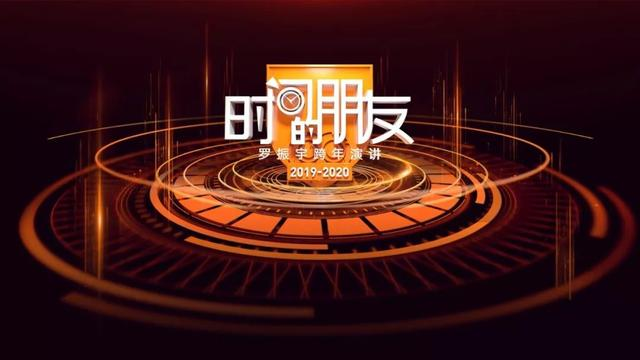

2019 年 12 月 31 日 20:30，上海东方体育中心，罗振宇“时间的朋友”跨年演讲如约而至。

罗胖曾发下大愿望：跨年演讲要连办二十年。今年是第五场，也是倒数第十六场。

今年的演讲主题是——基本盘。也就是不去看那些一惊一乍的标题，人云亦云的情绪，而是转过头，看手中的资源，脚下的道路。只有基于基本盘，才能看清我们自己的努力方向。

以下是跨年演讲精华版全文，与你分享。

## 第一部分：开场

### — 1 —

2019 年马上就要过去了。你的心中有没有一个特定的人，在这一年、在某一刻，曾经点亮了你？

我有。

此刻，我想向他致敬，贝聿铭先生。

2019 年 5 月 16 日，贝先生离开了这个世界，享年 102 岁。

他是一个在世上留下了很多座纪念碑的人。但是，你如果去读他的传记，会发现，几乎他的每一个建筑作品，在当时都面临责难和挑剔，都是历经千难万险才来到世间。

曾经有人问他：你怎么看待外界对你的挑剔？

贝聿铭对此的回答是：“我从来没有考虑过这些问题，因为我一直沉浸在如何解决自己的问题中。”

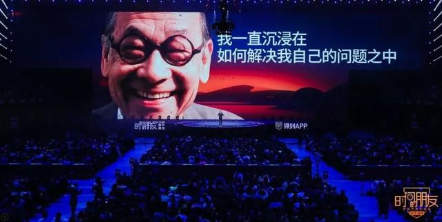

你，我，每个人都会有过这样的“贝聿铭时刻”。不论你做过什么、在做什么，你都会遇到形形色色的挑战。怎么办呢？贝先生的这句话是我听过的最好答案。

### — 2 —

那么，这一次，我们解决什么问题呢？

经济学家何帆会回答，我们的经济基本盘是什么？

投资人黄海会回答，我们的消费市场有什么新机会？

金融学家香帅会回答，我们要挣钱，钱从哪里来？

教育专家沈祖芸会回答，我们每个家庭最焦虑的教育问题，在发生什么变化？

科技产业专家王煜全会回答，中国的科技创新被美国卡住脖子了吗？

国际政治学家施展会回答，中国制造世界工厂的地位会被替代吗？

我非常荣幸地能够代表他们发布他们的研究成果。

### — 3 —

说到解决问题，不妨先说一个我的问题：搞清楚跨年演讲是为谁服务的。

去年，我们讲了一个词，叫“做事的人”。后来，我遇到好多人，都说对这个词特别有认同感。但是，我觉得好像还是很模糊，应该更具体才是。

用两件事来描述，可能更清楚。

第一件事，是关于图书馆的。公共图书馆有一个责任，就是为市民举办各种各样的文化类活动。

2019 年，我听到一个数，说有一家地级市的图书馆，才 100 多名工作人员，一年办了 5000 场活动。这个数给我惊到了。什么概念？你算下来，平均一天比 13 场还多。这家图书馆就是浙江嘉兴图书馆。

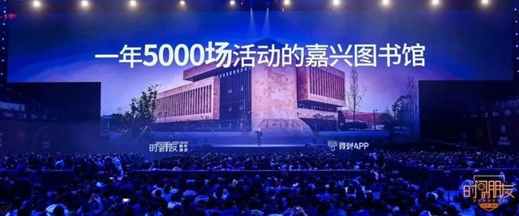

图书馆，这个东西好像已经很多年不在我们视野里了。在我们心目中，它应该是一个冷清的地方。嘉兴图书馆为什么这么热闹？5000 场活动都干了啥？

我们自己可以先在脑子里想想，比如针对老年人，你要是办活动，你能想到的题目是啥？琴棋书画？养生保健？你看，想象力差了点吧。因为在很多人心目中，老年人是退出了社会参与的一群人，找个乐子，打发时间，安度晚年就行了。

但是嘉兴图书馆可不是想，他们是真干。一干就知道，根本就不是这么回事。

首先，很少有老年人愿意报名参加一个带“老年”字样的活动。更重要的是，老年人恰恰需要的是社会参与。所以，他们为老年人开发的讲座活动是：怎么用智能手机？学会了智能手机，就可以查公交线路、淘宝购物，甚至自己上淘宝卖货了。

最受欢迎的讲座，你可能想不到，是怎么做电子相册。拍照片，选照片，配音乐，上字幕，发到微信群里，做完特别有成就感。这是老年人力所能及的一项创造性活动。请注意，重点是“创造性”。这既是这家图书馆对老年人发自内心的尊重，也是自己所要承担的社会责任的一种高级的理解。

你看，就是这样通过在真实世界的摸索，嘉兴图书馆一年办出了 5000 场活动。

什么叫“做事的人”？他们不是在解决一个个想象中的问题，他们是在回应一个个真实世界的挑战。

### — 4 —

如果我认同这个理念，到底怎样回应真实世界的挑战呢？

今年，我偶然翻到曾国藩讲的一个故事。农村里，有个人出门，看到在一条很窄的田埂上，俩人顶上了，谁也不让谁，谁也过不去。为什么不让呢？因为俩人都挑着很沉的担子，路太窄了，谁要让，谁就得从田埂上下去，站到水田里，沾一脚泥。

你作为一个旁观者，想上去劝，咋劝呢？谁也不服气啊。

那曾国藩的故事里，这个旁观者是怎么做的呢？

他走上前去说，来来来，我下到田里，你把担子交给我，我替你挑会儿，你一侧身，不就过去了吗？

你看，只要你的身份稍稍转换一下，从一个旁观者，变成一个置身其中的人，把自己放进去，是不是一个看似无解的事，就有了答案？

曾国藩管这种方法叫：躬身入局。

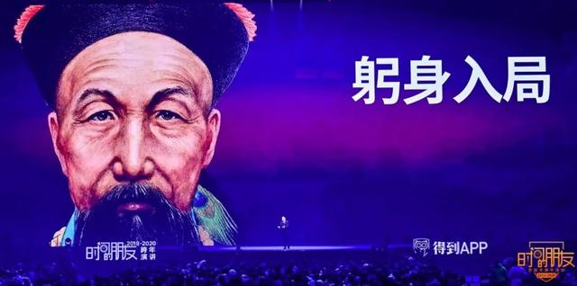

什么叫“做事的人”？不是置身事外，指点江山。而是躬身入局，把自己放进去，把自己变成解决问题的关键变量。

### — 5 —

但是，用“做事的人”来形容你们，还是觉得有点不到位。我得找到一个新词。

有一天我的同事，得到大学的教研长蔡钰给我讲了一部老电影《风声》里的一句台词：“只因民族已到存亡之际，我辈只能奋不顾身。”

她记了这句话十年，只因为其中那个词——“我辈”。她说：我辈这两个字里，写着对世界的主场感和建设性。无论哪个时代，我辈都是最令人神往的那群人。

“我辈”只是个代词，本来没啥意义，但是每个人都能感受到，这两个字里面有一种骄傲的认同感。

直面挑战，躬身入局，皆为我辈中人。

你不要以为这是我的发明，我辈这种人，什么时候开始有的？从我们这个民族精神发源的地方，我辈这种人就有了。

西方经常说，我们中国人没有信仰。但是，中国人没有信仰么？今年我看到一段话，如果你把中国那些最著名的神话，真的排出来，你会发现这样一组故事：盘古开天，女娲补天，后羿射日，夸父追日，精卫填海，愚公移山，大禹治水。

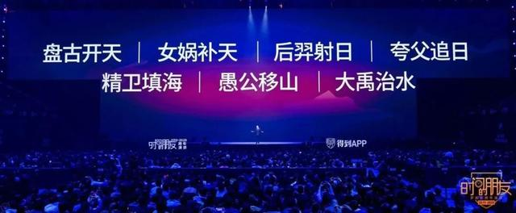

你发现什么共同点么？中国人从来不臣服于压倒性的力量，而是在面对一个不可能战胜的对手的时候，明知不可为而为之。

跨年演讲为谁服务？就是为这样的人服务的。

法国作家加缪曾经说过：不要走在我后面，因为我可能不会引路。不要走在我前面，因为我可能不会跟随。请走在我的身边，做我的朋友。

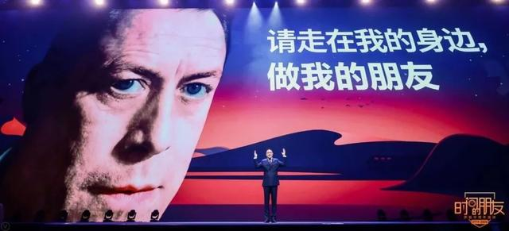

请走在我的身边，谢谢你，各位时间的朋友。

## 第二部分：什么是中国经济的基本盘？

### — 1 —

此时你心中一定有一个问题：中国经济到底怎么样？

你要是问我预测，我是真不会，那是经济学家的工作。

你要问我个人感受，可能我 20 年都这一句话：我辈正处于一个持续上升的通道中。

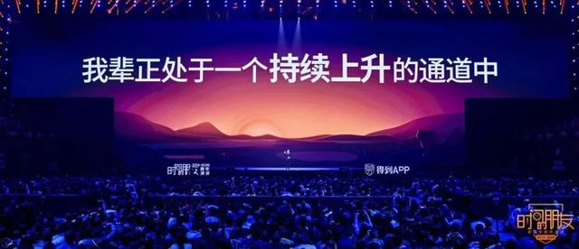

经济不是预测出来的，是干出来的。如果你觉得好，不错；如果觉得不好，那就努力干。

更重要的是，观察 2019 年中国经济的角度不仅是好和坏、乐观还是悲观，还有好多角度。

比如，曾鸣教授说：“容易赚的钱肯定是没了，往后大家都得做更辛苦的事。”

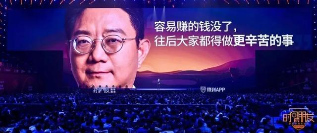

关于更辛苦的事，曾鸣教授还有进一步的解释：你别以为到下沉市场就算更辛苦了，也别以为找细分需求就算更辛苦了，这都不算。真正的机会是，改造每一个值得被重构的传统产业，这才是一件具备创造力的“苦差事”。

你看，在曾鸣教授的眼里，中国经济有冷有热，不是个总体上的好坏问题，而是一个干什么事和怎么干的问题。肯干苦差事就有机会，只想挣容易的钱，就没机会。

慈善家王兵提醒了我一个角度，2019 年的经济现象，背后本质上是因为技术进步的速度太快，而社会演化的速度太慢，这二者之间产生了摩擦。

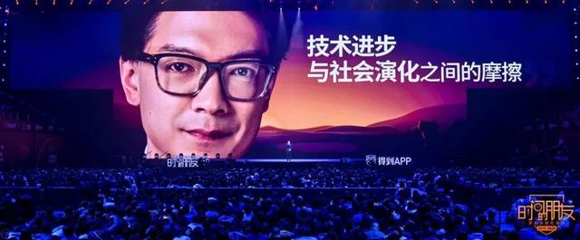

比如说，很多人年到半百还要闹离婚，为啥？因为医学技术进步了，百岁人生可能成为常态，一对夫妻五六十还闹离婚很正常，原来忍忍就结束了，现在还要再忍五六十年，忍不了了。你看他说的是时代错位问题，不是悲观乐观问题。

再比如，商业观察家梁宁说，有人给她看了一份 100 多个陷入困境的公司清单，她发现了一个问题：每个陷入困境的公司，同行里都有对应的正面典型。

做保健酒的椰岛鹿龟酒陷入困境，但是主打健康概念的食品开始爆发。

做饮料的汇源果汁陷入了困境，但是一批年轻态的饮品，开始异军突起。

都说服装不行，李宁变成了中国李宁，火了，成了国潮。

梁宁说背后的原因是市场人口换代了。你知道吗？现在生活在中国这片国土上的人，改革开放后出生的人，超过了之前的。

你看，她说的是人口结构问题，也不是总体上的好和坏、悲观乐观的问题。

而吴伯凡老师面对我的这个问题，给出的答案更有趣，他甩了一句话给我：2019 年就是典型的“悖论之年”，好坏都有，同时并行。

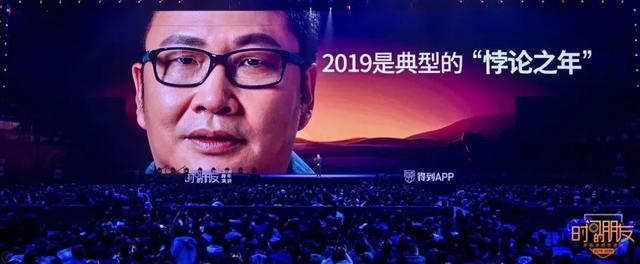

投资人张颖提示了一个角度，我觉得也很有意思。

张颖今年下半年有段时间，天天组织人看电影，连拉带拽，动员所有创业者，都去看一部纪录片——《徒手攀岩》。

张颖为什么这么积极地拉人看这部纪录片呢？他是一个投资人，他其实在跟这个时代的创业者说：徒手攀岩的过程不是克服困难，而是习惯困难。

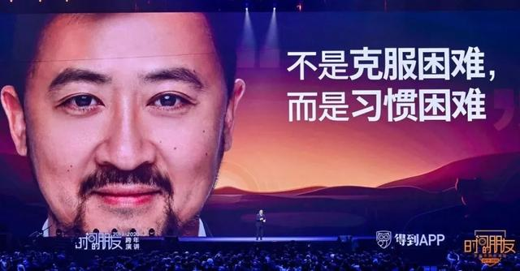

我理解，张颖还有另外一个意思，就是中国经济到了一个节点，就是从一个模式要转换到另一个模式，我称之为：从电梯模式切换为攀岩模式。

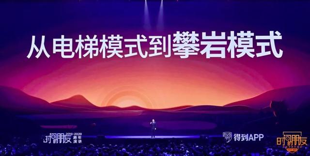

什么意思？所谓电梯指的就是，那些稳定的、确切的通道。过去我们理解这个世界的方式，只要搭上电梯，就能往上走，而且非常确定：好好学习，就能考上好大学；学历越高，就越能进好单位；进了好单位，就肯定比卖口红的挣钱多，今年这话，你在李佳琦面前再说说试试？

现在的中国已经切换到攀岩模式，下一步往哪里爬，每一步都在考验我们的创造力和选择能力。

### — 2 —

刚才我们讲的这几位老师的看法，没有一个用“好”或者“不好”这个简单的方法来判断中国。

接下来我们就开启何帆老师带回的这份报告：《何帆中国经济报告》。他是我们派出去的六路研究队伍中的第一队。他们走访了 40 多座城市，数十个产业，采访近 300 人。看看支撑我们中国经济走到今天的基本盘到底是什么？在这个基本盘上，我们又该怎么行动?

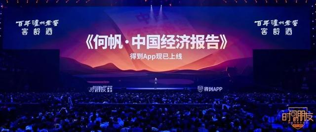

何帆老师给我一个启示：在这个时代的中国，从电梯模式切换到攀岩模式，其实没有我们想象的那么难。

提到中国经济的基本盘，我们首先会想到——

极其完备的基础设施、全球最大的供应链体系、世界最大的统一市场、从未中断的文明共识，当然，这一切都离不开国家超强的社会组织能力。

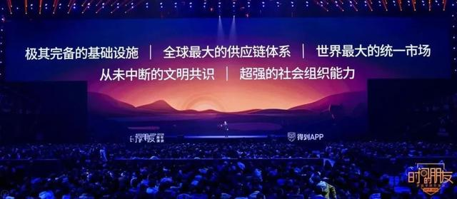

所有这些其实就一件事：超大规模。理解中国经济基本盘，必须把超大规模作为前提。但我们就停留在这么？肯定不行啊。我们还得往深了想。

超大规模仅仅意味着大、多么？不，它还意味着另外一件事：复杂。复杂意味着什么？就像在攀岩的时候，地形越复杂，抓手就越多，向上攀援越容易。

我们来看看复杂性是怎么成就中国这一代人的。

### — 3 —

我们这一代人大多数是从农村来到城市，从小地方来到大地方，很少有谁一步到位。但是每走一步，这个社会都能给我们提供落脚点和抓手——就像攀岩的岩壁上充满了抓手和歇脚的地方。

你就想，今天一个农村男孩来到上海打拼，没学历、没技术，当个快递员总还是可以的，人老实肯干，大几千的收入还是有的，这不就待下了么？然后站在这个点上往下一步进发，能学个手艺、入个行当吗？能好好干，当上主管吗？

这个人大家认识么？杀猪的。

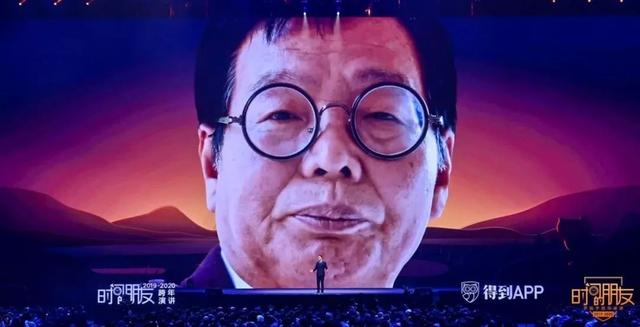

不认识也很正常，因为他上一次火还是 16 年前。媒体上称他为：北大屠夫，陆步轩。媒体报道他，就是因为大家惊讶地发现，一个北大中文系的高才生，居然沦落到卖猪肉。

我们可以回到当时的情景，对于这个人的处境最善意的理解也就是：行行都一样，不分高低贵贱。你是不是觉得，一个卖猪肉的，也就只能那样了。

但是这两年，他又火了，因为他卖猪肉干大了，成了一名卖猪肉的企业家。根据媒体报道，2018 年他们公司，销售收入有 18 个亿。

你看他前半辈子，从边远的农村，考上了北大中文系，在当年就算是坐上电梯了吧？不好使啊。没找着合适的工作。就耗着么？没有啊。从电梯里出来，哪怕上菜市场卖肉，也有机会。这就是最后一站了吗？也不是。还可以继续往前走，把卖肉的摊子发展成为一个正规的企业。当上企业家，就可以享受了吗？还是没有啊。你知道他现在在干什么吗？在抖音上当网红呢，跟现在的年轻人聊聊猪肉，聊聊人生，发一条短视频就有好几十万人点赞。

无论你从哪个角度看，陆步轩的故事在中国都非常常见。

你看一个人的一生，哪里是一个简单的标签、一部直达的电梯就能解释的，复杂得很呢。这就是我们中国社会复杂性所带来的各种各样的抓手。

当然我知道，我一讲陆步轩，就有人说那他是赶上了创业大潮，又赶上了猪肉涨价，是个幸存者偏差。那我们看一下 30 年前，可能和他一起在北大食堂打过饭的那些人吧：

张益唐，世界著名数学家；

李彦宏，百度公司的创始人；

西川，著名诗人；

陈涌海，物理学家；

郁亮，万科集团董事长；

宣明栋，得到 App 总编室主任。

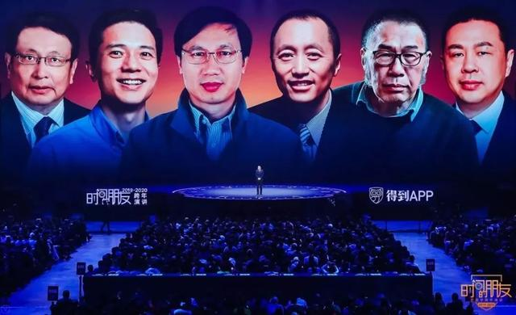

那你要非得说，他是北大毕业生才享受了一些好处，一般人没这机会，你再看看这几位：

米雯娟，VIPKID 的创始人，没上过大学；

张勇，海底捞的创始人，没上过大学；

李想，车和家的创始人，没上过大学；

黄章，魅族的创始人，没上过大学；

还有这位，国民女神，老干妈的创始人陶华碧女士。众所周知，基本上就没上过什么学。

这就是中国，无论你身处哪个位置，你都不能说自己没有机会。

什么是好的时代？就是走在街上，我们不敢小瞧任何一个人。

### — 4 —

其实不光是个人，我们再来看一座小镇的故事。这座小镇就是乌镇。

乌镇有个有意思的地方。它分东栅和西栅。

东栅是原生的自然市场，和上海周边很多的古镇一样，家家户户搞旅游：开客栈、办餐厅、卖特产，今天尝试个这，明天尝试个那，充满了活力和烟火气。

而西栅呢，把原住民迁出去，雇佣成员工，统一规划，整体升级。举办互联网大会的地方是西栅，去过的朋友都知道，门外是江南水乡，门内是 Wi-Fi、大床。

东栅全是自家生意，充满了能动性和灵活，什么容易赚钱，游客喜欢什么，东栅最容易嗅到风向，动作最快。但同时天花板也明显，商品服务同质化，追求短期效应。

所以，如果没有西栅陡然提升了这个古镇旅游服务的基础设施，秩序和标准。你看到的乌镇就是中国无数此类景区的一个，一样的小桥流水，一样的旅游纪念品，不会是今天这个脱颖而出的古镇旅游的旗舰。

你不觉得吗？乌镇就是中国的某种缩影，有人在前面探路，自由自在，但也承担代价，有人在后面修路，把探路出来的成果，固化为基础设施。

不断地寻找抓手，走一步，踩实一步，再寻觅下一个抓手。一步一步地往上走。这整个过程，不也是在徒手攀岩么？

你回到观念世界，始终有这样的争论——自由市场好还是强管理强规划好，但是在现实世界里其实没有这种矛盾，躬身入局，其义自现。

熟悉中国改革开放的人都知道，浦东、深圳都是这样出来的，始终都有探路的、有修路的。

美国著名畅销书作家纳西姆·塔勒布说：世界上有两种人，一种想赢，一种想赢得辩论。每当我们陷入纠结的时候，就想想乌镇。在乌镇外的人还在为两种模式哪个好搞辩论时，乌镇则早已开干，管他呢，反正乌镇真想赢。

### — 5 —

你看，有这种复杂性的国家，当然就能出现一种新的成功模式，何帆老师称之为：在复杂环境里的演化算法。

而生物学家王立铭教授说：对啊，演化算法是地球上唯一可靠的成功学。

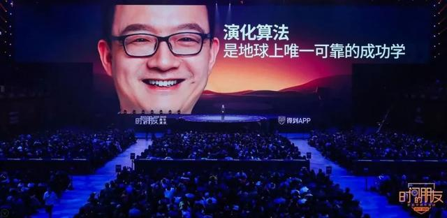

我们面对这么一个岩壁，有那么多抓手，面对中国的复杂性的时候，我辈应该采取的姿势是什么？

何帆老师在最新的报告中提出了一个词：苟且红利。意思是虽然看起来所有人都在做事，但是其中有大量的苟且者。你只要稍微比他们往前一点点，就能享受到的那个红利，就是苟且红利。

我们稍有成就的人，可以扪心自问，我们的那些成就真的是因为天赋异禀么？不是，是因为我们在某些时刻，比别人稍微认真了一丢丢，这就足够了。在攀岩时代的中国，咱们比周边人认真一丢丢，这就足够了。别人的苟且，成就了我们的努力。所以苟且红利准确来说，应该是不苟且红利。

我给你举个例子：

前几天，我打了辆专车。估计很多人都打过。下车的时候，司机都会要你给个好评。因为五星好评对司机很重要，能被优先派单。很多人没给，往往是因为下车的时候，忙忙叨叨给忘了。而那天我见的那位司机呢，你看他这一通操作：

首先，离我们家还有二三百米的时候，他非常有礼貌地和我说，我提前给你结束行程，少收你点钱。听到这句话，你肯定觉得，占便宜了。

我正要说谢谢呢，紧接着，这位司机就和我说了一句话，麻烦您，如果您方便的话，能不能给我点一个五星好评？

你看，这话一出口，我人还在车上，正好还有空，刚占了人一便宜，不点还是人吗？

就这么一个简单动作，我心里对他顿生敬意。我就坐他这一回车，都没跟他聊过天，但我心里知道，这人对他的工作不苟且，同行业面对的共同问题，他会想一个办法解决它，这样的人一定在这一行里出类拔萃，收入一定高。哪怕将来改个行，他照样有前途。

我们是不是从小到大，走南闯北，到处能够遇到这样的人？这就是我们的中国。每个人都能找到自己的着力点。往旁边看一看，迈出这么一小步，这就是你向上攀岩的着力点。

我知道说到这里，你还不过瘾，你老想找何帆老师要个答案，要个对未来的预测。

但是就像互联网思想家尼葛洛庞帝那句话所说的：预测未来的最好办法，就是把它创造出来。

## 第三部分：消费市场有什么新机会？

### — 1 —

刚才我们说到，中国像一个攀岩胜地，到处都有抓手，可以让我们向上攀爬。但是，机会到底在哪呢？

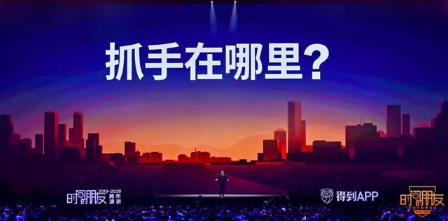

以前总是忙着赶新风口，我们就容易忽略一个非常确定的机会：消费。你想，不管什么时候，老百姓总要追求更美好的生活嘛。

2019 年发生了一件事，今年中国社会消费品零售总额将超过 40 万亿人民币。这意味着从今年开始，中国会超过美国，成为全球第一大消费市场。而且中国现在的年均增速，比美国快得多。也就是说，从 2019 年开始，我们的消费能力不仅会向全世界最强迈进，而且还会越来越强。

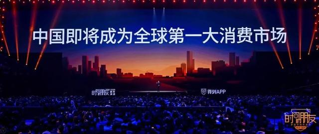

投资人李丰还提醒我：我们不光是消费能力强，供给能力也强，我们拥有全世界最大最完整的供应链，不光需求供给都强，我们的效率提升还非常快。我们在以人工智能和大数据为代表的，新一代技术的应用和转化速度也是首屈一指的。

你看，最大的供给，最大的需求，最快的效率提升，这三个变量同时集中在一个国家、一个市场，这在人类历史上是极其罕见。会发生什么呢？结果一定会超出我们的预想。

### — 2 —

所以，投资人黄海在看了 1000 多个消费项目之后，带回了一份关于中国消费市场的调查报告：《中国消费产业报告》。

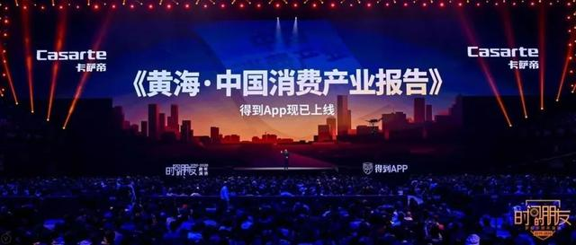

黄海老师下了一个判断：中国消费市场正在多点爆发。

网红带货、盲盒、潮牌，好多现象大家可能已经看到了，那么这个消费市场，和我们每个人有什么关系？有哪些抓手是可以帮助每一个人往上爬的？

至少有三个巨大的机会：

第一，新基础设施。

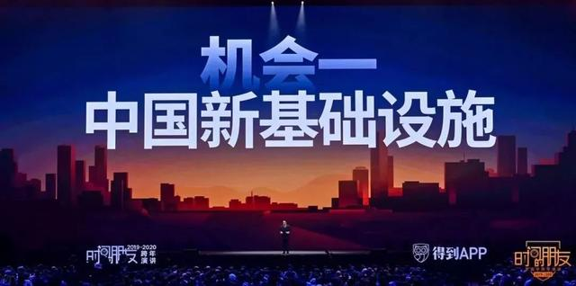

咱们从一个现象说起。

今年的天猫彩妆品牌冠军是谁呢？完美日记，一个全新的中国品牌。

更有意思的点是天猫彩妆前三名的历史：巴黎欧莱雅 112 年，雅诗兰黛 73 年，而完美日记只有 2 年。

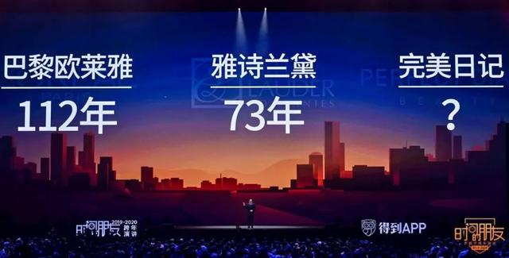

如果倒转十年前，做一个新品牌，干个实业，2 年，你连工厂投产都不可能。更别说，做品牌、通渠道、上规模，那都是需要花时间才能熬出来的事。为什么完美日记只花 2 年时间就能当第一呢？

因为它很好地借助了中国新基础设施。

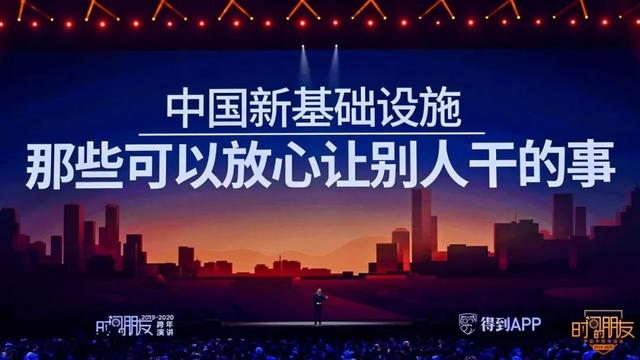

基础设施指的不仅仅是铁路、公路和机场。它指的是一个创新者可以放心甩出去，让别人干的所有事。

我们还是拿中国化妆品来举例子。在今天中国的市场上，你要想做一个新的化妆品品牌，很多事你不用自己做了。你只需要做好一件事：定义好你的那个不可外包的核心能力。比如，洞察用户、连接用户、把用户服务好，剩下的所有研发设计、制造、物流、营销平台，都有现成的基础设施为你提供全套解决方案。

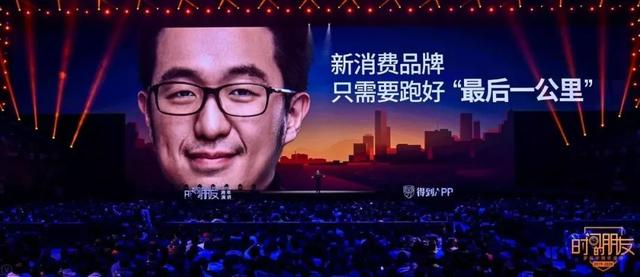

我们再看一眼中国的新基础设施——

假如我有个靠谱的方案，这个方案怎么变成货呢？中国庞大的制造业实力是我的后盾。

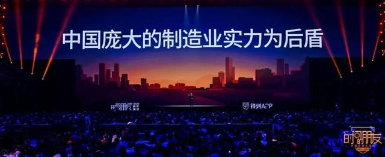

有了货，货在哪儿卖？中国强大的电商平台就是我的基础设施，通过它，我可以触达 8 亿用户。

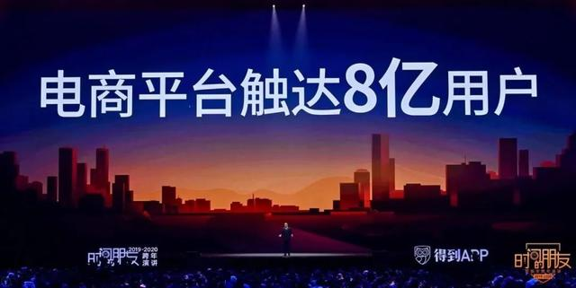

电商争气，这事就完了吗？电商平台的下面是发达的物流体系。1 美金的平均快递成本就可以通运全国。这事在全世界都是奇迹。

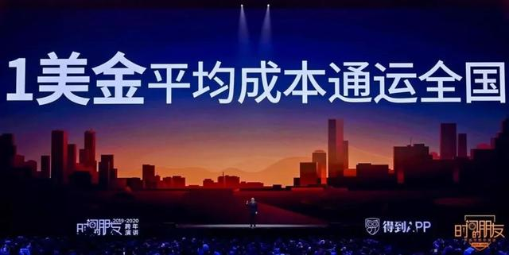

那再往下看呢？中国物流的下面，是持续几十年没有间断的村村通工程的结果。在这么大范围的国土上，每一个村子都要做到通电、通路、通网络。

你知道吗？在一些边远地区，仅仅为了实现通电目标，每户的投资平均是 4 万块钱，要是靠收电费的话要 100 年都收不回成本。

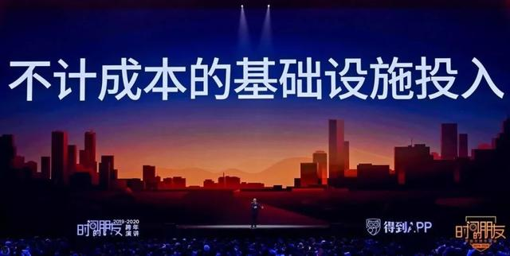

有了这些基础设施，哪怕你身处在一个偏远的农村，只要你懂需求、会表达、能沟通。你都可以把这些基础设施利用起来，成为你自己的抓手。把茄子辣椒西红柿卖出个花来。就地致富，就地崛起。

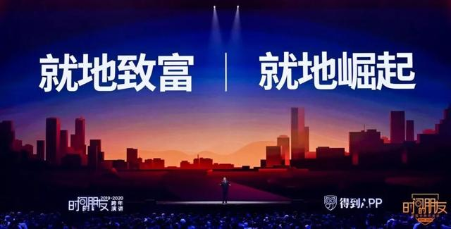

所以，当我们乐呵地在抖音和快手上看农村小哥带货、卖当地土特产的时候，你只要抽身一看，看到的是一个全球唯一的、一层一层累加的、规模、深度、复杂性都极其恐怖的新基础设施体系。
