# 吴晓波：预见 2021（跨年演讲全文）

面向 2021 年，我们仍然要以一颗勇敢的心，使出全部的力量往前冲，不要回头，如此一来，我们将看到原本看不到的东西。

演讲 / 吴晓波

今年 4 月 8 日武汉解封以后我开始走出书房，算下来，到今天走访了 68 家企业，今年居然是我这些年走访企业最多的一个年份。

我是 1990 年参加工作的，30 年了。30 年前我是一个记者，今天我还是一个记者，观察中国产业经济最好的办法是用脚行走、用眼观察、用心思考、用笔把它记录下来。

今年走访的 68 家企业中，有互联网公司、科技公司、金融公司，也有十多年没有涉足的钢铁厂。我到了内蒙古的牧场，到了纺织公司、橱柜公司、鞋革公司等很多企业。走访的过程，也是中国经济慢慢开始复苏、走出恐惧的过程。

我们看到在 2020 年，巨石崩裂之时，有人看见了恐惧，有人看见了光。

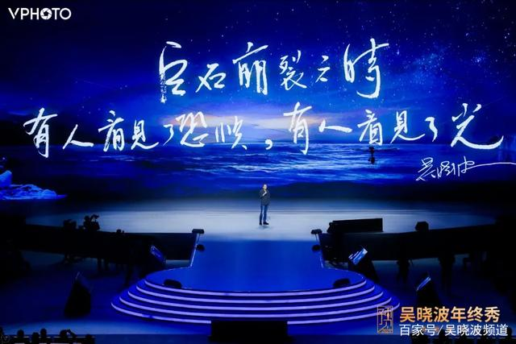

我记得在南通一家零部件工厂做调研的时候，接到团队的电话：“吴老师，我们正在讨论 2020 年年终秀的主题，你有什么建议吗？”

我当时脱口而出，以“勇敢者”作为主题吧，后来就有了今年年终秀的主题《勇敢者的心》。

我们致敬 2020 年所有的勇敢者。

汤因比在《历史研究》中说：“创造是一种遭遇的结果，文明总是在异常困难、而非异常优越的环境中降生。挑战越大，刺激越大。”

人类文明几乎所有的发展都符合“汤因比原则”，中国 42 年改革开放的发展亦然。我们是在极端困难的环境下接受挑战，然后完成了一次全新的创造。

一年前，2019 年 12 月 30 日，也是在这个舞台，我们曾经做过对 2020 年的几项预测，现在我们回头看看是否应验。

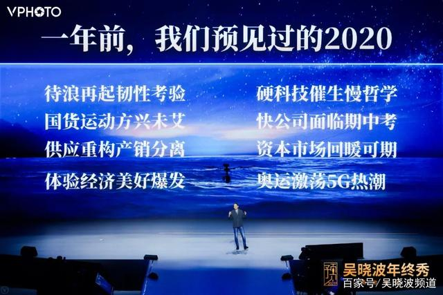

我们当时认为 2020 年的经济在 2018 年四季度下行以后可能会面临一个比较困难的状况，所以我们当时说“待浪再起，韧性考验”，中国经济会面临一次忍耐力的巨大考验。

在消费品市场，我们认为“国货运动，方兴未艾”。越来越多的企业会愿意投入到国产品牌的创造中，越来越多的消费者愿意为国货买单，而这次创造跟 1980 年代那次中国商品复兴最大的区别是“供应重构，产销分离”。

创新的曲线变得越来越陡峭，创新的可能性和品类爆发的能力越来越强，同时“体验经济，美好爆发”。中国从 2019 年到今年，是一个过剩的市场，什么东西都过剩。老百姓为什么买单呢？不再为必需品，他们为自己的美好生活体验买单。

我们看到从去年 7 月科创板开板以后，中国创业市场的野蛮发展阶段彻底结束了，“硬科技”会成为下一个创业浪潮的新主流。“唯快不败”的原则可能会慢慢被放弃，我们会呼唤一种“慢哲学”，同时那些“快公司”会面临考验。

因为整个产业经济的下行，所以货币政策会相对宽松。钱去哪里呢？当中央政府确定“房住不炒”的原则，钱可能钻入另一个大池子，就是资本市场。我们去年说资本市场、A 股市场、权益类市场在 2020 年可能会爆发。

各位如果去年参加过我们的年终秀，听从了我们的建议，在 2020 年购买了一些权益性资产，比如购买了股票型基金、混合型基金、指数型基金，等到会议结束以后记得给我们发一个红包。

我们当时的第八个预见是“奥运激荡，5G 热潮”，认为今年可能会是“运动大年”。但是新冠疫情暴发以后，我们看到 2020 年几乎所有重要的赛事都没有办法正常举办，这是一个完全落空的景象。

我们当时没有看到“新基建”“双循环”这些概念的提出，因为所有在 2020 年出现的制度创新、个体创新，都是在“汤因比原则”下对危机所做出的反应。

今年，我们还是像往年一样，做了一个常规动作：邀请 50 位经济学者，让他们从自己的角度对 2021 年进行预判。

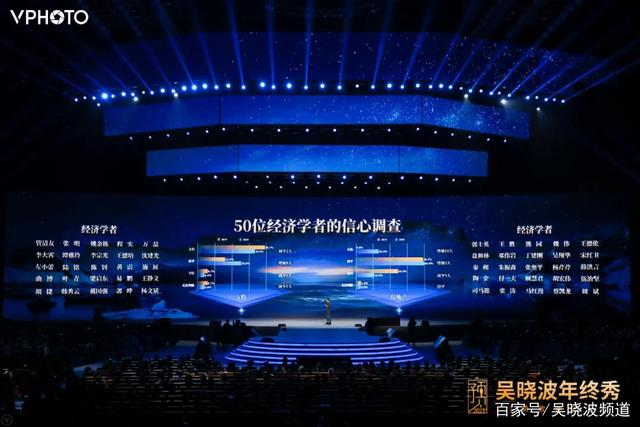

在 2019 年的时候，50 个学者中只有几个人看好 2020 年的中国经济。今年增加到多少呢？有 44 人认为 2021 年宏观经济向好。

在中美贸易摩擦部分，选择“对抗会趋缓”的人数增加，判断“达成协议”的人数在下降。所以拜登上任以后，中美贸易摩擦会以另一种方式来进行，但 2021 年肯定不是中美贸易摩擦的终结之年。

对于 A 股市场，大家的意见还是挺统一的，认为 2021 年的 A 股市场仍然值得期待，上行和持平的选择量都很大。

对于房地产市场，大部分学者认为处在持平的状态。而认为房地产很有可能复苏的人，比去年增加了 10 人。

在所有的观察中分歧最大的是全球化。全球化三个选项的比重接近，无论认为向好的、持平的或者认为恶化没有信心的人数都相差不多。这说明全球化受到了两个不可测因素的干扰。一是新冠疫情到底会如何发展；二是中美的贸易关系在 2021 年会呈现出怎样的局面。

以上是 50 位经济学者在不久前对 2021 年作出的预测。

我们需要在一个如此不确定性的年份中寻找其中的确定性。确定性在哪里？确定性在基本面。

中国产业经济发展到今天，基本面是什么？有新冠疫情它会发生，没有新冠疫情也会发生的基本面要素是什么？

我觉得 2021 年，中国产业经济的“三班车”一定会继续往前开。

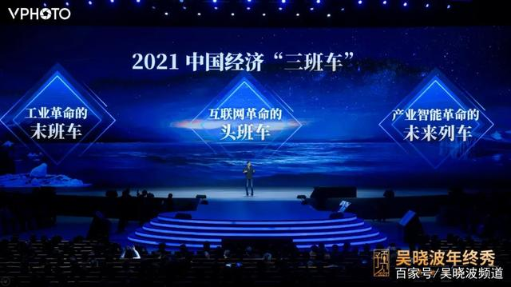

第一班是工业革命的“末班车”。

1978 年改革开放初期，我国是短缺经济的状态。到了 2009 年，中国汽车销量超过美国，2010 年中国制造业增加值超过了美国。今天中国成了过剩经济，我们因为过剩而进行产业转型升级。

如今，中国是全球最大的制造业国家，2020 年很幸运地看到，中国的供应链经受住了极大的压力测试，我们赶上了工业革命的“末班车”。

第二班是互联网革命“头班车”。

中国很多著名的互联网公司，新浪、搜狐、网易、腾讯、百度、阿里、携程、京东、盛大，全部诞生在 1996 年的二季度到 1999 年的四季度。那个时候也正是互联网走出硅谷开始商业化应用的全球化时期。

在互联网革命的前十年 PC 时代，我们成为硅谷的追随着，2011 年以后的移动互联网时代，中国产生了无数的商业模式创新。

24 年来，中国成为了被互联网改变得最为彻底的国家。

今天到场的人，口袋里有超过 500 元现金的举手告诉我。因为支付场景和方式转移，中国在消费互联网时代完成了一次巨大的革命，我们赶上了互联网革命的“头班车”。

再接着中国的产业经济要走向产业智能革命的未来列车，就是会通过新硬件革命、新材料革命、大数据革命，形成工业革命和互联网革命的一次巨大融合。用互联网的技术改造中国社会和企业的每一个细胞，所以我们每个人、每家企业都正在踏上这班通往未来的产业智能革命的列车上。

各位同学，无论新冠疫情如何发展，无论中美贸易摩擦激化或趋缓，这三列车通往明天的方向和轨道并不会发生任何变化。

我们在剧变中寻找那些确定性，就是建立在对中国产业经济的基本面的判断下。

在 2021 年，我认为可能发生的一些现象和趋势。

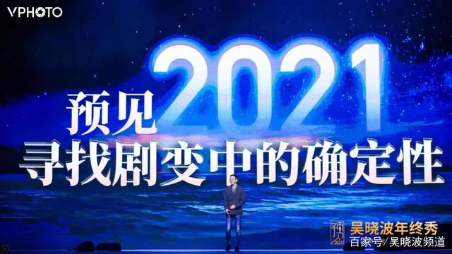

预见 2021 的八大预测

01、进口替代科创热潮

“进口替代”一词在中国产业界并不陌生，甚至可以说中国 42 年的产业变革发展就是一部进口替代史。

在 1980 年代，中国的制造业怎么发展起来的？有两句话：以市场换技术，以时间换空间。

我们引进一条德国的生产线，允许在中国卖比德国还贵的汽车，给予超国民待遇，在税收上“两免三减半”，但希望这个汽车的零部件能够逐渐完成国产化的替代。十年之内要完成 97%的替代，完成不了的话，中方的总经理全部撤职。

用市场换技术，用时间换空间，用这种方式让这个国家成为了全球第一制造业大国。

1996 年代开始的互联网时代也是一次进口替代。很多互联网公司都说“模仿是最好的创新”，当我开始模仿，把技术和商业模式拿到中国以后水土不服，就要小步迭代、试错快跑，最后完成替代。

今天进入了通往未来的产业智能革命的“未来列车”，我们仍然要完成一次进口替代，我们发觉 40 多年到今天，接下来要完成的任务比过去艰难得多。

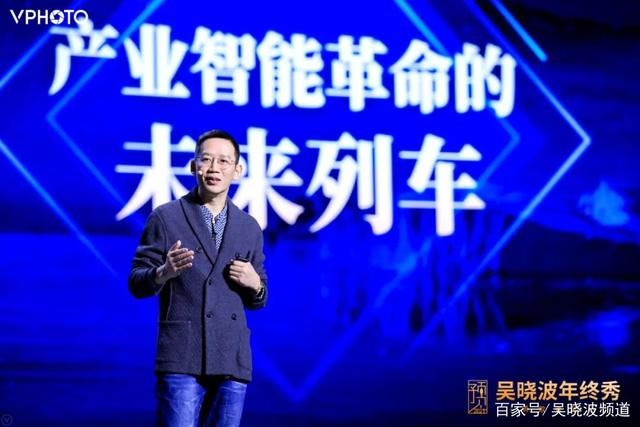

我们不再是那个传统意义上的发展中国家，不再是被援助的国家，我们成为了全球第二大经济体。所以这次产业智能的变革是一张明牌。在众目睽睽之下，欧美对中国崛起抱着极大的警惕，甚至认为你是敌手。

在此背景下，我们会看到这一轮的进口替代出现了一些全新的特征，比如从引进型替代进入到自主型替代，从应用型研发到基础型研发，从数量型扩张到质量型增长。

第一次和第二次替代非常像物理变化的过程，但到了第三次替代，就是一次化学反应，需要我们有更大的忍耐力、更大的投入、更长远的视野和更大的耐心来完成这一次的进口替代。

中国制造有“阿喀琉斯之踵”。

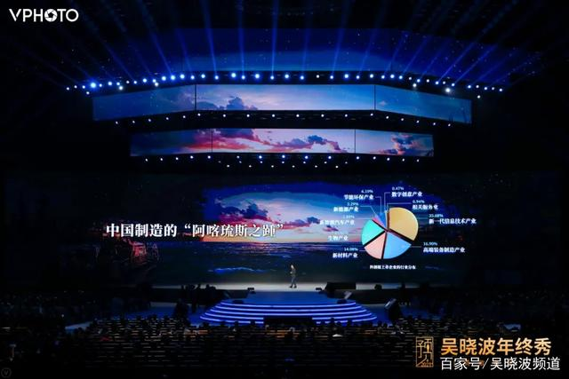

我们常常说生产不出芯片，生产不出民用飞机的发动机，我总认为打火机这件事情我们能搞定。今年我去了一家打火机企业，一次性打火机，28 个零部件，浙江慈溪的老板跟我说，“吴老师，实在抱歉，让打火机的火苗保持在恒定的高度，需要一个垫片。这个垫片到今天还来自日本。”

那顿饭吃得实在心塞，中国制造确实存在很多“阿喀琉斯之踵”。

怎么办？需要我们下一代、再下一代企业家把它生产出来。

去年 7 月，科创板开板以后到今天有 200 多家企业，这些是在硬科技领域里面解决中国未来“阿喀琉斯之踵”的企业。信息技术产业、高端装备制造产业、新材料产业和生物产业的比例超过了 87%。

今年 4 月，国家公布北京、上海、深圳、合肥是中国四大科学中心，承担着不同的科技研发方向。合肥有核聚变、环境科学、先进光源等；深圳有生命科学、空间科学、国家超算等；北京有环境科学、地球科学、空间科学等；上海有先进光源、类脑智能、生物科技等。

这些行业的每一个核心技术，都很难用市场换空间的方式获得，时间换空间也很难，“模仿是最好的创新”也失效了。

中国的创业市场、中国的产业经济到了最后的攻坚战阶段，我们可能需要花五年、十年、二十年，甚至更长的时间来完成中国这次的进口替代和科创硬科技的发展。

02、“云上中国”初露峥嵘

20 多年来，互联网对中国的产业经济构成了一轮又一轮的冲击。

1998、1999 年，互联网通过新闻门户、邮箱、搜索这些新的产品改变了人和信息的关系；2003 年有了淘宝，非典推动了中国零售电子商务的蓬勃发展，同时改变了人和商品的关系；2013 年有了 O2O，改变了人和服务的关系；2007 年有了互联网金融，改变了人和金融的关系；2016 年有人提出新零售，改变人和空间的关系。

从 1998 年的新闻门户到 2016 年的新零售都叫消费互联网。2016 年以后，互联网试图改变城市治理和城市运营，再接着通过传感器、大数据、云计算改变中国传统制造业的每个生产要素和运转模型，所以前五个阶段叫做消费互联网，从今往后的阶段叫做产业互联网。

今年我们和阿里云合作拍了一部纪录片《云上的中国》，为了拍这部片子我走访了很多地方，去内蒙古的草原牧场，到大凉山一家钢铁公司看它的“钢铁大脑”。

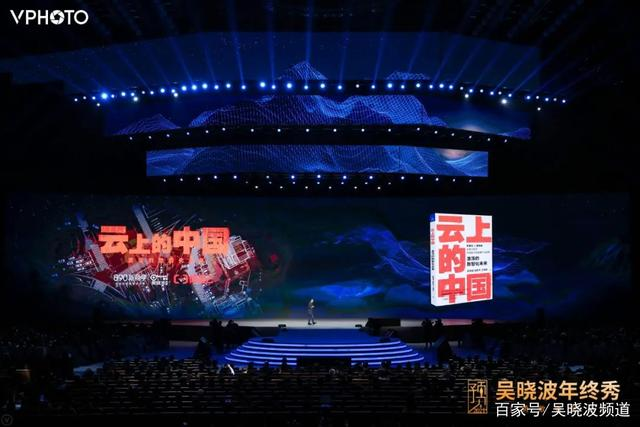

可以非常负责任地跟大家讲，在全世界的制造工厂和实体企业中，中国今天战斗在一线的这些企业家朋友，无论是做钢铁厂的，做服装厂的，还是蔬菜市场的，他们都是今天这个地球上最激进的产业智能化实践者。

今天到日本、德国、法国，哪怕到美国，都没有看到那么广泛的产业智能化的巨大实验。在这一点上，各位同学一定要对中国未来的产业智能化保持极大的信心。

我们看到了很多新的改造，比如城市大脑。

中国城市大脑的改造从 2016 年开始，它第一个改造的是十字路口的红绿灯。

有人讲过一句话，“全世界最远的距离不是从南极到北极，是从红绿灯到交通摄像头。”做城市大脑的第一件事情就是把它连起来，把这个数据放到后台，形成一个城市交通大脑。

全中国第一个干这个事情的是我的家乡杭州。2016 年杭州是全中国堵车排名第二的城市，把红绿灯和交通摄像头接起来以后，今天杭州市的拥堵排名下降到全国第 17 位。

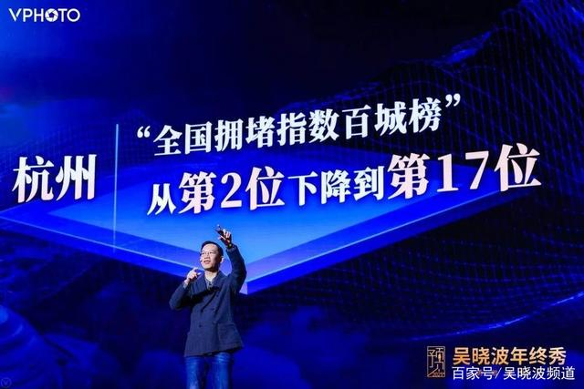

今年我到成都交通部门做调研，成都通过交通大脑把所有区域在移动的物体，比如公交车、出租车、网约车、共享单车的情况数据化，再把各个区域的交通数据反向共享给所有出租车司机们。就这么一个动作，让成都的出租车司机一个月多赚 600 元。

至于医院，有了城市大脑以后，不需要排队，在家里先上网预约，再去门诊。

中国在 2014 年以后，互联网基础设施能力的建设，在全世界所有城市建设中一定是非常领先的，我们看到“云上中国”的面貌正慢慢清晰。

金融大脑。在过去几年中，晚上最睡不着觉的人很大一部分是银行家。全世界的企业当中，曾经墙最厚、门槛最高、门口安两个石狮子的是谁？银行。过去以为它干一件事，叫锦上添花，它其实也会雪中送炭。

有一个词叫“信用”，什么是信用呢？你家里有多少钱。我把钱贷给你，你拿什么抵押，你有厂房吗，有生产设备吗，有房产证吗？有，把钱借给你，这叫信用。

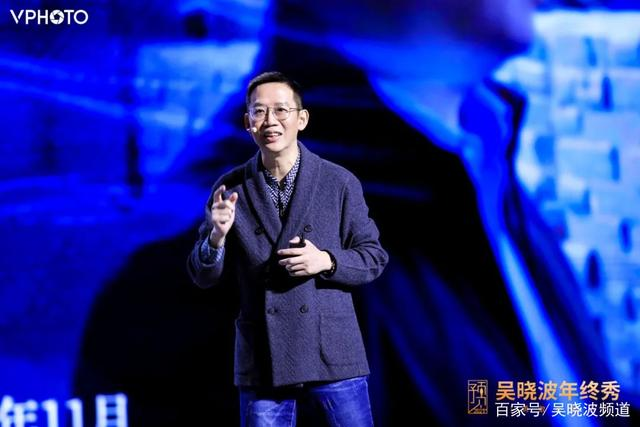

中国有几千万家企业，其中 90%是小微企业，这些小微企业中的 60%从来没有得到过银行的贷款。得到贷款的 60%是一年期的短贷，这是 2018 年以前中国金融市场的基本情况。

后来，出现了一些互联网银行，他们开始重新定义“信用”，一个企业的信用并不只是你有多少厂房、多少生产线、有没有房产可以抵押。还是什么呢？是现金流，是每天做多少生意、做多少业务。所以，业务本身构成了数据，形成了一种新的金融信用。

我在一些互联网银行做调研的时候，他们跟我说，“小业主的贷款信用，并不比大企业低。”

深圳的微众银行微业贷，这是国内首个线上无抵押的企业流动资金贷款产品。截至 2020 年 11 月，微业贷已服务了超过 170 万的企业法人，其中超过 60%的授信客户是首次获得银行企业贷款。

大数据对整个金融系统的改造已然深化。不仅仅是互联网银行、互联网金融公司形成了数据能力，很多传统的股份制银行甚至城商行都在建立自己的“金融大脑”。

所以，今天中国金融系统的云改造和智能化改造在全球范围内也是非常先进的。

我还去了十多年没有进过的一个钢铁公司。

今天中国最先进的钢铁厂，一家在广东的湛江，另外一家是在哪里呢？很奇怪，居然在中国最穷的大凉山深处，在西昌，叫西昌钢钒。我站在厂房中巨型钢炉面前的时候是很感慨的。原来如果出现这个场面，必有很多汗流浃背的炼钢工人在那里管炉子。

十多年前我去的时候，一炉钢大概能炼 10 吨、20 吨，现在一炉钢能炼 200 吨，而且门前只站了一个指挥员，整个炼钢系统都完成了自动化和信息化。

在自动化和信息化的背后要干第三件事，叫做智能化。200 吨冶炼的时候要放很多铁水，还要放七八种合金，原来多少铁水、多少合金，全凭炼钢工人的经验，现在通过 AI 计算配比。

改造后，每吨钢节约一公斤原料，所以一年单单这一项可以节省 1700 万元，效益提高 2.4 倍。

钢炼完以后做钢锭，钢锭做完以后要打成板材，板材出厂以前要做表面检查，上面有很多斑点、裂痕、不合格的部分。

原来做表检怎么做呢？需要一个人站在一个板材面前用肉眼观察，哪里有问题，拿笔画一个圈。现在，表检有了 AI 辅助，既高效又准确。所以，在一个最最传统的钢铁公司，我们看到了一个“云上中国”的变化。

我们还去看奶牛。中国有 1000 多万头奶牛，我今年 11 月到内蒙古的一个牧场，看到 2000 头奶牛脖子上套了一个智能脖环。

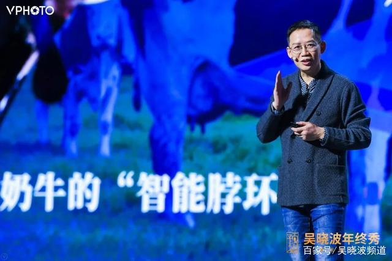

当奶牛套上智能脖环以后，它所有的行为数据和生理数据都可以被记录下来。

奶牛工告诉我在牛套上脖环之前，他每天在这个牧场中管理 2000 头牛要走 2.7 万步，套上脖环之后呢？走 1 万步就可以。发现一头奶牛，原来需要 20 分钟，现在花 2 分钟，定位系统一找就找到了。

奶牛最重要的是什么呢？要看它什么时候发情。屏幕上的小伙子很厉害，他能目测奶牛什么时候发情，揭发率可达 75%。脖环套上之后，揭发率达到 95%，产奶量可以提升 10%。

从城市的交通信号灯到奶牛的脖环，我们看到了一个“云上中国”的面貌已经慢慢地呈现出来。

2021 年中国几乎所有产业的领跑公司，都有机会正在、已经或者将要开始他们的产业智能化的建设。朋友们，这是中国制造业一个巨大的未来。

03、生态赋能，范式继承

在 1997 年互联网革命刚刚爆发的时候，哈佛大学教授克里斯坦森写了一本书，叫做《创新者的窘境》。据说这是乔布斯很喜欢的一本书，给了老乔极大的勇气。

因为克里斯坦森在他的书中说，即将爆发的互联网革命，会对传统产业，无论是制造产业还是消费产业，进行破坏式的创新。当破坏式创新时刻到来的时候，越是管理卓越的大型公司越难以摆脱困境。这句话在 1997 年对乔布斯这样的人来说就是一个福音，对大企业 IBM、索尼、摩托罗拉来说就是一个诅咒。

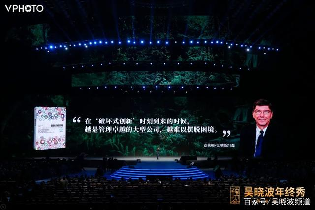

这句话在过去几年的中国也发生过。在 1980 年代、1990 年代，制造业、流通服务业崛起的那些大型企业，在过去几年里巨大的恐慌是什么呢？就是当信息化革命冲击到自己这个行业的时候，当它开始冲击信息行业、消费行业、金融行业，越是那些行业里效益最好、管理最卓越的企业，越是难以摆脱困境。因为你是既得利益者，你是被革命者。

2015 年有过一个概念，叫“互联网+”。我记得 2015 年 4 月去佛山，我们举办了一个制造业千人大会，有 5、6 个制造业企业家在台上吵了一个半小时，吵一句话，到底是“互联网+”还是“+互联网”。

到 2020 年、2021 年，我想没有一个制造业企业家还会纠结是“互联网+”还是“+互联网”。2015 年以来的“互联网+”焦虑症已经基本消失，而且一个令人特别欣喜的景象是什么呢？不仅那些中小企业消除了“互联网+”焦虑症，而且那些大型公司，克里斯坦森所说的那些管理卓越的大型公司，它们的“互联网+”焦虑症也已经消除了。

分享两个案例，都是中国的超大型企业，一家是海尔。

以海尔为例，原来是生产冰箱的。这张照片是很有名的“张瑞敏砸冰箱”。我在《激荡三十年》里说，中国制造企业质量意识的苏醒就是从这儿开始的，不合格的产品不能出厂房了。靠这一条能走进 2020 年的今天吗？走不进。

在过去的 30 多年里，这家大型企业已经发展到第 6 个战略阶段。1984 年-1991 年是海尔的名牌战略阶段，它发展成为中国最大的冰箱企业。1991 年-1998 年，海尔的多元化战略阶段通过“激活休克鱼”大规模对全国存量公司进行激活，由此海尔成为一家多元化的家电企业。

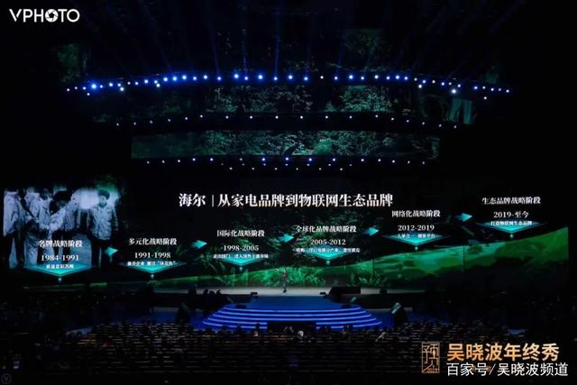

从 1998 年开始，海尔不仅把 Made in China 的产品卖到海外去，更是在海外建设工厂。2005 年-2012 年，海尔在海外并购了三洋白电、斐雪派克，这是海尔的全球化品牌战略阶段。

直到这个阶段，海尔作为一家大型公司，它的发展战略都非常符合迈克尔·波特的“战略竞争理论”，你在西方的管理学书桌里可以找到这条路径发展的可能性。

但从 2012 年到今天海尔走过的路，你在全世界所有的战略教科书中都已经找不到了。张瑞敏领导海尔从“砸冰箱”到“砸组织”，彻底打碎了正三角的金字塔式的科层制管理，组织内部只有三类人：平台主、小微主、创客。

2019 年开始，当组织变得柔性化以后，海尔开始把自身的组织能力进行一次大规模的升级，开启了“生态品牌战略阶段”。

传统制造业企业以产品为核心形成一个体系，而海尔旗下的卡奥斯工业互联网平台是以用户体验为核心，并以此来整合物流、服务、交互、研发、营销、采购和生产等等各个环节，完成了从大规模制造向大规模定制的转变。

现在卡奥斯已经开放赋能了 15 大行业，从农业到啤酒，从智慧交通到智慧仓储。今年 2 月份，山西遭遇疫情的时候，整个山西省居然没有一家工厂可以生产口罩，怎么办？卡奥斯在 48 个小时内完成了一次赋能，每天生产 10 万只口罩的生产线顺利投产。

我们再看另一家企业——苏宁。1990 年创业，到这周是 30 周年，苏宁经历了 4 个发展阶段。

第一个十年卖空调，卖成江苏的老大。1999 年中国出现了两家企业，一家叫苏宁，一家叫国美，学习美国百思买的模式，开始做全国性的家电连锁卖场模式。

1999 年—2009 年，这十年是苏宁和国美的高光时刻，它们成为了全中国所有家电企业非常恐惧又不得不合作的两个大型的连锁机构。因为那一轮的发展，苏宁成为了家电连锁第一股。2009 年就是中国民营企业 500 强中的第三名，2019 年是第二名。

但是真正的进步并不发生在企业规模和营业额上，发生在哪里呢？发生在后面两个阶段。2009 年它改了一个名字，原来叫“苏宁电器”，后来改名“苏宁易购”，把线下 2000 多个大型连锁店和线上的流量进行了一次互通。本来是一个被革命者，当名字从“苏宁电器”改成“苏宁易购”的时候，张近东就成为了一个自我革命者。他要革自己的命，为此要做很多原来没有做过的事情。

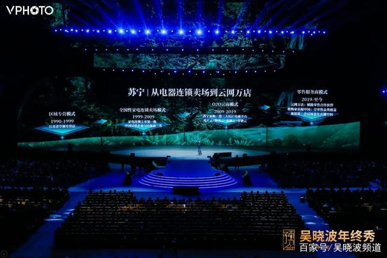

2015 年初，我去苏宁调研，苏宁在紫金山下有一个很大的总部，有两幢楼。当时他们的副董事长孙总跟我说：晓波，两幢楼，这幢楼是苏宁的业务总部，那幢楼是研发总部。苏宁内部把这个叫做存量总部，把那个叫增量总部，增量是干什么的？用户云、物流云、金融云、营销云。

这是一家非常传统意义上的家电连锁企业进行自我革命的过程。建立云平台以后，就可以把云能力进行赋能。

今天它由一个零售商开始向零售服务商转型，这个大战略叫做云网万店战略；收购了家乐福中国，补足了家电以外的其他品类；在农村和集贸小店合作，在城市做苏宁小店，这两部分 1 万个店，明年快速复制；再把现在的苏宁易购改成苏宁云店，跟直播做对接，所有零售空间都变成一个可直播的场景化空间。

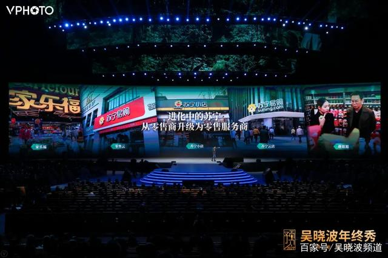

我们在两家企业身上看到了什么事情？看到了一个让中国所有管理学家非常兴奋和手痒的事情，就是今天中国的大型企业正在贡献数字化转型的中国范式。非常希望 2021 年中国大学管理学院的老师们能够走出教室，走进企业，去看看这些大型企业正在发生的教科书上从来没有过的变化。

这些大型企业的前面已经没有对标物了，它们的假想敌是谁呢？只有两个东西：一是时代，二是自己。这些变化是中国经济基本面所发生的重要变革之一，这些变化意味着中国的第一代和第二代创业者到今天仍然没有下火线，他们仍然在用自己的企业家精神完成着企业的变革。

这个变革非常困难，他们需要刀刃向内自我破坏，通过组织创新来强行植入互联网基因，他们需要不断地尝试激烈的模式创新，打破绩效主义的大公司魔咒，同时他们要把自己的专业能力迭代为赋能服务能力，形成新的平台级优势。

我们在这里真的要给这些中国大型公司，这些已经完成了他们的积累和光荣的企业家朋友们一点鼓励的掌声，他们一点都不比那些 80 后、90 后的年轻创业者更容易，他们完全可以金盆洗手了，完全可以回家写自己的回忆录了，但是他们今天仍然把自己放在非常危险的边缘，希望能够帮助中国的制造业在下一轮变革中蹚出一条新路来。

大公司的难是小公司完全难以想象的，既得利益者的难是革命者完全难以想象的，自我革命者的难是颠覆者完全难以想象的。

在 2020 年，我们确实看到了这些全新的变化。

04、百万直播闹翻中国

去年的此时此刻，我们在这里举办吴晓波年终秀时，有多少人知道直播这件事？估计 90%以上的人是没有看过直播或没有参与过直播的。

我也是去年 9 月底才第一次知道，居然有直播电商这回事。

2017 年，直播电商全国交易额是 300 多亿，去年 4000 多亿，今年突破 1 万亿，明年大概率突破 2 万亿，它在互联网零售电商中的占比会从 0.5%增加到 14.3%。

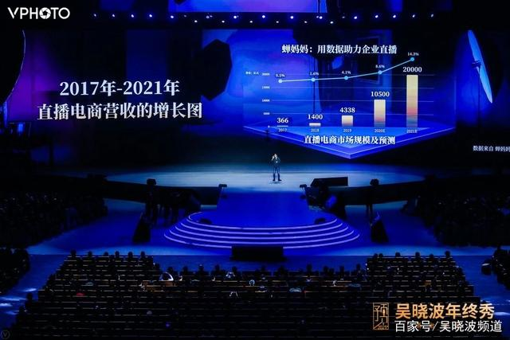

厦门有一家创业公司叫蝉妈妈，具有很强的数据分析能力。现在我们关于直播增长的数据、运营的数据都是跟它合作获得的，非常感谢蝉妈妈。

蝉妈妈数据显示：2020 年，每个月在直播电商产生过一次及以上消费的互联网用户已经超过 50%了。

更难以想象的，是喜欢直播电商还是传统电商？居然有 43%的人喜欢直播电商，35%的人喜欢传统电商，这是很难被改变的趋势了。

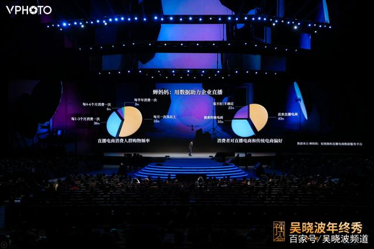

今天在这里演讲时，晚上全中国有 5 万场以上的直播。而且，手机上看直播，屏幕前虽然是一个个小姑娘、小伙子，他们的背后却需要有编导、助播、供应链、售后服务、流量运营等 8~10 个工种，需要非常完整的产业链。

未来，直播将为中国解决 2500 万~3000 万的新增就业人口。

平时谈直播，常常说到几个头部播主，薇娅、李佳琦、辛巴等，不如讲几个大家从来没有听说过的名字，我认为直播真正在改造的是他们的命运和他们周边人的命运。

麻功佐，1980 年的，大学毕业后，在杭州做了几年生意，没有起色，于是回老家。他老家在浙江非常偏远的山城松阳县，他们整个村里的人是做蜂蜜的。小伙子开始在抖音上做直播，他今天在抖音上有 77 万粉丝，2020 年卖了将近 2000 万的蜂蜜，把他们村里的蜂蜜卖完了，把邻居村里的蜂蜜也卖完了，他说我现在在村里可以横着走路。

这个女孩子叫少嫚，是聋哑人，1983 年出生，有一个女儿，她的丈夫也是聋哑人。去年年底她失业了，两夫妻同时失业，丈夫去送外卖，她在家里没事儿干，今年 9 月做直播。

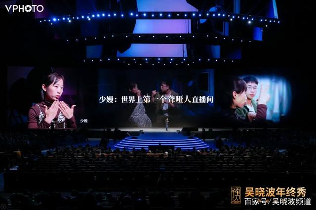

朋友们，这是全世界第一间聋哑人直播间。我们的编导走进去跟我说“好安静的直播间”。

她做直播那天，有 8000 个人看，这 8000 个人绝大多数都是聋哑人，她卖一些食品、一些化妆品。2 个小时直播卖了几万元，分到 2000 元，她非常高兴，我们也非常高兴，这是在她失业期间最大的一笔收入。现在她每半个月做一次直播。

这个人叫周新平，58 岁，是一个科技创业者，他有 150 多项发明，十多年前在上海一家跨国公司当老总，他跟我说，十二年前回到家乡湖南，他们家是种油茶树，家乡的老乡们会种茶油树、会榨油，但不会卖。

周新平在城市待腻了，回老家去重新创业，签了家乡的 4.8 万个老乡农户，承包了 40 万亩茶油田。因为他是平安私行的客户。平安私行帮他做了很多金融赋能、渠道赋能、服务赋能。今年周新平 58 岁，进直播间做直播，通过直播，帮他的老乡们卖茶油，熬过了这个最困难的冬天。

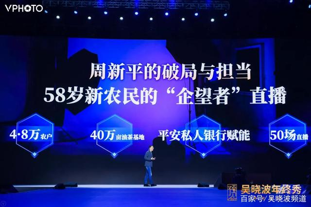

每天晚上的几万场直播改变的是一个乡村的命运，是一个村庄的命运，是一个聋哑人的命运。更大的意义并不在于出了一个头部的网红，一个晚上卖几千万、几个亿，这个不重要，重要的是它深入到了这个社会的组织细胞和经济细胞的末梢部分。

从商业角度来讲，直播电商是全球商业史上第一个以人为终极节点的零售模型。

如果未来真的总结中国互联网产业所谓的四大发明，别的三个不知道，我想直播一定是其中一个，确实在 2020 年新冠疫情下得到了极大的喷发，改变了原来人货场的基本逻辑。

2021 年一个非常大概率的事件是，每一家公司都可能需要一个直播间。

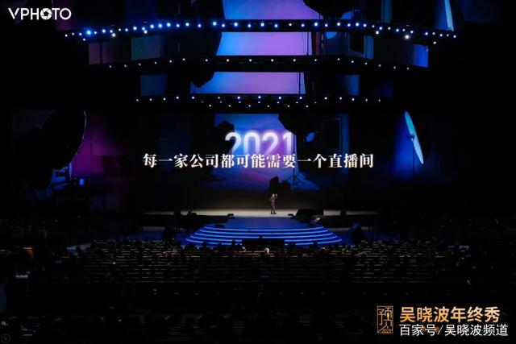

在这样的变化发生情况下，中国的互联网产业也正在发生非常激烈的变化。

互联网 20 多年到今天产生了很多的流量来源，比如资讯流量、社交流量、电商流量。在直播电商发生之前，这三大流量之间是泾渭分明，你每天有 6 个亿 DAU，他每天有 10 个亿的 DAU，我每天只有 2 个亿的 DAU，没关系，因为之间的变现模型完全不一样。

有了直播电商以后，你们有没有在社交环境下买过东西？你们有没有看一个新闻、看一个消息时买一个东西？因为有了直播电商，造成传统意义上的资讯流量、社交流量、电商流量第一次出现了破壁汇合。我们一方面看到它对每个个体、每家企业组织细胞、每个村庄可能催生的变化，同时在互联网产业和互联网史意义上也正在发生巨大的变化。

2020 年用户增长数量最大的互联网工具，不久前公布说企业微信用户数已经超过 4 个亿，变化从哪发生的？去年 12 月 23 日，企业微信和微信开始互通，互通以后，在过去 365 天完成了 27 个版本的迭代。

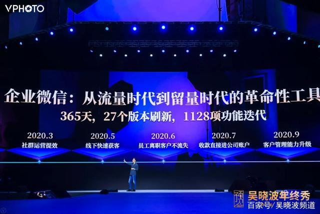

我曾经用八个字形容腾讯的产品哲学，“小步迭代，试错快跑”，这八个字在这个产品上得到了极大的发挥，365 天 27 次迭代，1128 项功能面世。

从流量时代进入到留量时代，把那些通过内容、通过直播所产生的用户关系沉淀到自己的私域中然后进行交互，在他需要购买时完成购买，是一个非常好的工具。

每个产品都有它的命运，都是技术变革、外部环境变化和消费者需求同时呼唤所产生的结果。

我们今天看到中国的零售市场出现了万物皆可播，人人皆可播，场场皆可播的局面。

我们拍了一个片子《直播启示录》，12 月 28 日刚刚上线，现在正在优酷播出。明天（12 月 31 日）我们也会在厦门举办一场新国货跨年直播秀，希望大家有时间可以去看一看。今年我在直播上踩了很大的坑，到了 12 月为这个行业做了两大事情，一是做一场直播秀，二是拍一个纪录片，我们还是通过内容的方式来支持这个行业的变化。

05、品类流行替代品牌

今天在中国所有做消费品品牌的企业家都非常焦虑，因为你不知道今天的 80 后、90 后或已经走进会场的 00 后喜欢什么商品。

在一个过剩的时代，消费者需求是非常难以被定义和难以琢磨的行为，他们自己也不知道，我已经有 18 件衬衫了，你怎么把第 19 件卖给我呢？我已经吃过全世界最好的冰淇淋了，那下一个冰淇淋的味道应该是什么呢？我也不知道。

今天在消费品市场看到的这些变化是体验大于必需，颜值大于功能，口碑大于品宣，当这些发生时，在过去二三十年中建立了自己的品牌价值的传统消费品公司完全找不到去向。

2020 年看到几个全新的品类，我不知道在座各位用过多少个，冻干咖啡喝过没有？自嗨锅用过没有？罐装鲜米吃过没有？

颈椎按摩仪、家庭投影仪、中式雪糕、速干瑜伽服、运动文胸、即食燕窝、盲盒、奶酪棒、环保小家电，这都是一些非常小的品类，由品类引爆流行，引爆流行获得基础用户，获得基础用户形成品牌。

所以今天我们看到一个特点：品类创新是催生新品牌一个非常好的路径。这也是很多大型公司很难找到的，因为都不知道什么叫做盲盒，什么叫做小酒，什么叫做冻干咖啡。

这些新的品类创新可能很小，只跟体验有关，而且长得非常漂亮。它撕开了一个口子，然后形成了一个巨大的品牌优势。

我们来给大家讲两个案例。

第一个案例是火锅。中国现在一年的火锅消费额 1 万亿，没想到吧，火锅居然是个万亿行业。全中国有几十万家火锅店，火锅已经成为红海了，怎么在这么一个万亿级的红海中创新出来呢？品类创新。

比如说今天的火锅，在市场上有四川火锅、重庆火锅、台湾火锅、东北火锅、云南火锅，店里卖的东西也不一样，各有各的主打品，毛肚、菌菇、和牛、江鱼、牛蛙。把区域品类作为横轴线，食材品类作为竖轴线，横轴和竖轴交错都可能产生一个全新的品类。

2020 年火锅行业做了一个品牌榜，第一名是海底捞，第二名是一个台湾火锅，第三名是一个毛肚火锅——巴奴。巴奴只干了一件事，把火锅中用的最多的产品毛肚，通过技术创新的方式做到极致。

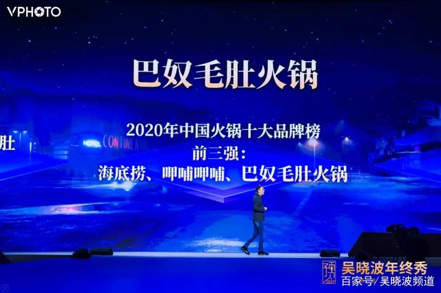

喜欢毛肚火锅、巴奴火锅的人是谁呢？90 后占到了 56%，女性占到了 45%，难以想象吧？它用了一个毛肚在火锅红海中撕开了一条线。

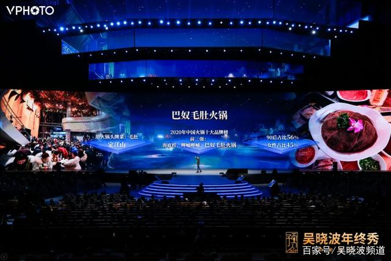

家里买过米没有？买什么米呢？你脑子里想的是米的品牌吗？那是一个巨大的红海。

今年有一家公司居然做到了全网直播米类销售量的第一名，是一家非常年轻的才创办三年多的公司，叫“龙米家”，干了一件事，把米装到一个罐子里。它首创了罐装充氮锁鲜，米买回去打开来很鲜，里面充了氮。

这罐米倒到电饭煲以后，拿这个罐子装一罐水倒到电饭煲里，这锅饭刚刚够一家三口人吃。为什么这么了解？我们家就吃它的米，一罐米、一罐水、一顿饭，两年半的时间 200 万的用户，35%的复购率。在一个超级难打的一个红海市场中，通过品类创新活生生地撕开了一条线。

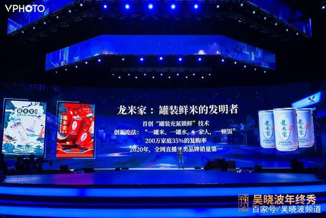

今年的新国货还有一个流行词——返祖。品牌出现了“返祖景象”，然后出现了品类返祖，健康的、环保的、中式的，成为了消费者愿意买单的三大元素。

再接着出现了传播返祖。每个人早上睁开眼起床到晚上放好手机闭起眼睛，我们每一天会接触到 2000 个品牌。你会记住几个？有的可能 0.5 秒就过了，有的多看两眼，出现 2 秒。

今天，不在场景中出现的品牌都跟你没有关系，这个场景可能是电梯，可能是高铁，可能是社交，就像两微一抖一分众，公域化场景中集中引爆，再呼唤留存到私域。只有在场景中出现能让你多看两眼的那个品牌，才叫做跟你有关的品牌。

我们在 2018 年年终秀提出过未来中国的消费品市场在传播层面出现三个东西：一个叫做圈层社交；一个叫做私域流量运营；一个叫做会员制。两年过去了，我们看到这三件事在中国的消费品市场正在发生。再接着是渠道返祖、审美返祖、传播返祖，金字塔式的渠道已经彻底瓦解，进入到了 C2M 的模型，产品直接到工厂，工厂直接到个人。

这是我们在消费品市场看到的全新变化。2021 年在消费品市场中最大的那个字叫做“Me（我）”，我的喜欢、我的需求、我的社群，再加上我的收入，等于我的消费。我主义的消费时代已经到来了。

我们所有的这些观察始于 2015 年，我们开始做一件事，叫《新中产白皮书》，如今已经是第六年了。2018 年开始我们做《新国货白皮书》。如果你加入我们的超级会员，我们会送出这些产品和这些白皮书，也欢迎大家在未来能够和我们一起对中国的新中产和新国货有更多的观察，一起学习，一起成长。

06、购物中心即将消亡

问大家一声，你们最近有没有去过商场？为什么去商场？

我们在《新中产白皮书》中针对十万个 80 后、90 后消费者做了一个调查，问他们为什么要去一个商业空间，得出的结论让我们非常吃惊，81%是去餐饮，75%是亲子，42%是会友，35%是看电影，33%是健身，20%是我也不知道干什么，去打个卡，19%是购物，9%是看展、听讲座。

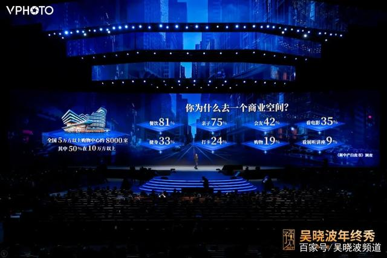

今天中国 5 万方以上的大型购物中心 8000 座，其中 50%是 10 万方以上。传统的商场、购物中心的主要格局是什么样呢？一楼黄金、化妆品，二楼少女服饰，三楼淑女服饰，四楼是男装，五楼是运动服饰，底层是超市。是不是大概这个格局？如果购物中心是这样的格局，能够对应今天发生的消费变化吗？它们都会死，都会变得空空荡荡，不管有没有疫情。

所以，2021 年我们会看到很多让人恐怖的空壳式的购物中心，购物中心的拐点时刻到来了，体验，即服务性消费将全面替代物质性消费，商品的呈现会出现完全不同的场景。

刚才吴声给大家推荐了他们团队认为 2020 年年轻人最喜欢的八大空间，没有一个是传统意义上的购物中心。他们都跟两个东西有关，一是体验，二是服务。所有的场景服务都会出现快闪、策展、集合、直播这些全新的方式。

我们再把吴声推荐的 8 个年轻人喜欢的空间给大家呈现一下，它们是新物种，代表着未来年轻人喜欢的空间。

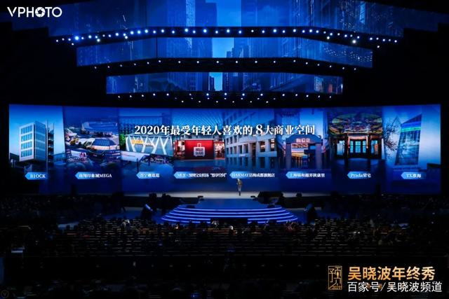

我们仍然需要空间。吴声的演讲中提到了场景的亲密时代，在今天这样的新冠疫情环境下，“亲密”两个字越来越具有温暖感，我们需要到空间去跟我们的爱人、朋友、孩子在一起。

去干吗呢？我们不是去买东西，我们去展现和告诉自己什么叫做美好的生活。阳光为什么从这个窗户投射进来？我为什么去看那个油画展？为什么今天那么多人赶到现场来参加一场吴晓波年终秀？我们都是为了美好生活买单的人，体验成为了我们愿意为之付出金钱和时间的最大理由。

所有的商业空间都需要完成对生活态度的一种表达，而不仅仅基于商品的呈现。所以，文化元素、场景打造、消费唤醒可以满足我们对美好生活的向往。2021 年中国的购物中心将面临一次极大的洗牌和挑战。

07、房产投资低空飞行

中国的房地产市场是从 1998 年开始的，朱镕基构建了国民经济的三驾马车：消费、出口、投资。出口，Made in China；投资，政府性的大规模基础设施建设。消费是什么？

当年的消费和今年不一样，今天的消费是满足对美好生活的需求，当年的消费最大众的一件事就是买房子，买了房子之后才会买冰箱、空调、洗衣机，住得远的买辆车，住进去请人吃顿饭，拉动 60 多个行业。

所以，从 1998 年开始，中国的房产价格和中国的货币发行居然形成了一种奇妙的对等关系。屏幕左边是 M2 广义货币，1998 年到 2020 年 11 月，M2 余额从 10.4 万亿增加到 217 万亿。

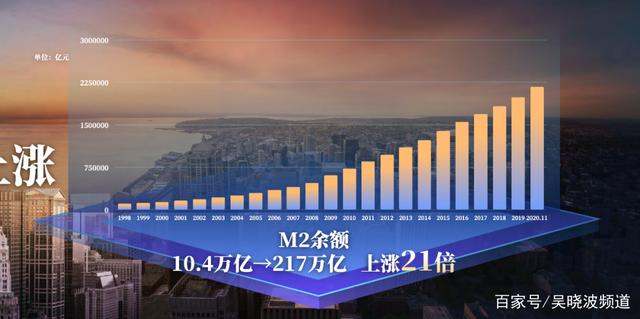

相对应 1998 年上海的房价 3000 元/平，2020 年 1 月份到 11 月份，57000 元/平。过去的 22 年里，M2 上涨了 21 倍，房价上涨了 19 倍。

2020 年以后的五到十年，这种对等关系还会存在吗？不会存在了。

你们知道从 2016 年到 2020 年过去的五年里，中国百大城市房价年均增长多少吗？我曾经拿这个问题问过很多同学，很多人的眼神迷茫地看着我：“80%？40%？15%？”跟算命差不多。大家也确实没有认真地关注过这个问题，2016 年—2020 年中国百城房价年均增长 5%。

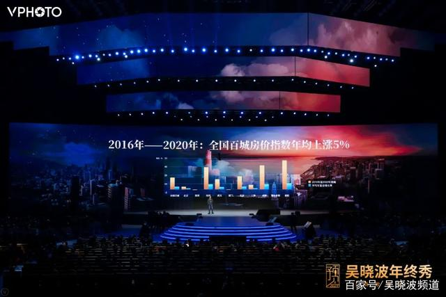

即将过去的 2020 年这个数据是 4%，如果我们从一个家庭理财和投资角度来看，它意味着什么呢？

2020 年黄金涨了 13%；如果你买的是股票型基金，平均涨了 37%；如果你买的是指数型基金，平均涨了 28%；如果你买了一个纯债基金，对不起，平均只涨了 2.6%；新房涨了 4%；把钱在银行做定存，涨了 1.75%。你看，人不理财，财不理人。

所以，整个中国资本市场的丰富性和延伸性使得今天中国的每一个中产家庭，除了我们的劳动性收入以外，真的要认真地思考一下我们的财产性收入在这么一个巨大的动荡之际该如何经营。

在 1998 年以后很长时间里你只要干三件事：买房、买房、买房。未来不行了，所以你要变化。

去年，我们拜托我们的老朋友，也是中国最大的第三方理财公司恒天财富，他们的研究院帮我们梳理了 2020 年中国财富市场可能发生的新变化，其中非常重要的就是要大家关注权益性资产增长的可能性。今年我们继续拜托恒天财富研究院，给我们提出了 2020 年—2021 年中国理财市场的三个大的趋势：

1\. 新的理财模式：理财服务从线下转到线上；

2\. 新的配置需求：从固收型理财向权益资产配置转移；

3\. 新的科技赋能：数字化科技成为金融服务的重要抓手。

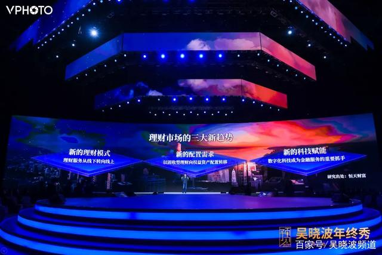

所以，中国的资本市场发生剧烈变化的同时，我们每一个人的理财观和对自己财富的重新配置，在 2021 年一定要进行一个重新的思考。

08、超级城市大赛鸣枪

超级城市的定义建立在人口数据上，人口超过 1000 万的是超级城市。

欧洲有多少个城市人口超过 1000 万？两个半，伊斯坦布尔、莫斯科和半个伦敦，伦敦有近 900 万人口。美国有多少城市人口超过 1000 万？半个，纽约 840 万人。中国有多少个 1000 万人口城市？16+7 个，7 个是人口已经超过 800 万，还在快速增加，未来五到十年内会成为千万级人口的城市。

今天中国的城市化运营和城市治理，跟中国制造业企业和互联网公司所面临的情况是一样的，我们的前面是没有对标物的。

上海的对标一定不是纽约，深圳的对标一定不是硅谷，中国的城市化在欧洲和美国根本找不到对标物，我们加在一起 20 多个，美国和欧洲加在一起不到 5 个，对标什么呢？所以中国的超级城市在未来十年的发展也会走一条非常具有中国特色、值得我们长期关注的道路。

这 23 座城市的选取标准是人口，那么中国有多少城市一年的 GDP 超过 1 万亿呢？17 座万亿城市，7 座准万亿城市。

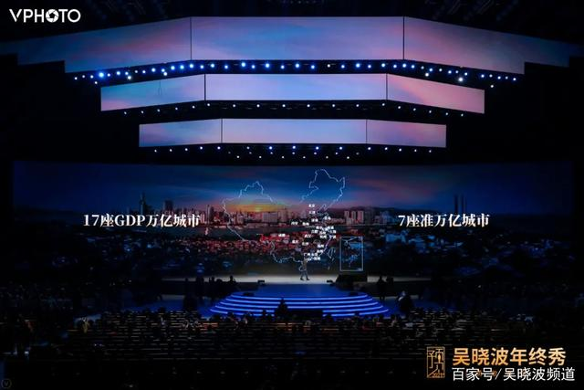

把人口过 1000 万和 GDP 过 1 万亿的城市叠加在一起，在这两个榜单上同时出现的城市有多少座呢？18 座，它们占到了全国人口的 17%，GDP 总量占到全国的 32%。它们的未来发展代表了中国城市化和区域经济发展全新的可能性。

同时中国正在沿海地区建设几大城市圈，北方叫做京津冀，东部叫做长三角，南方叫做粤港澳。

对标全球六大城市圈，把中国沿海三大城市圈和美国东北部、美国西部、东京大都市圈进行对比发现，今天全世界第一大城市群是美国东北部的以纽约、费城、波士顿和华盛顿为代表的老美国，中国长三角的经济总量在未来三年内大概率会超过美国东北部城市群，成为全球第一大城市群，粤港澳大湾区的经济总量将超过东京大都市圈。

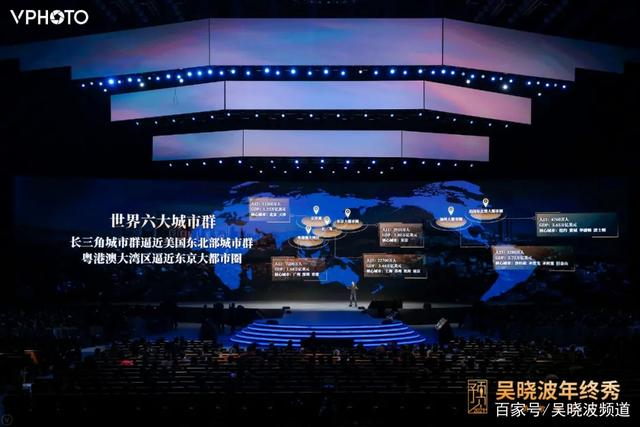

中国的“巨国效应”让这个国家在全世界经济学家面前变得越来越陌生和越来越眩目，同时也给我们带来了更大的挑战，为我们企业和城市的发展带来了更大的可能性。

我们今天来到的城市是厦门。如果 40 年前来厦门，厦门的脑门上写着四个字：海防岛城，是台海的前线，根本不是发展经济的地方。然后小平同志画了一个圈，搞了四大特区。今年是深圳特区 40 年，也是厦门特区 40 年。

今天来到这座美丽的海滨商业城市，看到 40 年发展的景象是什么？她的经济总量上升到全国第 32 位。厦门地方国有企业中居然有 3 家国企进入了世界 500 强，这个数据仅次于上海。40 年来，厦门的货物贸易年均增长 18.1%。

下面这个数据真的应该给厦门鼓掌，经济那么发展，空气质量居然在中国排在第四位，第一名是拉萨，第二名是海口，第三名是舟山，第四名是厦门。后面这个应该给予更大的掌声，厦门注册志愿者超过 70 万，占常住人口的 1/6，说明厦门市民的素质非常高。

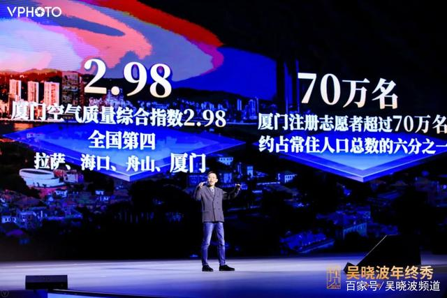

一个幸福的城市除了要有很好的产业和经济以外，更关键的是有很好的空气，有非常善良的市民。

去年和今年，吴晓波年终秀的联合主办单位都是厦门建发集团，建发早年只有七八个人，只是一个窗口单位，随着厦门特区 40 年的发展，建发也不断改革创新，40 年来经历了六个发展阶段，如今位列世界 500 强第 234 位。

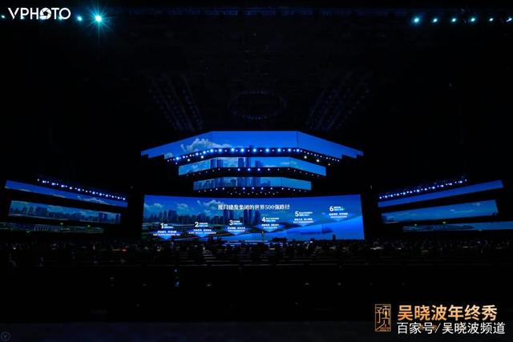

建发的供应链业务位居全国前列，供应链业务经营主体建发股份进口钢铁全国第三，粮油饲料全国第二，浆纸全国第一，葡萄酒全国第一。在出口部分，鞋类全国前三，出口俄罗斯服装全国第一。

在过去几年中，我们在互联网企业看到的变化，在建发身上同样看到。通过加强在智慧供应链上的投入，通过多年积累优势形成的全赋能型服务等，它从一家传统贸易商开始转变成为一个全球供应链的整合者。

在超级城市发展的过程中，我们会问，到哪个城市去创业？我们的孩子去哪个城市居住？我们把自己的生命托付给哪个城市？两个字：年轻。一座有未来的城市一定是有很多年轻人的城市，有年轻产业的城市，有年轻钱的城市，同时需要有年轻心态的政府。

所以中国的超级城市大赛在 2021 年会进入白热化阶段，这又是一个非常长期的中国区域经济发展的过程。

我们在 2020 年的岁末，将近 12 点，再过 24 小时，即将告别 2020 年，我们很难忘记 2020 年，但是我们也希望永远不要返回这么充满灾难的一年了。

希望 2021 年的中国经济真的能够如同我们在数据上和趋势上看到的，实现一个决定性的反弹，希望在 2021 年中国的产业智能化能够继续往前迈出更坚定的步伐，希望中国的消费品市场会出现越来越多受年轻人喜欢的空间和商品。

2021 年，我们也仍然会面临很多曲折，面临很多到今天都没有办法想像、预见的种种陷阱、种种挑战。

但是在岁末之时，我们仍然要以一颗勇敢的心对自己说，面向那个 2021 年，要加倍使出全部的力量往前冲，不要回头，如此一来，我们将可以看到原本看不到的东西。

我的演讲结束了，谢谢大家。

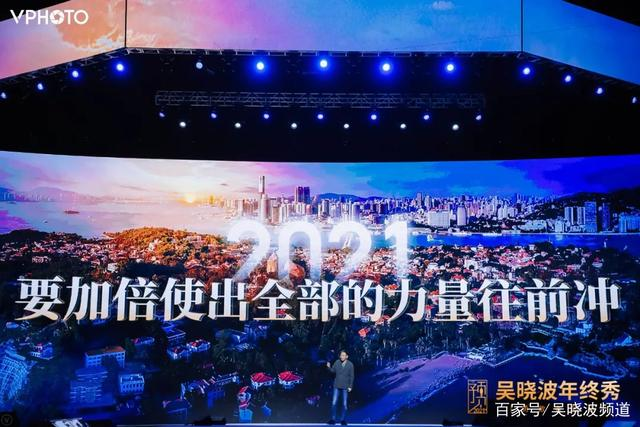

#预见 2021 吴晓波年终秀#圆满落幕啦，感谢大家的陪伴与支持，我们明年再见~

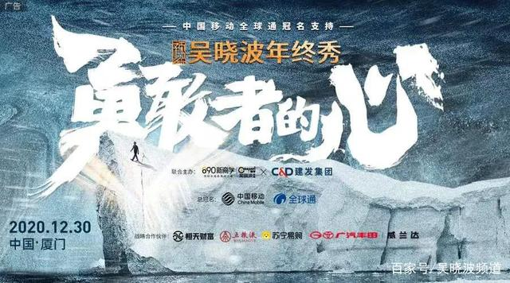

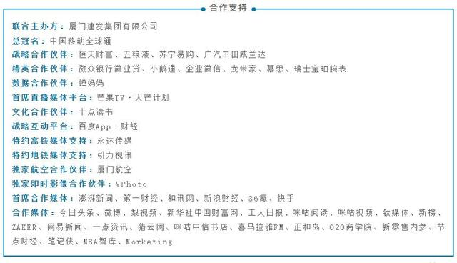

